# GPS-Denied Autonomous UAV Swarm Platform

### Edge-computing swarm intelligence, VIO/TDOA localization, secure telemetry, and confidence-aware distributed autonomy


[](https://github.com/smshagor-dev/UVA-GPS-Denied-Navigation-in-Dynamic-Environments/actions/workflows/ci.yml)
[](https://github.com/smshagor-dev/UVA-GPS-Denied-Navigation-in-Dynamic-Environments/actions/workflows/security.yml)
[](https://github.com/smshagor-dev/UVA-GPS-Denied-Navigation-in-Dynamic-Environments/actions/workflows/nightly.yml)


> **Safety and validation notice**  
> This repository is an advanced research and production-oriented software platform for GPS-denied UAV autonomy. It is **not flight validated**, **not production-radio validated**, and **not approved for free flight**. Treat the implementation as bench-demo-ready software plus architecture-level research until HIL, tethered, and flight-adjacent evidence exists.

> **CI scope notice**
> The GitHub Actions badges above represent repository validation for source quality, supported build presets, tests, packaging, and security scanning. They do **not** represent flight certification, hardware-in-the-loop clearance, or operational airworthiness approval.

---

## Table of Contents

1. [Executive Summary](#executive-summary)
2. [System Overview](#system-overview)
3. [Full Platform A-Z Overview](#full-platform-a-z-overview)
4. [Visual Asset Roadmap](#visual-asset-roadmap)
5. [Visual Architecture](#visual-architecture)
6. [Mathematical Modeling](#mathematical-modeling)
7. [Performance Benchmarking and Estimated Edge Gains](#performance-benchmarking-and-estimated-edge-gains)
8. [Complexity Analysis](#complexity-analysis)
9. [Edge AI Workflow](#edge-ai-workflow)
10. [Security Model](#security-model)
11. [Edge Failsafe System](#edge-failsafe-system)
12. [Dashboard](#dashboard)
13. [Runtime Modes](#runtime-modes)
14. [Validation Status](#validation-status)
15. [Hardware Roadmap](#hardware-roadmap)
16. [HIL and Bench Test Plan](#hil-and-bench-test-plan)
17. [Research Contribution](#research-contribution)
18. [Limitations](#limitations)
19. [Future Work](#future-work)
20. [Installation and Build](#installation-and-build)
21. [Repository Map](#repository-map)
22. [Expanded Repository Structure](#expanded-repository-structure)
23. [Related Documentation](#related-documentation)

---

## Executive Summary

GPS-denied autonomy is a central problem in modern aerial robotics. Indoor, subterranean, urban-canyon, disaster-response, and contested electromagnetic environments can make GNSS unavailable, unreliable, or actively misleading. A UAV swarm operating in those conditions cannot depend on a single external positioning source or a backend control loop that must remain continuously reachable.

This platform explores a full-stack architecture for **edge-supervised autonomous UAV swarms**. Each drone runs an onboard C++ autonomy stack with VIO/EKF fusion, UWB/TDOA localization support, LiDAR-aware obstacle reasoning, local mission logic, and a safety manager. Swarm coordination is moved toward peer-to-peer edge communication: drones exchange compact digests, health states, consensus hints, confidence estimates, and emergency corridor reservations over a V2X-style mesh. The Go backend and PySide6 dashboard remain critical for operator visibility, audit, mission injection, and fleet-level supervision, but they are deliberately kept outside the hard real-time safety path.

Centralized drone orchestration is attractive because it simplifies mission control, logging, and operator interfaces. It is also fragile under degraded links: the round trip to a backend adds latency, packet loss can block coordinated action, and a central failure can affect the entire swarm. In contrast, **distributed autonomy** improves resilience by allowing each node to continue local navigation and safety behavior when backend connectivity is impaired. It also improves scalability when peer awareness is shared as compact summaries rather than raw sensor streams.

The research direction is not simply "share more data." Naive shared awareness can be unsafe: a stale or relayed peer detection should not be treated as a local fact. This platform therefore introduces documentation and software support for **confidence-aware edge intelligence**: peer information is aged, trust-epoch checked, stale-peer filtered, and fused as advisory context. Local collision avoidance and emergency descent always remain locally authoritative.

The result is a software platform that reads like an aerospace/autonomy research system and behaves like a production-oriented engineering stack:

- C++20 onboard autonomy and sensor fusion
- Go control-plane backend
- Python/PySide6 operational dashboard
- runtime separation across simulation, bench, production, and edge_swarm modes
- secure telemetry, trust epochs, replay-aware communication concepts
- edge peer packet protocol and state cache
- distributed consensus manager
- split-swarm recovery and failsafe architecture
- bench-demo/local validation pipeline

---

## System Overview

### Onboard autonomy

The onboard node is the real-time autonomy core. It owns local perception, state estimation, local obstacle reasoning, decision generation, and safety gating. It is implemented primarily in C++20 and organized around deterministic update loops where possible.

Core onboard capabilities include:

- visual-inertial odometry and EKF fusion
- UWB/TDOA localization support for GPS-denied ranging
- LiDAR obstacle awareness and occupancy-grid support
- autonomy decision engine
- local safety manager
- secure swarm message support
- edge peer packet exchange
- runtime telemetry publication

### Edge swarm architecture

`edge_swarm` mode extends the platform from backend-visible autonomy to distributed edge autonomy. Each drone publishes compact packets to peers:

- heartbeat
- pose state
- edge health
- obstacle digest
- threat digest
- consensus state
- emergency corridor
- peer goodbye

These packets update a bounded peer state cache and support local decisions without making peer consensus mandatory for immediate safety.

### Supervisory backend

The Go backend provides:

- telemetry ingest
- fleet snapshot API
- mission and command endpoints
- event and audit trails
- production/simulation backend mode separation
- dashboard-facing state aggregation
- security and firmware-trust telemetry propagation

The backend is supervisory, not a hard real-time flight-control dependency.

### Dashboard visualization

The Python/PySide6 dashboard exposes:

- fleet state
- edge swarm status
- peer counts and stale peer counts
- topology-oriented telemetry
- sensor status
- runtime mode banners
- backend simulation/production truthfulness
- command and mission workflows

### Local safety priority

The system follows a strict safety hierarchy:

```text
local immediate safety
  > local degraded autonomy
  > fresh peer consensus hints
  > backend mission intent
```

Consensus is useful for coordination, but local collision avoidance and emergency descent do not wait for consensus.

---

## Full Platform A-Z Overview

This section keeps the project framed as a complete GPS-denied UAV platform, not only an `edge_swarm` protocol implementation.

| Platform area | Role in the system | Current evidence level |
|---|---|---|
| Onboard UAV stack | C++ runtime that orchestrates sensors, localization, autonomy, safety, swarm networking, and telemetry | implemented software stack |
| VIO/EKF localization | visual-inertial and inertial state estimation with confidence telemetry | implemented software path |
| UWB/TDOA localization | anchor/ranging support for GPS-denied correction and recovery | implemented parser/localizer support |
| LiDAR perception | scan parsing, obstacle extraction, occupancy/map integration | implemented software path |
| Edge AI inference | onboard detector/inference status and confidence telemetry with OpenCV DNN fallback | implemented software path |
| Local autonomy | decision engine, mission behavior, degraded localization handling, and return/hold logic | implemented software path |
| Safety/failsafe system | local safety manager, emergency behavior, missing-sensor gating, and command rejection | implemented and unit-tested |
| Distributed peer networking | V2X-style mesh packets, peer state, and swarm health exchange | implemented with UDP fallback |
| Edge swarm intelligence | peer packet model, state cache, stale-peer filtering, advisory consensus | implemented and unit-tested |
| Edge serialization | JSON debug path plus CBOR binary peer packet prototype | implemented and tested |
| Backend control plane | Go telemetry/control plane for fleet state and operator-facing APIs | implemented and tested |
| Telemetry system | C++ telemetry client, backend snapshot schema, dashboard parsing | implemented and tested |
| Dashboard/operator console | PySide6 UI for runtime mode, topology, replay, mission, sensor, and safety visibility | implemented and tested |
| Replay analysis | playback-aware data paths and dashboard source visibility | implemented software path |
| Mission planning | local planner plus operator-supervised command workflow | implemented software path |
| Runtime separation | explicit `simulation`, `bench`, `production`, and `edge_swarm` modes | implemented policy model |
| Security model | trust epoch, stale packet rejection, command policy, swarm security context | partial implementation |
| Post-quantum roadmap | ML-KEM/Kyber, Dilithium/ML-DSA, hybrid migration design | proposed future work |

The platform is intentionally layered:

```text
local safety and actuation
  -> localization and perception
  -> local autonomy
  -> peer mesh and edge consensus
  -> backend supervision
  -> dashboard/operator workflows
```

This hierarchy matters because the backend and dashboard should improve visibility and supervision without becoming mandatory for immediate collision avoidance or emergency descent.

---

## Visual Asset Roadmap

The README references image placeholders for future generated or designed visual assets. The placeholder directory is `docs/assets/`; the image files themselves are documentation targets and are not validation evidence.

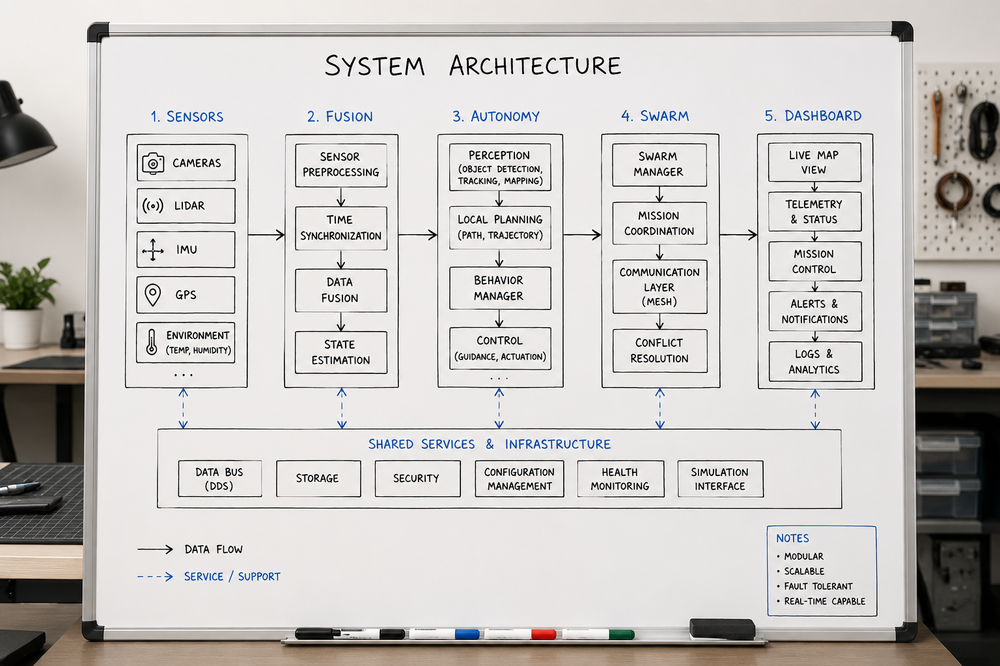  
Caption: Full end-to-end GPS-denied UAV swarm architecture with onboard autonomy, backend supervision, dashboard visibility, and peer mesh coordination. Suggested filename: `docs/assets/full_uav_swarm_architecture.png`.

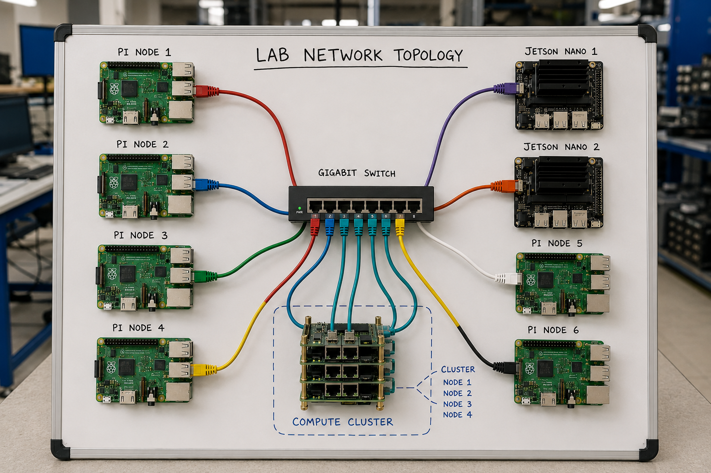  
Caption: Distributed `edge_swarm` coordination topology with peer cache, stale-peer filtering, and advisory consensus. Suggested filename: `docs/assets/edge_swarm_topology.png`.

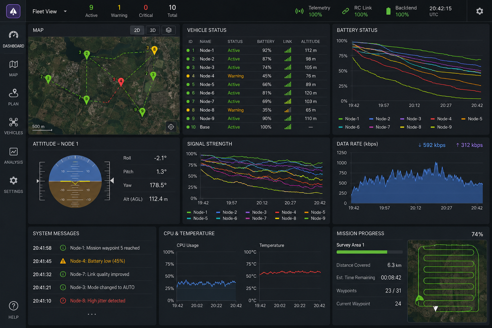  
Caption: Operator console concept showing runtime mode, localization source, peer health, topology, and safety state. Suggested filename: `docs/assets/dashboard_operator_console.png`.

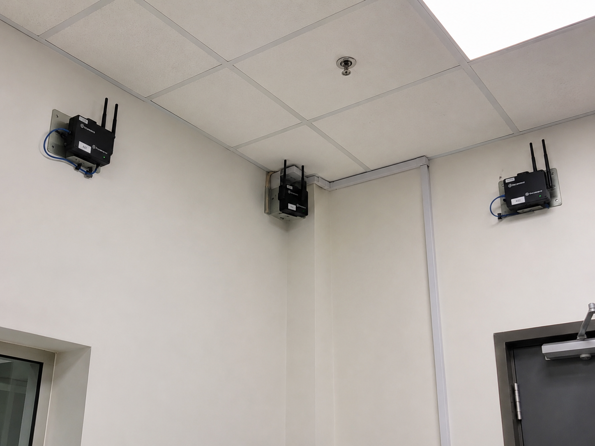  
Caption: VIO/EKF, UWB/TDOA, LiDAR, and confidence-aware localization under GNSS-denied operation. Suggested filename: `docs/assets/gps_denied_localization_concept.png`.

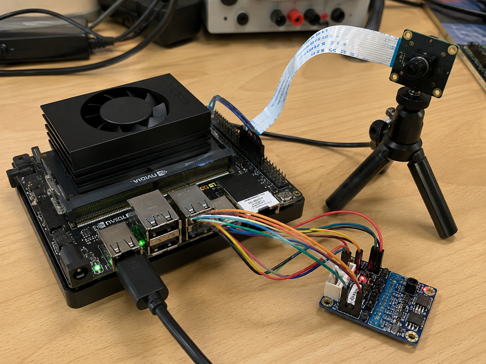  
Caption: Local edge AI inference and confidence propagation into peer-shared semantic digests. Suggested filename: `docs/assets/edge_ai_workflow.png`.

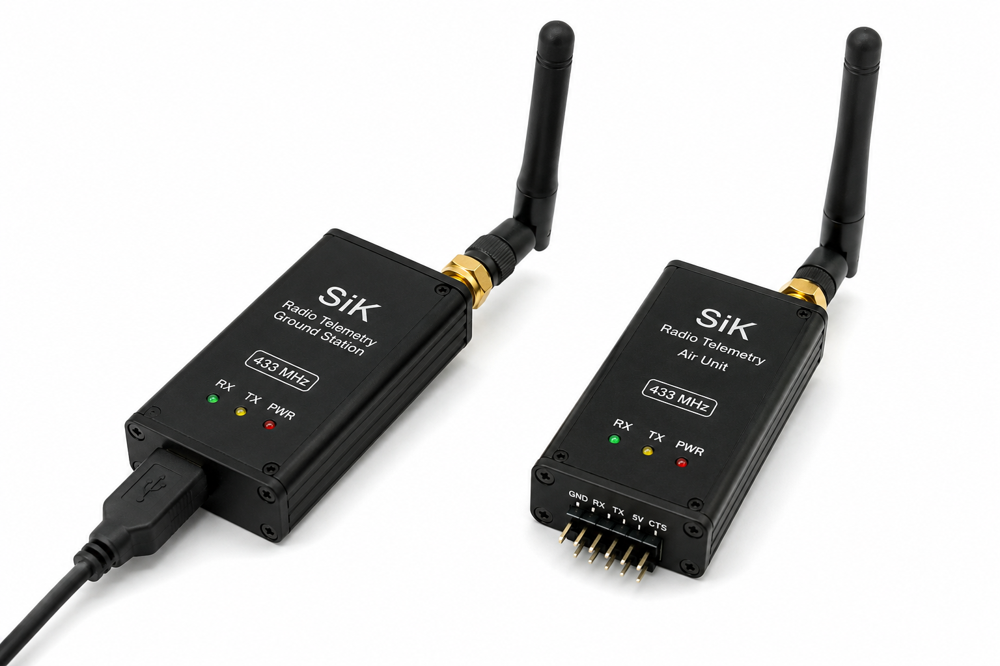  
Caption: Secure telemetry pipeline from C++ UAV node to Go backend and PySide6 dashboard. Suggested filename: `docs/assets/secure_telemetry_pipeline.png`.

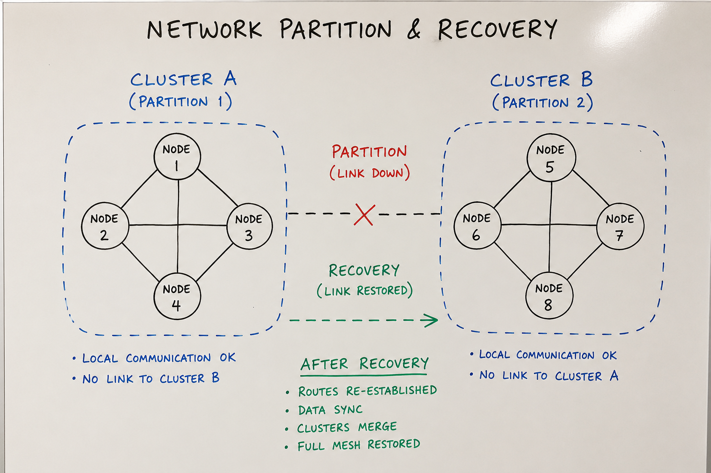  
Caption: Partition rejoin and deterministic conflict-resolution concept for split-swarm recovery. Suggested filename: `docs/assets/split_swarm_recovery.png`.

  
Caption: Control-plane backend and dashboard infrastructure for operator supervision and telemetry archiving. Suggested filename: `docs/assets/backend_dashboard_infrastructure.png`.

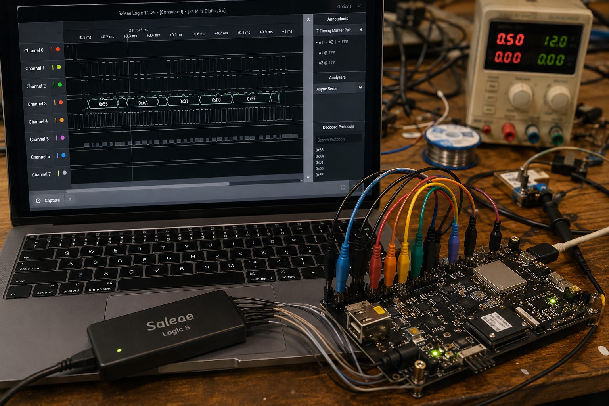  
Caption: JSON debug and CBOR binary peer-packet flow through deterministic validation and cache update. Suggested filename: `docs/assets/cbor_packet_flow.png`.

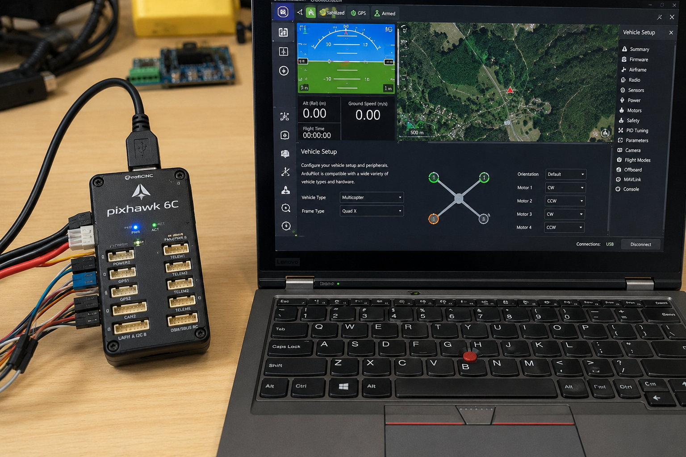  
Caption: Proposed HIL validation workflow from single-node timing to multi-node degraded mesh testing. Suggested filename: `docs/assets/hil_validation_workflow.png`.

---

## Visual Architecture

### A. Full Edge Node Pipeline

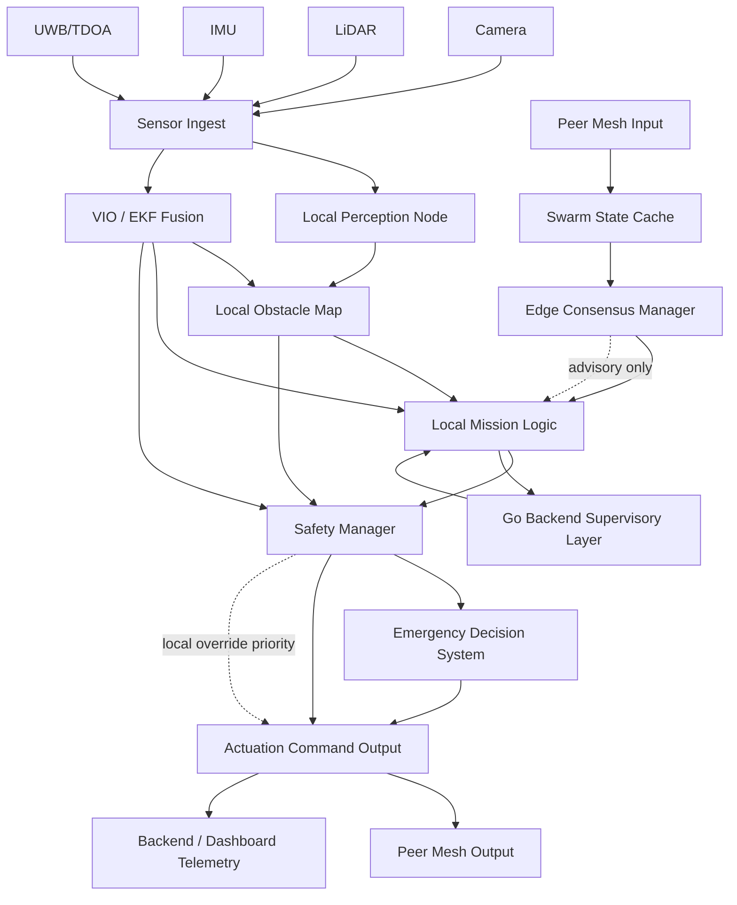
```mermaid
flowchart TD
    CAM[Camera] --> SI[Sensor Ingest]
    LIDAR[LiDAR] --> SI
    IMU[IMU] --> SI
    UWB[UWB/TDOA] --> SI

    SI --> LP[Local Perception Node]
    SI --> FUSION[VIO / EKF Fusion]

    LP --> MAP[Local Obstacle Map]
    FUSION --> MAP
    FUSION --> MISSION[Local Mission Logic]
    MAP --> MISSION

    PEER_IN[Peer Mesh Input] --> CACHE[Swarm State Cache]
    CACHE --> CONSENSUS[Edge Consensus Manager]
    CONSENSUS --> MISSION

    MISSION --> SAFETY[Safety Manager]
    MAP --> SAFETY
    FUSION --> SAFETY

    SAFETY --> EMERGENCY[Emergency Decision System]
    EMERGENCY --> ACT[Actuation Command Output]
    SAFETY --> ACT

    ACT --> PEER_OUT[Peer Mesh Output]
    ACT --> TELEMETRY[Backend / Dashboard Telemetry]

    BACKEND[Go Backend Supervisory Layer] --> MISSION
    MISSION --> BACKEND

    SAFETY -. local override priority .-> ACT
    CONSENSUS -. advisory only .-> MISSION
```

### B. Swarm Peer Communication Topology

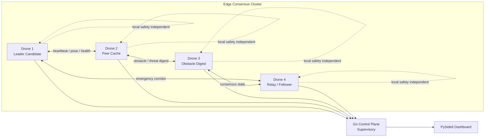
```mermaid
flowchart LR
    subgraph ClusterA[Edge Consensus Cluster]
        D1[Drone 1<br/>Leader Candidate]
        D2[Drone 2<br/>Peer Cache]
        D3[Drone 3<br/>Obstacle Digest]
        D4[Drone 4<br/>Relay / Follower]
    end

    D1 <-- heartbeat / pose / health --> D2
    D2 <-- obstacle / threat digest --> D3
    D3 <-- consensus state --> D4
    D4 <-- emergency corridor --> D1

    D1 --> Backend[Go Control Plane<br/>Supervisory]
    D2 --> Backend
    D3 --> Backend
    D4 --> Backend
    Backend --> Dashboard[PySide6 Dashboard]

    D1 -. local safety independent .-> D1
    D2 -. local safety independent .-> D2
    D3 -. local safety independent .-> D3
    D4 -. local safety independent .-> D4
```

### C. Edge AI Inference Pipeline

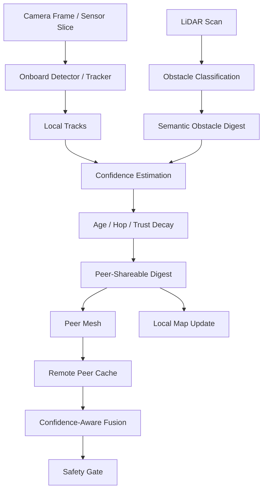
```mermaid
flowchart TD
    Frame[Camera Frame / Sensor Slice] --> Detector[Onboard Detector / Tracker]
    LiDAR[LiDAR Scan] --> ObstacleClassifier[Obstacle Classification]
    Detector --> LocalTracks[Local Tracks]
    ObstacleClassifier --> LocalDigest[Semantic Obstacle Digest]
    LocalTracks --> Confidence[Confidence Estimation]
    LocalDigest --> Confidence
    Confidence --> Decay[Age / Hop / Trust Decay]
    Decay --> PeerDigest[Peer-Shareable Digest]
    PeerDigest --> Mesh[Peer Mesh]
    PeerDigest --> LocalMap[Local Map Update]
    Mesh --> RemoteCache[Remote Peer Cache]
    RemoteCache --> AdvisoryFusion[Confidence-Aware Fusion]
    AdvisoryFusion --> SafetyGate[Safety Gate]
```

### D. Split-Swarm Recovery Flow

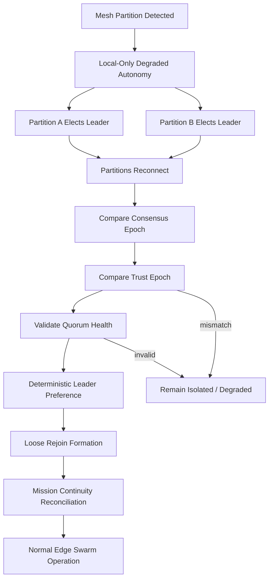
```mermaid
flowchart TD
    Split[Mesh Partition Detected] --> LocalOnly[Local-Only Degraded Autonomy]
    LocalOnly --> LeaderA[Partition A Elects Leader]
    LocalOnly --> LeaderB[Partition B Elects Leader]
    LeaderA --> Reconnect[Partitions Reconnect]
    LeaderB --> Reconnect
    Reconnect --> CompareEpoch[Compare Consensus Epoch]
    CompareEpoch --> CompareTrust[Compare Trust Epoch]
    CompareTrust --> Quorum[Validate Quorum Health]
    Quorum --> SelectLeader[Deterministic Leader Preference]
    SelectLeader --> LooseFormation[Loose Rejoin Formation]
    LooseFormation --> MissionRecover[Mission Continuity Reconciliation]
    MissionRecover --> Normal[Normal Edge Swarm Operation]
    Quorum -->|invalid| Isolate[Remain Isolated / Degraded]
    CompareTrust -->|mismatch| Isolate
```

### E. Backend Telemetry Flow

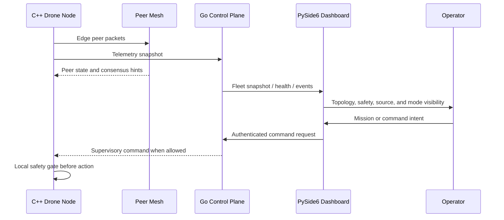
```mermaid
sequenceDiagram
    participant Drone as C++ Drone Node
    participant Mesh as Peer Mesh
    participant Backend as Go Control Plane
    participant Dashboard as PySide6 Dashboard
    participant Operator

    Drone->>Mesh: Edge peer packets
    Drone->>Backend: Telemetry snapshot
    Mesh-->>Drone: Peer state and consensus hints
    Backend->>Dashboard: Fleet snapshot / health / events
    Dashboard->>Operator: Topology, safety, source, and mode visibility
    Operator->>Dashboard: Mission or command intent
    Dashboard->>Backend: Authenticated command request
    Backend-->>Drone: Supervisory command when allowed
    Drone->>Drone: Local safety gate before action
```

### F. Runtime Mode State Diagram

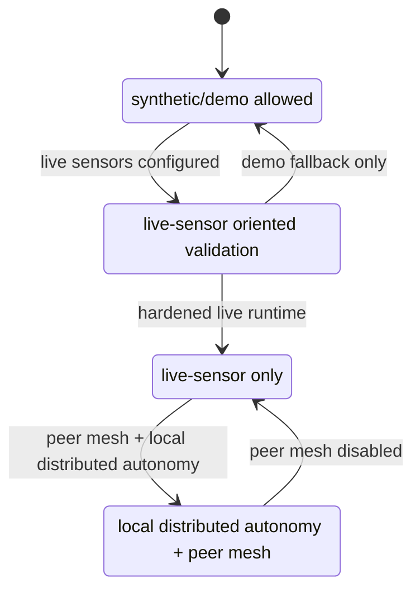
```mermaid
stateDiagram-v2
    [*] --> simulation
    simulation --> bench: live sensors configured
    bench --> production: hardened live runtime
    production --> edge_swarm: peer mesh + local distributed autonomy
    edge_swarm --> production: peer mesh disabled
    bench --> simulation: demo fallback only

    simulation: synthetic/demo allowed
    bench: live-sensor oriented validation
    production: live-sensor only
    edge_swarm: local distributed autonomy + peer mesh
```

---

## Mathematical Modeling

All equations in this section are design models for analysis and HIL planning. They are not flight-validated claims.

### A. Confidence propagation

For peer-shared AI or obstacle awareness, the receiving node computes:

```text
C_final =
    C_initial
    * exp(-lambda_t * Delta t)
    * exp(-lambda_h * hop_count)
    * T(epoch)
    * D(local_consistency)
```

Where:

| Symbol | Meaning |
|---|---|
| `C_initial` | confidence assigned by the sender |
| `Delta t` | message age at receiver |
| `lambda_t` | time decay constant |
| `hop_count` | mesh relay count |
| `lambda_h` | hop-count decay constant |
| `T(epoch)` | trust epoch compatibility factor |
| `D(local_consistency)` | local-sensor agreement factor |

This prevents stale or relayed peer perception from retaining full influence.

### B. Swarm bandwidth formula

```text
Bandwidth_total ~= N * packet_size * update_rate
```

Where:

- `N` = number of transmitting drones
- `packet_size` = serialized packet size
- `update_rate` = packets per second

For full-mesh exchange:

```text
B_full_mesh ~= N * (N - 1) * packet_size * update_rate
```

This motivates compact binary digests and cluster-limited consensus groups.

### C. Latency estimation

```text
T_total =
    T_sensor
    + T_fusion
    + T_consensus
    + T_network
    + T_actuation
```

For safety-critical local behavior:

```text
T_local_safety = T_sensor + T_fusion + T_safety_policy + T_actuation
```

The architecture aims to keep emergency and collision-avoidance behavior in `T_local_safety`, not in a backend round-trip.

### D. Edge consensus stability model

Let:

```text
Q = number of safety-eligible peers supporting a proposal
Q_min = required quorum
E_c = consensus epoch
E_t = trust epoch
S_peer = peer freshness and safety eligibility
```

A proposal is eligible only when:

```text
Q >= Q_min
and E_t is compatible
and all contributing peers satisfy S_peer = true
```

Consensus is advisory for mission coordination. It is not required for immediate collision avoidance or emergency descent.

### E. Localization confidence model

Localization confidence can be modeled as a weighted function:

```text
C_loc =
    w_vio * C_vio
    + w_tdoa * C_tdoa
    + w_sync * C_sync
    + w_map * C_map
```

Subject to:

```text
w_vio + w_tdoa + w_sync + w_map = 1
```

Where:

- `C_vio` = visual-inertial tracking confidence
- `C_tdoa` = UWB/TDOA solution confidence
- `C_sync` = time synchronization quality
- `C_map` = map or relocalization confidence

### F. VIO drift estimation

The monitoring model tracks drift as:

```text
drift(t) = || p_estimated(t) - p_reference(t) ||
```

The drift trend over a window is:

```text
drift_rate ~= (drift(t_2) - drift(t_1)) / (t_2 - t_1)
```

In real GPS-denied deployments, the reference must come from surveyed anchors, motion-capture, high-confidence UWB/TDOA, or controlled bench truth data.

---

## Performance Benchmarking and Estimated Edge Gains

**Benchmark status warning:** These benchmark graphs are estimated/model-based visualizations for research planning. They are not real flight or RF mesh measurements.

Current benchmark material combines architecture-level estimates, local software validation signals, and mock visualization data intended to guide future HIL experiments. The values below should be read as planning targets for a GPS-denied edge swarm, not as measured hardware performance.

| Scenario | Centralized / backend-heavy path | `edge_swarm` path | Evidence label |
|---|---:|---:|---|
| Obstacle reaction latency | 120 to 220 ms | 30 to 70 ms | architecture-level estimate |
| Peer synchronization latency | 80 to 160 ms | 25 to 70 ms | simulation estimate |
| Consensus propagation delay | 120 to 240 ms | 45 to 110 ms | architecture-level estimate |
| Obstacle awareness propagation | 100 to 210 ms | 35 to 85 ms | architecture-level estimate |
| Telemetry bandwidth per peer | 64 to 160 kbps | 24 to 64 kbps | mock visualization data |
| Backend dependency for safety loop | high | low | architecture property |

The reusable visualization dataset is stored in [docs/benchmarks/edge_swarm_benchmark_mock_data.json](docs/benchmarks/edge_swarm_benchmark_mock_data.json). It is explicitly labeled as mock/model data and should be replaced with synchronized HIL traces once hardware tests are available.

### Estimated Edge Swarm Reaction Latency

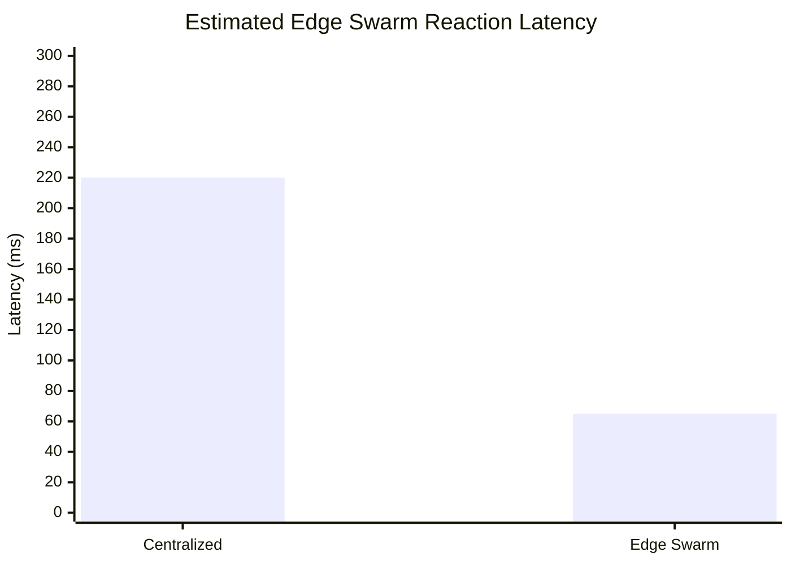
```mermaid
xychart-beta
    title "Estimated Edge Swarm Reaction Latency"
    x-axis ["Centralized", "Edge Swarm"]
    y-axis "Latency (ms)" 0 --> 300
    bar [220, 65]
```

### Estimated Peer Synchronization Latency

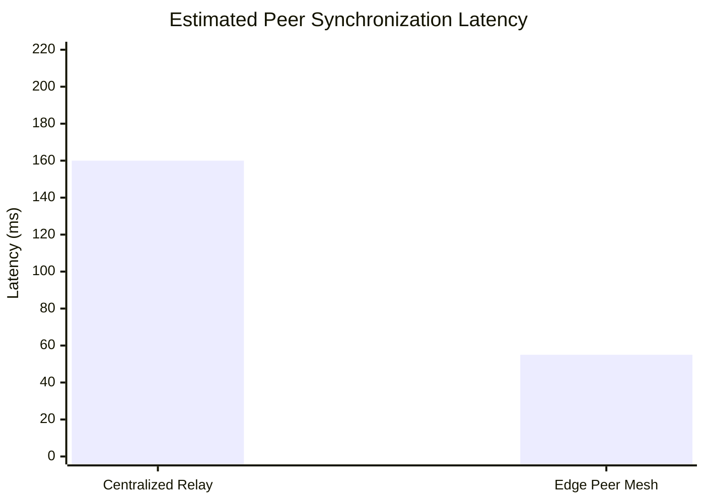
```mermaid
xychart-beta
    title "Estimated Peer Synchronization Latency"
    x-axis ["Centralized Relay", "Edge Peer Mesh"]
    y-axis "Latency (ms)" 0 --> 220
    bar [160, 55]
```

### Estimated Telemetry Bandwidth Demand

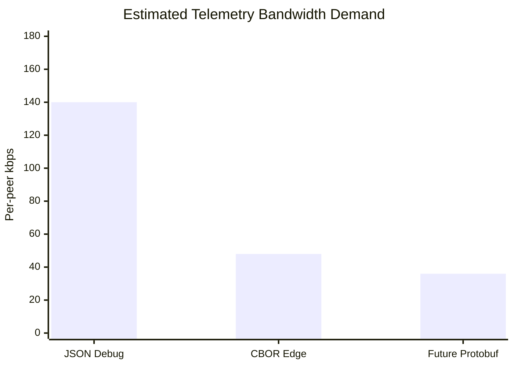
```mermaid
xychart-beta
    title "Estimated Telemetry Bandwidth Demand"
    x-axis ["JSON Debug", "CBOR Edge", "Future Protobuf"]
    y-axis "Per-peer kbps" 0 --> 180
    bar [140, 48, 36]
```

### Estimated Swarm Scaling Load

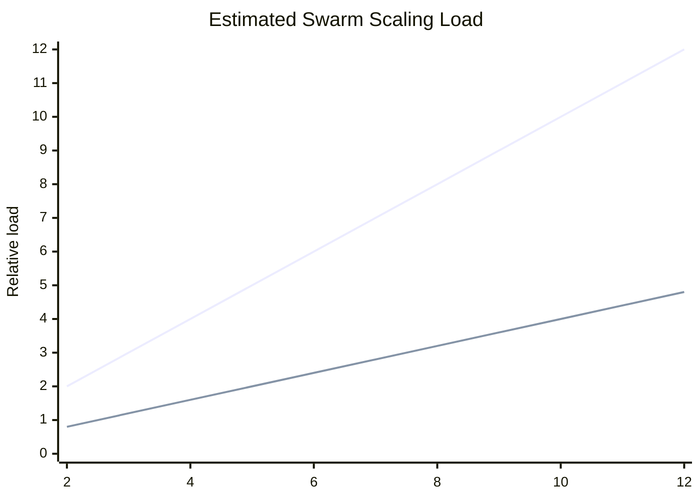
```mermaid
xychart-beta
    title "Estimated Swarm Scaling Load"
    x-axis ["2", "4", "6", "8", "10", "12"]
    y-axis "Relative load" 0 --> 12
    line "JSON debug digests" [2, 4, 6, 8, 10, 12]
    line "Binary edge digests" [0.8, 1.6, 2.4, 3.2, 4.0, 4.8]
```

### Future Real Benchmark Roadmap

Future HIL benchmarking should replace mock/model values with synchronized measurements:

- two-node bench packet latency with monotonic send/receive timestamps
- three-node stale-peer and recovery timing
- WiFi/RF congestion packet-loss characterization
- Jetson/Raspberry Pi thermal throttling and CPU saturation traces
- CBOR versus JSON encode/decode timing under onboard load
- emergency corridor propagation timing with backend disconnected
- tethered validation only after repeatable HIL pass criteria

---

## Complexity Analysis

Let:

- `p` = local sensor points/features
- `g` = occupancy grid cells
- `n` = cached peers
- `m` = peer digests per node
- `e` = bounded consensus records

| Operation | Complexity | Notes |
|---|---:|---|
| Local inference/front-end perception | `O(p)` plus neural inference cost | Model runtime depends on detector backend |
| Obstacle fusion | `O(g)` full grid or `O(p)` sparse insertion | LiDAR scan density dominates |
| Peer cache merge | `O(n * m)` | Bounded by configured cache limits |
| Consensus merge | `O(e)` or `O(n)` current epoch | Consensus remains advisory |
| Stale-peer filtering | `O(n)` | Required before safety-critical peer use |
| Swarm synchronization | `O(n)` one-hop, higher with relays | Mesh topology dependent |
| Edge packet verification | `O(1)` per packet plus signature cost | PQC signatures are proposed future work |
| Partition merge | `O(n log n)` if sorted, `O(n)` single-pass | Used for split-swarm healing |

Bounded caches are a core design requirement. Without bounded peer and digest histories, recovery after partition healing can create unbounded CPU and bandwidth load at the worst possible time.

---

## Edge AI Workflow

The edge AI workflow is local-first and confidence-aware:

1. Local frame or fused perception slice is captured.
2. Onboard detector/tracker extracts local awareness.
3. LiDAR and range sensors contribute obstacle cues.
4. Semantic digests are generated instead of raw streams.
5. Confidence is assigned based on detection score, localization confidence, freshness, and local map agreement.
6. Digests are published to peers at adaptive rates.
7. Remote digests are decayed by age, hop count, trust epoch, and disagreement with local sensing.
8. Safety manager gates any command before actuation.

### Distributed awareness

Peer awareness is used for:

- obstacle anticipation
- formation spacing
- leader continuity hints
- emergency corridor reservation
- degraded mesh visibility

It is not used as an unconditional truth source. Peer intelligence is advisory unless fresh, trusted, and consistent with local sensing.

### Degraded operation

Under degraded network or backend loss:

- continue local autonomy
- reduce background telemetry
- maintain heartbeat and emergency packets
- exclude stale peers from consensus
- widen separation assumptions
- prefer safe corridor behavior over mission optimality

---

## Security Model

### Implemented now

The repository includes security-oriented runtime and telemetry components:

- secure swarm transport helpers
- replay rejection concepts and tests in swarm security
- trust epoch propagation in telemetry
- Go backend device/operator authorization support
- TLS/mTLS support paths
- signed firmware manifest validation
- rollback counter and firmware trust telemetry
- dashboard-visible security state
- stale-peer rejection in edge peer cache

### Proposed future work

The edge peer protocol currently contains an `auth_hook` placeholder. Production-grade peer packet signing is not yet implemented in the edge packet layer.

Future roadmap:

- explicit packet hash and signature fields
- replay nonce bound to sender and trust epoch
- trust revocation and epoch rotation
- hybrid classical + post-quantum transition
- CRYSTALS-Kyber / ML-KEM for key establishment
- Dilithium / ML-DSA-style signatures for packet authentication
- selective full signing for emergency, consensus, and trust-transition packets

### Edge packet validation and serialization

The peer packet layer supports:

- `json` for readable debug and development transport
- `cbor` as the first production-oriented binary serialization prototype
- `protobuf_placeholder` as a reserved future schema-driven transport

Current packet validation rejects malformed packets, expired packets, unknown packet types, stale sequence numbers, oversized packets, invalid emergency corridors, and non-finite pose vectors. CBOR packets are decoded through a deterministic fixed-shape array model and then pass through the same validation/cache path as JSON.

Serialization visibility is exposed through telemetry fields:

- `edge_serialization_mode`
- `edge_average_packet_size_bytes`
- `edge_bandwidth_savings_estimate_pct`
- `edge_packet_encode_latency_us`

These metrics are local software/runtime telemetry. They are not RF throughput proof.

### Trust epoch model

`trust_epoch` represents security freshness. A peer packet should be considered stale or degraded when:

- the peer epoch is older than the local accepted epoch
- revocation state changed
- replay suspicion was detected
- command trust state changed

The proposed PQC roadmap is relevant for long-lifecycle robotics infrastructure, but it is not claimed as implemented operational cryptography in this repository.

---

## Edge Failsafe System

The failsafe system is local-authority first.

### Core behavior

- local safety override has highest priority
- emergency landing does not require backend permission
- disconnected operation remains possible when local sensing is healthy
- stale peers are excluded from safety-critical decisions
- consensus cannot force an unsafe command
- split-swarm operation is operator-visible and degraded

### Partition Merge Procedure

```text
procedure PartitionMerge(P_local, P_remote):
    A = FilterFreshTrustCompatible(P_local.peers)
    B = FilterFreshTrustCompatible(P_remote.peers)

    if Size(B) == 0:
        return LocalOnlyDegraded

    if TrustEpochMismatch(P_local.E_t, P_remote.E_t):
        return EpochIsolation

    if not QuorumValid(B):
        return RejectRemoteLeader

    candidates = {P_local.leader, P_remote.leader}
    L_star = ArgMax(candidates, LeaderScore)

    E_c_star = max(P_local.E_c, P_remote.E_c) + 1
    M_s_star = ReconcileMissionState(P_local.M_s, P_remote.M_s)
    O_star = MergeFreshObstacleDigests(P_local.obstacles, P_remote.obstacles)

    return MergedPartition(L_star, E_c_star, M_s_star, O_star)
```

Leader preference is deterministic:

1. highest valid trust epoch
2. highest quorum health
3. longest stable uptime
4. lowest fault score
5. deterministic node ID fallback

### Byzantine fault-tolerant concepts

The repository does not claim a validated BFT implementation. The architecture adopts BFT-inspired recovery concepts:

- malicious or stale peer rejection
- quorum validation
- epoch mismatch isolation
- consensus timeout fallback
- deterministic leader conflict resolution

Again: local collision avoidance and emergency descent bypass consensus.

---

## Dashboard

The PySide6 dashboard provides operator-facing visibility for local and fleet operation.

Capabilities include:

- edge swarm telemetry display
- topology and peer health visibility
- stale peer count and peer count display
- localization source and confidence display
- runtime mode banners
- simulation/production backend truthfulness
- mission and command workflows
- replay and backend status visibility
- sensor telemetry panels for camera, IMU, LiDAR, TDOA, and replay state
- edge serialization visibility for JSON/CBOR mode, packet size, estimated savings, and encode latency
- safety-state and security-state visibility for operator review

The dashboard is an operations and research visualization tool. It is not a flight certification interface.

---

## Runtime Modes

| Mode | Purpose | Allowed data behavior | Validation meaning |
|---|---|---|---|
| `simulation` | UI, digital twin, algorithm bring-up | synthetic/demo data allowed | not real-world proof |
| `bench` | local hardware and replay-assisted validation | live sensors preferred, replay may support testing | bench-level evidence only |
| `production` | live-sensor runtime with stricter validation | live sources required for safety-critical paths | not flight proof by itself |
| `edge_swarm` | distributed local autonomy with peer mesh | live sensors plus peer exchange | architecture/software readiness only |

`edge_swarm` is stricter than `bench`: no hidden simulation fallback should influence safety-critical behavior.

---

## Validation Status

| Validation item | Status | Evidence level |
|---|---|---|
| Python syntax and dashboard unit tests | Passing in local validation flow | software validation |
| Go tests | Passing in local validation flow | backend validation |
| C++ tests | Passing in local validation flow | unit/integration validation |
| Edge swarm protocol tests | Passing in local validation flow | protocol/cache/consensus validation |
| Telemetry smoke tests | Available via scripts | backend/dashboard schema validation |
| Production telemetry smoke tests | Available via scripts | production-mode backend behavior |
| HIL validation | Planned | not complete |
| Real hardware swarm validation | Not complete | no claim |
| Tethered flight validation | Not complete | no claim |
| Free flight validation | Not complete | no claim |

**Current verdict: NOT FLIGHT READY.**

The local validation command currently exercises Python, Go, CMake configure/build, and CTest:

```powershell
python scripts/local_validate.py --toolchain "$env:VCPKG_ROOT\scripts\buildsystems\vcpkg.cmake"
```

---

## Hardware Roadmap

Recommended future hardware validation stack:

- Jetson Nano or Jetson Orin for onboard inference and fusion
- Raspberry Pi class companion computer for lower-cost reduced workloads
- calibrated IMU
- camera module with known frame timing
- LiDAR with scan timestamping
- UWB anchors and TDOA-capable radios
- mesh radios or WiFi testbed with controllable congestion
- synchronized logging infrastructure
- current-limited power bench
- propeller-off HIL rig
- tethered validation fixture

Platform-specific risks:

- Jetson Nano thermal throttling
- Raspberry Pi CPU saturation
- camera frame drops
- LiDAR scan delay
- clock skew and synchronization drift
- WiFi packet loss and hidden-node congestion

---

## HIL and Bench Test Plan

Required staged plan:

1. **Two-node bench packet test**  
   Validate heartbeat, pose, edge health, obstacle digest, and consensus state exchange.

2. **Three-node degraded mesh test**  
   Drop one node or impair link quality; verify stale-peer exclusion and peer cache expiry.

3. **Backend disconnect test**  
   Run `edge_swarm` without backend availability; verify disconnected operation and local autonomy.

4. **Emergency corridor test**  
   Trigger an emergency corridor packet and verify peers treat it as high priority without waiting for consensus.

5. **Thermal throttling test**  
   Run long-duration Jetson/Raspberry Pi workloads and log clocks, CPU/GPU load, and inference latency.

6. **WiFi congestion and packet loss test**  
   Inject packet loss and bandwidth contention; measure stale-peer transitions, recovery time, and packet jitter.

7. **Synchronization drift test**  
   Introduce clock skew and verify TTL, trust epoch, and stale-packet rejection behavior.

Measurement equations:

```text
L_packet = t_receive - t_send
L_pipeline = t_decision - t_sensor_capture
skew_peer = t_peer_clock - t_local_clock
loss_rate = dropped_packets / expected_packets
B_observed ~= sum(packet_size_i) / measurement_window
```

---

## Research Contribution

This project contributes an integrated architecture for GPS-denied UAV swarms that combines:

- edge-supervised autonomy
- confidence-aware peer intelligence
- explicit simulation/bench/production/edge runtime separation
- distributed GPS-denied operation
- resilient autonomy under backend loss
- split-swarm recovery and deterministic leader conflict resolution
- secure telemetry and trust epoch propagation
- dashboard-visible truthfulness around data source and validation state

Its academic novelty lies in combining practical flight-stack concerns with distributed systems concepts: bounded peer caches, advisory consensus, confidence decay, trust epochs, partition healing, and edge AI digest sharing.

---

## Limitations

This section is intentionally blunt.

- No real flight validation is claimed.
- No free-flight readiness is claimed.
- No production radio validation is claimed.
- No full hardware swarm validation is claimed.
- HIL validation is planned but incomplete.
- Current edge peer serialization keeps JSON for debug readability and includes a CBOR software prototype.
- Protobuf transport is a roadmap item; CBOR is not yet production-radio or flight validated.
- PQC peer authentication is a roadmap item, not operational implementation.
- BFT recovery is architecture-level design, not a validated consensus protocol.
- Simulation and playback must not be used as evidence of real-world autonomy performance.
- Bench-demo validation proves software health, not flight safety.

---

## Future Work

Planned research and engineering directions:

- HIL validation of CBOR edge packet transport
- protobuf binary edge packet transport
- adaptive serialization benchmarks
- real packet signing and explicit replay nonce fields
- post-quantum authentication experiments
- HIL swarm validation
- multi-drone bench and tethered tests
- autonomous formation control under degraded links
- adaptive distributed mapping
- learned obstacle digest compression
- calibrated UWB/TDOA anchor deployment
- production radio testing
- formal safety invariant verification

---

## Installation and Build

### Prerequisites

Verified on 2026-07-14:

- Windows 11 + Visual Studio 17 2022 + MSVC x64
- CMake 4.4.0
- Go 1.26.4
- Python 3.14.5
- `vcpkg` manifest mode with `VCPKG_ROOT` set

Supported but not fully verified in this phase:

- Linux GCC and Clang via `CMakePresets.json`
- Linux sanitizer presets for GCC/Clang

Blocked in this phase:

- Linux runtime validation in WSL Ubuntu because `cmake` was not installed in the Linux environment on 2026-07-14

Required native dependencies:

- `Eigen3`
- `OpenCV`
- `PCL`
- `spdlog`

Optional native dependencies:

- `pybind11` for `drone_bridge`
- `Fast-DDS` for native DDS transport
- `TensorRT` for GPU inference

Python dashboard dependencies are listed in `requirements.txt`.

### Windows vcpkg setup

```powershell
git clone https://github.com/microsoft/vcpkg $env:USERPROFILE\vcpkg
$env:VCPKG_ROOT="$env:USERPROFILE\vcpkg"
& "$env:VCPKG_ROOT\bootstrap-vcpkg.bat"
```

The Phase 2 presets use manifest mode automatically. Do not pre-install individual packages unless you are intentionally warming the cache.

### Windows configure, build, and test

Verified commands:

```powershell
cmake --preset windows-msvc-release
cmake --build --preset windows-msvc-release
ctest --preset windows-msvc-release

cmake --preset windows-msvc-debug
cmake --build --preset windows-msvc-debug
ctest --preset windows-msvc-debug
```

Observed results on 2026-07-14:

- Release: `112/112` CTest PASS
- Debug: `112/112` CTest PASS

### Optional feature presets

Available tracked presets include:

- `windows-msvc-release`
- `windows-msvc-debug`
- `validation-msvc`
- `windows-msvc-release-werror`
- `windows-msvc-release-minimal`
- `windows-msvc-release-full`
- `linux-gcc-debug`
- `linux-gcc-release`
- `validation-linux-gcc`
- `linux-clang-debug`
- `linux-clang-release`
- `linux-gcc-asan-ubsan`
- `linux-clang-asan-ubsan`
- `linux-gcc-release-werror`
- `linux-gcc-release-minimal`

Behavior notes:

- `pybind11`: package config first, then FetchContent fallback
- `Fast-DDS`: optional, prints explicit fallback status
- `TensorRT`: optional, disabled by default
- `windows-msvc-release-minimal`: disables Python bindings
- `windows-msvc-release-full`: enables the `fastdds` manifest feature

### One-command local validation

```powershell
$env:VCPKG_ROOT="$env:USERPROFILE\vcpkg"
python scripts/local_validate.py
```

Verified result on 2026-07-14:

- Python syntax: PASS
- Python unit tests: `12/12` PASS
- Go tests: PASS
- Native preset `validation-msvc`: `112/112` CTest PASS

`scripts/local_validate.py` now auto-discovers `vcpkg` from `VCPKG_ROOT`, `PATH`, or `%USERPROFILE%\vcpkg` on Windows.

### Linux presets

Documented commands:

```bash
cmake --preset linux-gcc-release
cmake --build --preset linux-gcc-release
ctest --preset linux-gcc-release

cmake --preset linux-clang-release
cmake --build --preset linux-clang-release
ctest --preset linux-clang-release
```

Status on 2026-07-14:

- `SUPPORTED BUT NOT VERIFIED`
- WSL Ubuntu existed, but `cmake` was missing, so Linux runtime validation stayed blocked

### Installation

Verified command:

```powershell
cmake --install build\windows-msvc-release --config Release --prefix build\install-check
```

The install tree now contains:

- `bin/drone_node.exe`
- `lib/sensor_fusion_core.lib`
- `lib/drone_bridge.cp314-win_amd64.pyd`
- public headers, including vendored `sha3.h` and `monocypher.h`
- example config JSON files
- `LICENSE`, `NOTICE`, `README.md`, `DEPLOYMENT.md`
- exported CMake package files under `lib/cmake/DroneSwarmSensorFusion`

### Go backend startup

Production-like backend mode:

```powershell
$env:DRONE_BACKEND_MODE="production"
$env:DRONE_BACKEND_SIMULATION_ENABLED="false"
go run ./cmd/control-plane
```

### Dashboard startup

```powershell
python gui/dashboard.py --backend-url http://127.0.0.1:8080
```

Local dashboard mode:

```powershell
python gui/dashboard.py
```

### Configuration source of truth

Active default runtime configuration is loaded from:

- `config/runtime.json`
- `config/anchors.json`
- `config/lidar.json`
- `config/detector_labels.json`
- `config/swarm_edge_protocol.json`

Safe non-production templates are provided at:

- `config/runtime.example.json`
- `config/anchors.example.json`
- `config/lidar.example.json`
- `config/detector_labels.example.json`
- `config/swarm_edge_protocol.example.json`

Use the example files as starting points only. Review and replace every value for your own environment before bench or production use.

### Telemetry smoke tests

In one terminal:

```powershell
$env:DRONE_BACKEND_MODE="production"
$env:DRONE_BACKEND_SIMULATION_ENABLED="false"
go run ./cmd/control-plane
```

In another terminal:

```powershell
python scripts/telemetry_smoke_test.py --backend-url http://127.0.0.1:8080
python scripts/production_telemetry_smoke_test.py --backend-url http://127.0.0.1:8080
```

### C++ drone node

Example only; real hardware endpoints must match your bench setup:

```powershell
build-local-validate\Release\drone_node.exe --id=1 --esp32=192.168.4.1 --lidar=192.168.1.201:2368
```

Do not use this for flight without a validated hardware safety plan.

### Edge serialization mode

The edge peer protocol can run in JSON debug mode or CBOR binary mode:

```powershell
$env:DRONE_EDGE_SERIALIZATION_MODE="cbor"
build-local-validate\Release\drone_node.exe --id=1 --edge-serialization=cbor
```

The protocol configuration files are:

- `config/swarm_edge_protocol.json`
- `config/swarm_edge_protocol.example.json`

Supported values:

- `json`
- `cbor`
- `protobuf_placeholder`

`protobuf_placeholder` is reserved for future schema work and currently falls back to JSON compatibility.

---

## Repository Map

```text
cmd/control-plane/              Go backend entrypoint
internal/controlplane/          Go fleet state, server, security, API tests
gui/dashboard.py                PySide6 operational dashboard
gui/backend_status.py           Backend/runtime status helpers
include/                        C++ public headers
src/                            C++ implementation
src/swarm/                      V2X, security, edge peer protocol, cache, consensus
src/vio/                        VIO and EKF components
src/localization/               TDOA/UWB and localization fusion
src/sensors/                    Camera, LiDAR, IMU, range sensors
src/autonomy/                   Decision engine and experience memory
src/safety/                     Safety manager
tests/                          C++ and Python tests
scripts/local_validate.py       Python + Go + CMake + CTest validation
scripts/telemetry_smoke_test.py Backend telemetry smoke test
docs/                           Architecture, HIL, safety, edge swarm research notes
config/                         Runtime, anchors, labels, edge protocol configuration
```

---

## Expanded Repository Structure

```text
drone_swarm/
├── src/                         C++ implementation for onboard node, sensors, fusion, swarm, telemetry
│   ├── autonomy/                Mission decision logic and experience memory
│   ├── localization/            TDOA, UWB, time synchronization, localization fusion
│   ├── safety/                  Safety manager and failsafe policy implementation
│   ├── sensors/                 Camera, IMU, LiDAR, rangefinder, motor, thermal sensor drivers
│   ├── slam/                    Keyframe, map, occupancy, and planning components
│   ├── swarm/                   V2X mesh, edge peer protocol, consensus, state cache, swarm security
│   ├── telemetry/               Control-plane telemetry client
│   └── vio/                     EKF and VIO pipeline implementation
├── include/                     Public C++ headers matching the major runtime modules
│   ├── autonomy/                Decision engine and memory interfaces
│   ├── localization/            Localization and time-sync interfaces
│   ├── safety/                  Safety context/result interfaces
│   ├── security/                Command policy, drone security, firmware trust
│   ├── sensors/                 Sensor base classes and sensor telemetry contracts
│   ├── swarm/                   Edge peer protocol, V2X mesh, consensus, cache
│   ├── telemetry/               Telemetry snapshot/client interface
│   └── vio/                     EKF and VIO pipeline interfaces
├── gui/                         Python/PySide6 dashboard and backend-status helpers
├── internal/controlplane/       Go control-plane backend types, handlers, telemetry state
├── tests/                       C++, Go, and Python validation entry points
├── config/                      Runtime, detector, LiDAR, anchor, and swarm protocol examples
├── docs/                        Architecture, HIL, safety, edge swarm, benchmark, and research notes
├── docs/assets/                 README image placeholders and future generated documentation visuals
├── docs/benchmarks/             Mock/model benchmark data and future HIL benchmark artifacts
├── scripts/                     Local validation, smoke tests, and development utilities
├── telemetry/                   Telemetry-related schemas/assets when separated from source
└── third_party/                 Vendored crypto/support code used by the build
```

| Area | Primary paths | Purpose |
|---|---|---|
| Onboard autonomy | `src/main.cpp`, `src/autonomy/`, `include/autonomy/` | Node orchestration and local mission behavior |
| Sensors | `src/sensors/`, `include/sensors/` | Camera, IMU, LiDAR, range, motor, thermal acquisition |
| Localization | `src/localization/`, `src/vio/`, `include/vio/` | VIO/EKF, TDOA, time sync, confidence estimation |
| Swarm | `src/swarm/`, `include/swarm/` | V2X mesh, edge packets, CBOR/JSON serialization, consensus |
| Safety | `src/safety/`, `include/safety/` | Local safety authority and failsafe behavior |
| Security | `src/swarm/SwarmSecurity.cpp`, `include/security/` | Command policy, trust state, replay/stale rejection hooks |
| Backend | `internal/controlplane/` | Go telemetry/control plane |
| Dashboard | `gui/` | PySide6 operator visualization, replay, topology, mission pages |
| Tests | `tests/` | CTest, Go tests, Python dashboard/backend tests |

---

## Related Documentation

- [Edge Swarm Architecture](docs/EDGE_SWARM_ARCHITECTURE.md)
- [Edge Node Pipeline](docs/EDGE_NODE_PIPELINE.md)
- [Edge AI Workflow](docs/EDGE_AI_WORKFLOW.md)
- [Edge Failsafe Strategy](docs/EDGE_FAILSAFE_STRATEGY.md)
- [Edge Peer Packet Protocol](docs/EDGE_PEER_PACKET_PROTOCOL.md)
- [Edge Swarm HIL Test Plan](docs/EDGE_SWARM_HIL_TEST_PLAN.md)
- [Swarm Latency Optimization](docs/SWARM_LATENCY_OPTIMIZATION.md)
- [Edge Swarm Performance Estimate](docs/EDGE_SWARM_PERFORMANCE_ESTIMATE.md)
- [Dashboard Sensor Telemetry Schema](docs/DASHBOARD_SENSOR_TELEMETRY_SCHEMA.md)
- [Local Build and Bench Demo Guide](docs/LOCAL_BUILD_AND_BENCH_DEMO_GUIDE.md)
- [Security Implementation](SECURITY_IMPLEMENTATION.md)
- [Edge Swarm Research Notes](docs/EDGE_SWARM_RESEARCH_NOTES.md)
- [Benchmark Mock Data](docs/benchmarks/edge_swarm_benchmark_mock_data.json)
- [Documentation Visual Assets](docs/assets/README.md)

## License

This repository is licensed under the [Apache License 2.0](LICENSE).

Copyright 2026 Md Shahanur Islam Shagor.

Repository dependencies, vendored third-party components, and external tools remain governed by their respective licenses.

---

## Final Readiness Statement

This repository is a serious autonomy research and engineering platform. It contains real software for estimation, autonomy, swarm communication, backend telemetry, dashboard visualization, security-state propagation, and edge peer packet validation.

It is also deliberately honest:

```text
bench-demo software stack: ready
local validation: passing
edge_swarm architecture: implemented at protocol/cache/consensus visibility level
HIL validation: pending
tethered validation: pending
free flight validation: not complete
flight readiness: NOT READY
```

The intended next step is disciplined HIL validation, followed by tethered and flight-adjacent testing only after hardware timing, radio behavior, sensor stability, and safety invariants are demonstrated under controlled conditions.
