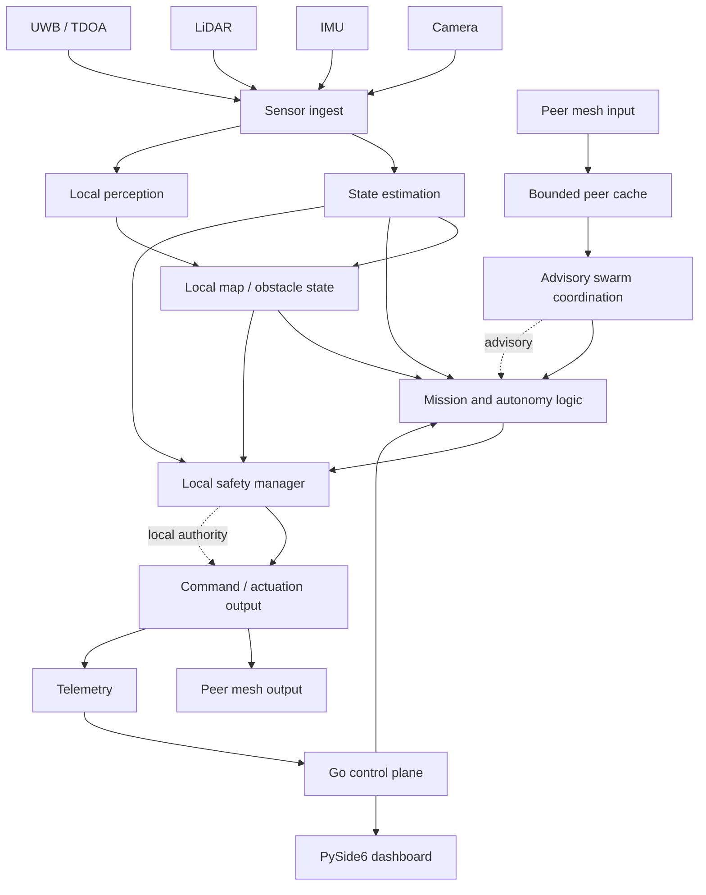
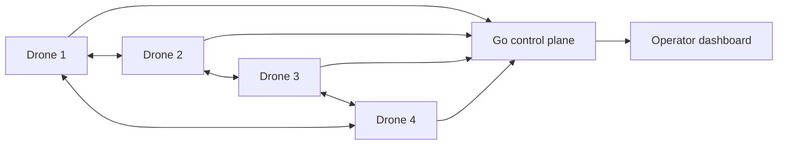

RESEARCH STATUS:
READY FOR SCIENTIFIC REPLICATION

PROJECT STATUS:
READY

PRODUCTION STATUS:
PRODUCTION-GRADE SOFTWARE ARCHITECTURE

ARTIFACT STATUS:
DOI ARCHIVED

REPLICATION STATUS:
READY

AUTONOMY STATUS:
SOFTWARE VALIDATED

HARDWARE STATUS:
PHYSICAL FLIGHT VALIDATION REQUIRED

SOFTWARE PRODUCTION READINESS:
PASS

RESEARCH REPRODUCIBILITY:
PASS

PHYSICAL DEPLOYMENT READINESS:
PENDING HARDWARE VALIDATION

PHYSICAL DEPLOYMENT:
REQUIRES HARDWARE VALIDATION

```

---

## 22 Stage Development Timeline

### Stage 1 — Foundation & Repository Hygiene

Objective:
Establish repository hygiene, baseline validation, and dependency visibility.

Work:
- repository cleanup
- dependency and build artifact audit
- documentation and licensing baseline

Validation:
- clean configure/build/test path
- dependency audit
- workstation evidence capture

Report:
[docs/foundation-repository-hygiene/FINAL_REPORT.md](docs/foundation-repository-hygiene/FINAL_REPORT.md)

Status:
COMPLETE

### Stage 2 — Build System, Dependencies & Cross-Platform Validation

Objective:
Harden build, install, and preset-based cross-platform validation.

Work:
- CMake preset matrix
- dependency management with `vcpkg`
- installation and reproducibility validation

Validation:
- Windows and Linux build-path evidence
- sanitizer-oriented validation
- install validation

Report:
[docs/build-system-cross-platform-validation/FINAL_REPORT.md](docs/build-system-cross-platform-validation/FINAL_REPORT.md)

Status:
COMPLETE

### Stage 3 — CI/CD & Control-Plane Orchestration Documentation

Objective:
Document the workflow and CI/CD layer that supports the control-plane lifecycle.

Work:
- CI workflow mapping
- release and security workflow indexing
- control-plane workflow evidence closure

Validation:
- workflow coverage review
- mixed-language CI/CD evidence mapping

Report:
[docs/ci-cd-control-plane-orchestration/CICD_REPORT.md](docs/ci-cd-control-plane-orchestration/CICD_REPORT.md)

Status:
COMPLETE

### Stage 4 — Architecture, Safety & Software Validation Hardening

Objective:
Strengthen architecture review, safety evidence, sanitizers, and software validation.

Work:
- architecture review
- sanitizer and Valgrind evidence
- race and memory analysis
- benchmark and reproducibility capture

Validation:
- ASan, UBSan, TSan, Valgrind
- native, Python, and Go tests
- software research validation

Report:
[docs/architecture-safety-validation-hardening/FINAL_REPORT.md](docs/architecture-safety-validation-hardening/FINAL_REPORT.md)

Status:
COMPLETE

### Stage 5 — Production Readiness, Deployment & Reproducibility Foundations

Objective:
Package the platform for production-oriented software use without reopening core runtime design.

Work:
- deployment architecture review
- Docker and runtime validation
- observability and reproducibility documentation

Validation:
- deployment smoke paths
- release workflow review
- runtime and reproducibility evidence

Report:
[docs/production-readiness-deployment-reproducibility/FINAL_REPORT.md](docs/production-readiness-deployment-reproducibility/FINAL_REPORT.md)

Status:
COMPLETE

### Stage 6 — Performance Engineering & Stability Validation

Objective:
Measure latency, throughput, stability, and profiling evidence.

Work:
- benchmark suite
- stress and soak coverage
- CPU and memory profiling
- latency and TSan root-cause documentation

Validation:
- backend performance reruns
- stress metrics
- soak and profiling artifacts

Report:
[docs/performance-engineering-stability-validation/FINAL_REPORT.md](docs/performance-engineering-stability-validation/FINAL_REPORT.md)

Status:
COMPLETE

### Stage 7 — Research Validation, Software HIL & Scenario Framework

Objective:
Create deterministic research validation and software HIL evidence.

Work:
- mission scenarios
- software HIL harness
- simulator abstraction
- failure injection and regression comparison

Validation:
- scenario reruns
- software HIL and simulation artifacts
- safety and observability evidence

Report:
[docs/research-validation-software-hil-scenarios/FINAL_REPORT.md](docs/research-validation-software-hil-scenarios/FINAL_REPORT.md)

Status:
COMPLETE

### Stage 8 — Open Research Release & Advanced Scenario Evaluation

Objective:
Prepare the repository for open scientific use and advanced autonomy experimentation.

Work:
- advanced deterministic scenarios
- research paper outline
- dataset and methodology package
- community-facing documentation

Validation:
- advanced scenario rerun
- regression preservation
- benchmark comparison package

Report:
[docs/open-research-release-advanced-scenarios/FINAL_REPORT.md](docs/open-research-release-advanced-scenarios/FINAL_REPORT.md)

Status:
COMPLETE

### Stage 9 — AI Autonomy & Intelligent Decision Layer

Objective:
Add software-only AI autonomy, planning, swarm, and safety interfaces.

Work:
- perception pipeline
- mission planner
- swarm intelligence layer
- AI benchmark and safety package

Validation:
- perception validation
- planning validation
- swarm validation
- AI benchmark and safety reruns

Report:
[docs/ai-autonomy-intelligent-decision-layer/FINAL_REPORT.md](docs/ai-autonomy-intelligent-decision-layer/FINAL_REPORT.md)

Status:
COMPLETE

### Stage 10 — Enterprise Deployment, Security & Production Readiness

Objective:
Deliver enterprise-grade software deployment, monitoring, security, and operations assets.

Work:
- production Docker and Compose stack
- Kubernetes manifests
- monitoring, security, reliability, and disaster-recovery assets

Validation:
- deployment validation
- monitoring and security evidence
- scalability and reliability checks

Report:
[docs/enterprise-deployment-security-readiness/FINAL_REPORT.md](docs/enterprise-deployment-security-readiness/FINAL_REPORT.md)

Status:
COMPLETE

### Stage 11 — Multi-Agent AI, Reinforcement Learning & Digital Twin

Objective:
Extend the platform with multi-agent coordination, RL abstraction, world modeling, XAI, and digital twin support.

Work:
- multi-agent framework
- RL interfaces
- digital twin and world model
- XAI and AI evaluation package

Validation:
- Stage 11 script reruns
- AI evaluation and benchmark artifacts

Report:
[docs/multi-agent-ai-rl-digital-twin/FINAL_REPORT.md](docs/multi-agent-ai-rl-digital-twin/FINAL_REPORT.md)

Status:
COMPLETE

### Stage 12 — Scientific Publication & Artifact Evaluation

Objective:
Prepare the software artifact for publication-oriented replication, citation, and open-science packaging.

Work:
- IEEE/ACM outline package
- artifact evaluation package
- replication package
- DOI integration

Validation:
- repository reproducibility validation
- citation consistency validation
- artifact package validation

Report:
[docs/scientific-publication-artifact-evaluation/FINAL_REPORT.md](docs/scientific-publication-artifact-evaluation/FINAL_REPORT.md)

Status:
COMPLETE

### Stage 13 — Final System Maturity, Production Readiness & Research Certification

Objective:
Finalize readiness classification, lifecycle indexing, final maturity presentation, and integrated architecture review.

Work:
- lifecycle index
- final architecture review
- final quality audit
- system readiness classification

Validation:
- core regression checks
- representative Stage 6-12 validation reruns
- README and artifact package integration checks

Report:
[docs/final-system-maturity-readiness-certification/FINAL_REPORT.md](docs/final-system-maturity-readiness-certification/FINAL_REPORT.md)

Status:
COMPLETE

### Stage 14 — External Validation, Benchmarking & Industry Readiness

Objective:
Package the repository for external software review, benchmark methodology discussion, engineering maturity scoring, and industry-facing readiness communication.

Work:
- external validation package
- benchmark framework and performance baseline summary
- engineering scorecard and community readiness package
- final audit and external-facing presentation assets

Validation:
- Stage 6-13 evidence cross-check
- Go, Python, native, and config validation reruns
- documentation consistency audit

Report:
[docs/external-validation-benchmarking-industry-readiness/FINAL_REPORT.md](docs/external-validation-benchmarking-industry-readiness/FINAL_REPORT.md)

Status:
COMPLETE

### Stage 15 — Estimator Safety Hardening & Deterministic Replay Baseline

Objective:
Harden the native EKF update path with transactional safety checks, deterministic replay, and regression-grade validation.

Work:
- estimator validation config and fail-closed runtime wiring
- timestamp-validating IMU ingestion path
- transactional propagation and correction commit behavior
- Joseph-form covariance correction flow
- deterministic replay executable and expanded EKF regression coverage

Validation:
- EKF unit tests
- deterministic replay
- long-duration replay stability
- formatting and static-analysis checks

Report:
[docs/estimator-safety-deterministic-replay-baseline/FINAL_REPORT.md](docs/estimator-safety-deterministic-replay-baseline/FINAL_REPORT.md)

Status:
COMPLETE

### Stage 16 — Shadow Estimator Architecture & Native Replay Validation

Objective:
Introduce active/shadow estimator architecture without changing active estimator authority.

Work:
- `StateEstimator` abstraction and adapter layering
- `EstimatorCoordinator` worker and isolation flow
- measurement envelope and adapter integration
- native replay workflow and long-duration shadow replay
- shadow-only validation and evidence closure

Validation:
- Stage 16 unit suite
- shadow replay and determinism
- active-output equivalence
- compiler, formatting, and sanitizer lanes

Report:
[docs/shadow-estimator-native-replay-validation/FINAL_REPORT.md](docs/shadow-estimator-native-replay-validation/FINAL_REPORT.md)

Status:
COMPLETE

### Stage 17 — ESKF Mathematical Hardening & Shadow Validation

Objective:
Harden the error-state estimator mathematics while preserving shadow-only execution and active-estimator authority.

Work:
- nominal/error-state convention verification
- hardened IMU propagation and process-noise discretization
- safe error-state injection and reset Jacobian handling
- shadow-only Stage 17 integration through `EstimatorCoordinator`
- native Linux TSan validation and evidence closure

Validation:
- Stage 17 unit and replay suites
- deterministic long-duration shadow replay
- active-output equivalence
- native Linux TSan, compiler, formatting, and static-analysis checks

Report:
[docs/eskf-mathematical-hardening-shadow-validation/FINAL_REPORT.md](docs/eskf-mathematical-hardening-shadow-validation/FINAL_REPORT.md)

Status:
COMPLETE

### Stage 18 — Stationary Detection & ZUPT Shadow Validation

Objective:
Add explicit stationary detection and automatic zero-velocity updates to the shadow ESKF while preserving active-estimator authority.

Work:
- IMU-only stationary detector with hysteresis
- configurable detector thresholds, windowing, and minimum stationary duration
- shadow-only automatic ZUPT integration
- replay and documentation evidence closure

Validation:
- Phase 18 unit and replay suites
- active-output equivalence preservation
- compiler, formatting, static-analysis, and sanitizer lanes

Report:
[docs/stationary-detection-zupt-shadow-validation/FINAL_REPORT.md](docs/stationary-detection-zupt-shadow-validation/FINAL_REPORT.md)

Status:
COMPLETE

### Stage 19 — First-Estimate Jacobian Shadow Validation

Objective:
Add First-Estimate Jacobian support to the shadow ESKF while preserving nominal propagation, deterministic replay, and active-estimator authority.

Work:
- nested FEJ validation configuration
- deterministic FEJ snapshot storage and lifecycle management
- FEJ-aware measurement Jacobian evaluation in the shadow estimator
- replay, sanitizer, and documentation evidence closure

Validation:
- Phase 19 unit and replay suites
- deterministic replay and finite covariance checks
- compiler, formatting, static-analysis, and sanitizer lanes including project-owned race validation

Report:
[docs/first-estimate-jacobian-shadow-validation/FINAL_REPORT.md](docs/first-estimate-jacobian-shadow-validation/FINAL_REPORT.md)

Status:
COMPLETE

### Stage 20 — MSCKF Sliding-Window Shadow Validation

Objective:
Add a deterministic MSCKF camera-state sliding-window foundation to the shadow ESKF while preserving active-estimator authority.

Work:
- nested MSCKF validation configuration
- deterministic camera-state creation, lookup, and reset handling
- oldest-first deterministic eviction
- replay, sanitizer, and documentation evidence closure

Validation:
- Phase 20 unit and replay suites
- deterministic window lifecycle and finite covariance checks
- compiler, formatting, static-analysis, and sanitizer lanes including project-owned race validation

Report:
[docs/msckf-sliding-window-shadow-validation/FINAL_REPORT.md](docs/msckf-sliding-window-shadow-validation/FINAL_REPORT.md)

Status:
COMPLETE

### Stage 21 — Feature Triangulation & Geometric Initialization

Objective:
Add robust shadow-only feature triangulation and geometric landmark initialization on top of the MSCKF sliding window without changing active estimator authority.

Work:
- feature observation history and normalized bearing storage
- multi-view triangulation with minimum observation and baseline gating
- positive-depth and reprojection validation
- triangulation diagnostics and replay evidence closure

Validation:
- Phase 21 unit and replay suites
- deterministic replay and finite landmark checks
- compiler, formatting, static-analysis, and sanitizer lanes including project-owned race validation

Report:
[docs/feature-triangulation-geometric-initialization-shadow-validation/FINAL_REPORT.md](docs/feature-triangulation-geometric-initialization-shadow-validation/FINAL_REPORT.md)

Status:
COMPLETE

### Stage 22 — MSCKF Feature Constraint Update

Objective:
Add the first complete shadow-only MSCKF feature measurement update, including residual construction, null-space projection, residual stacking, and statistical gating, without changing active estimator authority.

Work:
- shadow-only residual and Jacobian construction over triangulated feature tracks
- FEJ-aware null-space projection and deterministic stacked measurement formation
- configurable chi-square and innovation-norm gating with transactional Joseph-form correction
- feature-update diagnostics, replay evidence, and regression validation closure

Validation:
- Phase 22 unit and replay suites
- Phase 15–21 regression and replay compatibility checks
- compiler, formatting, static-analysis, and sanitizer lanes including project-owned race validation

Report:
[docs/msckf-feature-constraint-update-shadow-validation/FINAL_REPORT.md](docs/msckf-feature-constraint-update-shadow-validation/FINAL_REPORT.md)

Status:
COMPLETE

---

## Architecture Overview

The final architecture has seven major layers:

- control plane: Go backend for telemetry, readiness, metrics, and supervision
- onboard autonomy: C++ runtime for sensing, fusion, mission logic, swarm logic, and safety
- AI autonomy layer: Stage 9 and Stage 11 software modules for perception, planning, swarm intelligence, RL abstraction, and XAI
- simulation layer: deterministic software HIL, scenario runners, fault injection, and digital twin
- research layer: datasets, experiments, reproducibility metadata, and publication packaging
- deployment layer: Docker, Compose, Kubernetes, monitoring, reliability, and disaster recovery
- documentation ecosystem: lifecycle reports, replication guides, DOI citations, and final maturity review

The full integrated review is documented in [docs/final-system-maturity-readiness-certification/FINAL_ARCHITECTURE_REVIEW.md](docs/final-system-maturity-readiness-certification/FINAL_ARCHITECTURE_REVIEW.md).

---

## Executive Summary

GPS-denied autonomy is a central problem in modern aerial robotics. Indoor, subterranean, urban-canyon, disaster-response, and contested electromagnetic environments can make GNSS unavailable, unreliable, or actively misleading. A UAV swarm operating in those conditions cannot depend on a single external positioning source or a backend control loop that must remain continuously reachable.

This platform explores a full-stack architecture for **edge-supervised autonomous UAV swarms**. Each drone runs an onboard C++ autonomy stack with VIO/EKF fusion, UWB/TDOA localization support, LiDAR-aware obstacle reasoning, local mission logic, and a safety manager. Swarm coordination is moved toward peer-to-peer edge communication: drones exchange compact digests, health states, consensus hints, confidence estimates, and emergency corridor reservations over a V2X-style mesh. The Go backend and PySide6 dashboard remain critical for operator visibility, audit, mission injection, and fleet-level supervision, but they are deliberately kept outside the hard real-time safety path.

Centralized drone orchestration is attractive because it simplifies mission control, logging, and operator interfaces. It is also fragile under degraded links: the round trip to a backend adds latency, packet loss can block coordinated action, and a central failure can affect the entire swarm. In contrast, **distributed autonomy** improves resilience by allowing each node to continue local navigation and safety behavior when backend connectivity is impaired. It also improves scalability when peer awareness is shared as compact summaries rather than raw sensor streams.

The research direction is not simply "share more data." Naive shared awareness can be unsafe: a stale or relayed peer detection should not be treated as a local fact. This platform therefore introduces documentation and software support for **confidence-aware edge intelligence**: peer information is aged, trust-epoch checked, stale-peer filtered, and fused as advisory context. Local collision avoidance and emergency descent always remain locally authoritative.

The result is a software platform that reads like an aerospace/autonomy research system and behaves like a production-oriented engineering stack:

- C++20 onboard autonomy and sensor fusion
- Go control-plane backend
- Python/PySide6 operational dashboard
- runtime separation across simulation, bench, production, and edge_swarm modes
- secure telemetry, trust epochs, replay-aware communication concepts
- edge peer packet protocol and state cache
- distributed consensus manager
- split-swarm recovery and failsafe architecture
- bench-demo/local validation pipeline

---

## System Overview

### Onboard autonomy

The onboard node is the real-time autonomy core. It owns local perception, state estimation, local obstacle reasoning, decision generation, and safety gating. It is implemented primarily in C++20 and organized around deterministic update loops where possible.

Core onboard capabilities include:

- visual-inertial odometry and EKF fusion
- UWB/TDOA localization support for GPS-denied ranging
- LiDAR obstacle awareness and occupancy-grid support
- autonomy decision engine
- local safety manager
- secure swarm message support
- edge peer packet exchange
- runtime telemetry publication
# GPS-Denied Autonomous UAV Swarm Platform

A research and engineering codebase for UAV navigation, local autonomy, and swarm coordination when GNSS is unavailable, degraded, or unreliable.

The platform combines a C++20 onboard runtime, a Go supervisory control plane, a Python/PySide6 operator dashboard, sensor-fusion and localization code, peer-to-peer swarm communication, replay and simulation tools, deployment assets, and experiment tooling in one repository.

[](https://github.com/smshagor-dev/UVA-GPS-Denied-Navigation-in-Dynamic-Environments/actions/workflows/ci.yml)
[](https://github.com/smshagor-dev/UVA-GPS-Denied-Navigation-in-Dynamic-Environments/actions/workflows/security.yml)
[](https://github.com/smshagor-dev/UVA-GPS-Denied-Navigation-in-Dynamic-Environments/actions/workflows/nightly.yml)

> **Safety note**
>
> This is research software, not a certified flight controller. The repository contains software tests, replay tooling, simulation support, bench-oriented workflows, and hardware-facing interfaces, but it does not claim completed free-flight validation, production-radio qualification, airworthiness approval, or regulatory certification. Hardware timing, sensor calibration, radio behavior, failsafe behavior, and physical flight safety must be validated independently before use on an aircraft.

## Contents

- [Why this project exists](#why-this-project-exists)
- [Architecture](#architecture)
- [Platform overview](#platform-overview)
- [Onboard autonomy](#onboard-autonomy)
- [Localization and state estimation](#localization-and-state-estimation)
- [UWB and TDOA localization](#uwb-and-tdoa-localization)
- [Perception and mapping](#perception-and-mapping)
- [Swarm networking and distributed coordination](#swarm-networking-and-distributed-coordination)
- [Safety and degraded operation](#safety-and-degraded-operation)
- [Control plane](#control-plane)
- [Operator dashboard](#operator-dashboard)
- [Runtime modes](#runtime-modes)
- [Security model](#security-model)
- [Mathematical models](#mathematical-models)
- [Performance model and benchmark planning](#performance-model-and-benchmark-planning)
- [Complexity notes](#complexity-notes)
- [Replay, simulation, and repeatability](#replay-simulation-and-repeatability)
- [Testing and validation](#testing-and-validation)
- [Hardware and HIL plan](#hardware-and-hil-plan)
- [Build and installation](#build-and-installation)
- [Running the backend and dashboard](#running-the-backend-and-dashboard)
- [Configuration](#configuration)
- [Repository layout](#repository-layout)
- [Research use and reproducibility](#research-use-and-reproducibility)
- [Research direction](#research-direction)
- [Current limitations](#current-limitations)
- [Roadmap](#roadmap)
- [Documentation](#documentation)
- [Citation](#citation)
- [Contributing](#contributing)
- [License](#license)

## Why this project exists

GPS-denied navigation appears in indoor environments, urban canyons, tunnels, disaster-response areas, industrial sites, and other places where GNSS is missing or unreliable. A single UAV can fall back to onboard estimation, but a swarm adds another problem: coordination should not collapse just because a backend link becomes slow or unavailable.

This project explores a local-first architecture. Each vehicle keeps state estimation, obstacle handling, mission decisions, and immediate safety onboard. Peer communication is used to exchange compact state and awareness summaries. The backend remains useful for supervision, mission management, logging, and fleet visibility, but it is deliberately kept outside the immediate safety loop.

The main engineering goals are:

- combine VIO/inertial estimation with UWB/TDOA and map-aware corrections;
- keep emergency and collision-related decisions local to the UAV;
- support peer-to-peer swarm state without streaming raw sensor data between every vehicle;
- reject stale or invalid peer state before it influences coordination;
- keep simulation, bench, and live-source behavior clearly separated;
- provide replay and fault-injection tooling for repeatable software testing;
- expose fleet, sensor, localization, safety, and security state through a supervisory backend and dashboard;
- keep the implementation testable across C++, Go, and Python components.

## Architecture

At a high level, the repository is split into seven areas:

1. **Onboard runtime** — C++20 sensing, estimation, autonomy, swarm networking, telemetry, and local safety.
2. **Localization and perception** — VIO/EKF/ESKF work, UWB/TDOA, LiDAR, camera, occupancy mapping, and feature tracking.
3. **Peer coordination** — bounded peer state, packet validation, advisory consensus, stale-peer handling, and partition recovery logic.
4. **Control plane** — Go service for telemetry, fleet state, commands, mission APIs, event handling, and operator-facing state.
5. **Operator tooling** — PySide6 dashboard for fleet, mission, sensor, localization, replay, safety, and security visibility.
6. **Experiment and simulation tooling** — replay, scenario runners, fault injection, digital-twin and multi-agent experiments, benchmark utilities, and configuration checks.
7. **Deployment and operations** — CMake presets, Docker/Compose, Kubernetes material, monitoring, packaging, release automation, security scanning, and reproducibility documentation.

### End-to-end data flow



### Swarm communication topology



The peer mesh is not intended to become a second flight controller. It provides shared context for formation, obstacle anticipation, health, and mission coordination while local safety retains authority.

## Platform overview

| Area | What is present in the repository | Current scope |
|---|---|---|
| Onboard UAV runtime | C++ node for sensors, localization, autonomy, swarm, telemetry, and safety | implemented software stack |
| VIO / inertial estimation | EKF path, ESKF work, replay, guarded corrections, confidence/state handling | implemented and under continued estimator development |
| UWB / TDOA | ranging input, time synchronization, localizer and fusion interfaces | implemented software support |
| LiDAR / mapping | scan handling, obstacle extraction, occupancy/map components | implemented software path |
| Camera / perception | camera path, feature tracking and detector-facing interfaces | implemented software path |
| Local autonomy | decision engine, mission behavior, degraded-localization handling | implemented software path |
| Safety | local safety manager, emergency behavior, command rejection and degraded-state handling | implemented software logic; physical validation still required |
| Peer networking | V2X-style peer packets, UDP fallback, bounded peer state and health exchange | implemented software path |
| Peer serialization | JSON debug transport and CBOR binary transport | implemented; radio characterization still required |
| Swarm coordination | peer cache, stale-peer filtering, advisory consensus and recovery concepts | implemented software logic |
| Go backend | telemetry/control plane, fleet state, command and mission APIs | implemented |
| Dashboard | PySide6 operator console and supporting dialogs/workspaces | implemented |
| Replay / simulation | replay-aware paths, scenario tools, fault injection and simulation helpers | implemented for software testing |
| Security | command policy, TLS/mTLS paths, trust state, stale/replay handling, firmware-state support | partial operational security model |
| Post-quantum work | migration design and experiment direction around ML-KEM and ML-DSA families | research direction, not operational peer transport |
| Deployment | CMake presets, containers, Kubernetes material, monitoring and release packaging | software/deployment tooling |

## Onboard autonomy

The onboard node is the latency-sensitive part of the platform. It is responsible for local perception, state estimation, obstacle state, decision generation, peer awareness, safety checks, and telemetry publication.

Core modules include:

- `src/autonomy/DecisionEngine.cpp`
- `src/autonomy/ExperienceMemory.cpp`
- `src/safety/SafetyManager.cpp`
- `src/swarm/EdgeConsensusManager.cpp`
- `src/swarm/EdgePeerProtocol.cpp`
- `src/swarm/SwarmStateCache.cpp`
- `src/telemetry/ControlPlaneTelemetryClient.cpp`

The design intentionally avoids making backend connectivity a hard dependency for emergency behavior. If the backend is unavailable and local sensing remains usable, the onboard path should still be able to enter degraded operation and enforce local safety policy.

## Localization and state estimation

The estimator work in this repository has grown beyond a single EKF implementation. The current codebase includes an active estimator path plus secondary estimator work used for comparison and continued development.

### EKF path

The EKF implementation includes:

- timestamp-aware IMU ingestion;
- propagation and correction guards;
- transactional state/covariance update behavior so invalid updates are not partially committed;
- Joseph-form covariance correction;
- finite-state and covariance checks;
- replay-based regression tests;
- long-duration replay checks.

### Estimator abstraction

`StateEstimator` and `EstimatorCoordinator` separate estimator implementations from the rest of the runtime. The coordinator supports an active estimator and a secondary estimator path without automatically handing flight authority to the secondary implementation.

The active estimator remains authoritative unless a future, explicit promotion mechanism is designed and validated.

### Error-state estimator work

The ESKF path includes:

- nominal and error-state separation;
- IMU propagation and process-noise handling;
- error-state injection;
- reset Jacobian handling;
- covariance checks;
- secondary-path replay;
- comparison against the active estimator output.

### Stationary detection and ZUPT

The secondary estimator path includes an IMU-based stationary detector with configurable thresholds, hysteresis, windowing, and minimum stationary duration. When the detector reports a stable stationary condition, a zero-velocity update can be applied to the secondary estimator.

### First-Estimate Jacobian support

The code contains FEJ snapshot handling so selected measurement Jacobians can be evaluated against stored first-estimate state rather than always using the latest relinearized state. This work is isolated to the estimator development path and covered by replay/unit checks.

### MSCKF groundwork

The repository includes the following pieces for MSCKF-style visual constraints:

- bounded camera-state history;
- deterministic oldest-first camera-state eviction;
- feature observation history;
- normalized bearing storage;
- multi-view triangulation;
- baseline checks;
- positive-depth checks;
- reprojection gating;
- feature residual and Jacobian construction;
- null-space projection;
- stacked feature updates;
- innovation and chi-square style gating;
- Joseph-form correction.

This work should be read as estimator software development, not as a statement that the complete visual-inertial stack has been physically flight-validated.

### Estimator health monitoring

The repository also contains sustained health/readiness monitoring logic. A candidate estimator must remain healthy for a configurable number of consecutive samples; a blocker or health regression resets the monitor. This provides a useful software primitive for future promotion policy without enabling automatic promotion today.

## UWB and TDOA localization

GPS-denied correction support lives under `src/localization/` and includes:

- `TDOAIngestor`
- `TDOALocalizer`
- `TimeSyncTracker`
- `UWBSerialDriver`
- `LocalizationFusion`

The intended role of UWB/TDOA is to provide an external local reference when GNSS is unavailable. Its usefulness depends heavily on anchor geometry, clock quality, timestamping, radio behavior, calibration, and the actual environment.

A production deployment would need surveyed anchor positions, synchronized logging, measured timing error, outlier handling, and repeatable hardware tests before the ranging solution can be treated as a reliable correction source.

## Perception and mapping

The C++ runtime includes camera, LiDAR, IMU, rangefinder, barometer, optical-flow and motor-facing components, together with occupancy-grid and mapping code.

Relevant paths include:

- `src/sensors/`
- `src/slam/`
- `src/vio/`
- `src/localization/`

The current perception direction is local-first. Raw camera or LiDAR streams are not intended to be broadcast across the swarm. Instead, a vehicle can derive compact obstacle or semantic summaries that are cheap enough to share with peers.

A peer summary is treated as advisory context. The receiving vehicle still applies freshness, trust, and local-consistency checks before that information is allowed to influence coordination.

## Swarm networking and distributed coordination

`edge_swarm` mode adds peer communication on top of local autonomy. A peer packet can represent:

- heartbeat;
- pose state;
- health state;
- obstacle summary;
- threat summary;
- coordination/consensus state;
- emergency corridor information;
- peer shutdown/goodbye state.

The peer cache is bounded. Old or invalid state must age out instead of accumulating indefinitely.

### Serialization

The current peer protocol supports:

- `json` for readable development/debug transport;
- `cbor` for a more compact binary transport;
- `protobuf_placeholder` as a reserved configuration value for future schema work.

`protobuf_placeholder` currently falls back to JSON compatibility rather than providing a complete Protobuf implementation.

Packet validation covers malformed input, expiry, unknown packet types, stale sequence information, oversized packets, invalid emergency-corridor data, and non-finite pose values. CBOR data is decoded and sent through the same validation/cache logic used by the readable path.

Runtime telemetry exposes serialization-related values such as:

- `edge_serialization_mode`
- `edge_average_packet_size_bytes`
- `edge_bandwidth_savings_estimate_pct`
- `edge_packet_encode_latency_us`

These are software/runtime metrics. They are not a substitute for RF throughput and packet-loss measurements on the target radios.

### Advisory consensus

Swarm consensus is used for coordination, not for immediate collision avoidance or emergency descent. A proposal is only useful if peers are fresh, security state is compatible, and the configured quorum rules are satisfied.

### Split-swarm recovery

The repository contains recovery logic and design notes for the case where a swarm partitions and later reconnects. The intended order of checks is:

1. discard stale or trust-incompatible peers;
2. reject a remote partition if its security epoch is incompatible;
3. require a healthy quorum before accepting remote coordination state;
4. resolve leader conflicts using a stable ordering rule;
5. advance the coordination epoch;
6. reconcile mission state and fresh obstacle summaries;
7. rejoin gradually rather than forcing an immediate tight formation.

Leader preference follows the available trust state, quorum health, stable uptime, fault score, and a stable node-ID fallback.

This is BFT-inspired recovery logic, not a claim of a formally verified Byzantine-fault-tolerant protocol.

## Safety and degraded operation

The safety hierarchy is intentionally simple:

```text
local immediate safety
  > degraded local autonomy
  > fresh peer coordination
  > backend mission intent
```

Practical consequences:

- an emergency action does not wait for backend approval;
- stale peers are removed from safety-sensitive coordination;
- consensus cannot force a command that the local safety layer rejects;
- backend loss does not automatically disable all local behavior;
- network degradation should reduce coordination confidence before it changes local safety authority;
- split-swarm operation is treated as degraded and should be visible to the operator.

Under degraded networking the software is designed to prefer local operation, reduce nonessential telemetry, preserve heartbeat/emergency traffic, exclude stale peers, and use more conservative spacing assumptions.

## Control plane

The Go control plane is supervisory. It provides the fleet-facing side of the system without becoming the immediate control loop.

It handles:

- telemetry ingestion;
- fleet snapshots;
- mission and command endpoints;
- event and audit state;
- dashboard-facing aggregation;
- simulation/production backend separation;
- security and firmware-trust state propagation;
- operator/device authorization support.

The entry point is:

```text
cmd/control-plane/
```

and the main implementation is under:

```text
internal/controlplane/
```

## Operator dashboard

The PySide6 interface is designed for local and fleet supervision. `gui/dashboard.py` owns application lifecycle, polling, backend integration, command dispatch, dialogs, and persistence. `gui/operator_console.py` contains the main console layout.

The dashboard includes or exposes:

- fleet and selected-vehicle state;
- peer and stale-peer counts;
- topology-oriented information;
- localization source and confidence;
- camera, IMU, LiDAR, TDOA/UWB and replay state;
- mission and command workflows;
- runtime-mode visibility;
- backend connectivity;
- telemetry and link-health summaries;
- safety and security state;
- packet serialization information;
- map and vehicle-table views;
- battery and signal trends;
- mission progress;
- CPU temperature;
- system messages;
- operations, sensors, analytics, settings, safety/security, system-health, and bench-oriented workspaces.

Supported operator roles include:

- `operator`
- `commander`
- `maintenance`

For stricter security profiles, the dashboard supports signed command envelopes and HTTPS/mTLS-related configuration.

The dashboard is an engineering and operations interface. It is not an airworthiness or flight-certification interface.

## Runtime modes

| Mode | Intended use | Data policy |
|---|---|---|
| `simulation` | UI, algorithm bring-up, synthetic or replay work | synthetic/demo data is allowed |
| `bench` | local hardware and replay-assisted testing | live sensors are preferred; replay can support testing |
| `production` | live-source runtime with stricter configuration | safety-sensitive paths expect live inputs |
| `edge_swarm` | live local autonomy with peer communication | live local sensing plus peer exchange |

The name `production` is a software configuration name. It does not mean the vehicle is certified, flight-ready, or qualified for an operational deployment.

`edge_swarm` is intended to be stricter than the bench path: hidden synthetic fallback should not influence safety-sensitive behavior.

## Security model

Security work in the repository includes:

- swarm transport helpers;
- replay/stale-message handling concepts and tests;
- trust-epoch propagation;
- command policy;
- Go backend device/operator authorization;
- TLS and mTLS support paths;
- signed firmware-manifest handling;
- rollback counter and firmware-trust telemetry;
- dashboard-visible security state;
- peer freshness and stale-state rejection.

The peer protocol still has unfinished work for an operational threat model. In particular, full peer-packet signing is not presented as complete production security.

Planned security work includes:

- explicit packet hash/signature fields;
- sender-bound replay nonces;
- trust revocation and epoch rotation;
- selective signing of emergency and trust-transition packets;
- hybrid classical/post-quantum experiments;
- ML-KEM-family key establishment experiments;
- ML-DSA-family signature experiments.

Post-quantum items in this repository are a research direction and migration design, not a claim that the live peer transport is already post-quantum secured.

## Mathematical models

The equations below are design models used to reason about the system and to plan experiments. They are not measured flight results.

### Peer confidence decay

A shared detection or obstacle summary can be weighted by confidence, age, relay depth, trust compatibility, and local consistency:

```text
C_final =
    C_initial
    * exp(-lambda_t * Delta_t)
    * exp(-lambda_h * hop_count)
    * T(epoch)
    * D(local_consistency)
```

where:

| Symbol | Meaning |
|---|---|
| `C_initial` | confidence assigned by the sender |
| `Delta_t` | message age at the receiver |
| `lambda_t` | time-decay constant |
| `hop_count` | relay count |
| `lambda_h` | hop-decay constant |
| `T(epoch)` | trust/security epoch compatibility factor |
| `D(local_consistency)` | agreement with local sensing |

The practical purpose is to prevent old or heavily relayed peer information from keeping the same influence as fresh local sensing.

### Swarm bandwidth

For one message stream per vehicle:

```text
Bandwidth_total ~= N * packet_size * update_rate
```

For a simple full-mesh approximation:

```text
B_full_mesh ~= N * (N - 1) * packet_size * update_rate
```

This is why the peer protocol favors compact summaries over raw sensor streams.

### End-to-end latency

A general decision path can be approximated as:

```text
T_total =
    T_sensor
    + T_fusion
    + T_coordination
    + T_network
    + T_actuation
```

For immediate local safety:

```text
T_local_safety = T_sensor + T_fusion + T_safety_policy + T_actuation
```

The architecture tries to keep emergency behavior in the second expression rather than adding a backend round trip.

### Coordination eligibility

Let:

```text
Q = number of safety-eligible peers supporting a proposal
Q_min = required quorum
E_c = coordination epoch
E_t = trust epoch
S_peer = peer freshness and safety eligibility
```

A coordination proposal is usable only when:

```text
Q >= Q_min
and E_t is compatible
and contributing peers satisfy S_peer = true
```

Again, this applies to mission coordination. Immediate local safety does not wait for quorum.

### Localization confidence

A simple high-level confidence model is:

```text
C_loc =
    w_vio * C_vio
    + w_tdoa * C_tdoa
    + w_sync * C_sync
    + w_map * C_map
```

with:

```text
w_vio + w_tdoa + w_sync + w_map = 1
```

The weights are configuration/design parameters, not universal constants.

### Drift monitoring

When a trusted reference is available:

```text
drift(t) = || p_estimated(t) - p_reference(t) ||
```

and an approximate trend over a window is:

```text
drift_rate ~= (drift(t2) - drift(t1)) / (t2 - t1)
```

A real GPS-denied experiment needs an independent reference such as surveyed anchors, motion capture, a calibrated local positioning system, or another controlled source of truth.

## Performance model and benchmark planning

The repository contains model/mock benchmark material under `docs/benchmarks/`. The values below are planning numbers used to design later HIL experiments. They are **not** measurements from a validated multi-UAV flight or production RF network.

| Scenario | Backend-heavy planning range | Peer/local planning range |
|---|---:|---:|
| Obstacle reaction latency | 120–220 ms | 30–70 ms |
| Peer synchronization latency | 80–160 ms | 25–70 ms |
| Coordination propagation | 120–240 ms | 45–110 ms |
| Obstacle-awareness propagation | 100–210 ms | 35–85 ms |
| Telemetry per peer | 64–160 kbps | 24–64 kbps |

The reusable planning dataset is stored at:

```text
docs/benchmarks/edge_swarm_benchmark_mock_data.json
```

Future hardware measurements should replace these assumptions with synchronized traces for:

- two-node packet latency;
- three-node stale-peer and recovery timing;
- packet loss under WiFi/RF congestion;
- encode/decode time for JSON vs CBOR;
- CPU/GPU saturation and thermal throttling;
- emergency-corridor propagation with the backend disconnected;
- clock skew and timestamp error;
- end-to-end sensor-to-decision latency.

## Complexity notes

Let:

- `p` = local points/features;
- `g` = occupancy-grid cells;
- `n` = cached peers;
- `m` = peer summaries per node;
- `e` = bounded coordination records.

| Operation | Approximate complexity | Main concern |
|---|---:|---|
| Front-end perception | `O(p)` plus detector/inference cost | detector and sensor rate dominate |
| Obstacle/grid fusion | `O(g)` or sparse `O(p)` | map size and LiDAR density |
| Peer-cache merge | `O(n * m)` | must remain bounded |
| Coordination merge | `O(e)` or `O(n)` | current-epoch state only |
| Stale-peer filtering | `O(n)` | required before peer use |
| One-hop synchronization | `O(n)` | topology and transport dependent |
| Packet verification | approximately `O(1)` per packet plus cryptographic cost | signature scheme matters |
| Partition merge | `O(n)` to `O(n log n)` | depends on ordering/reconciliation strategy |

Bounding peer history matters. A partition rejoin is exactly the wrong time to let old peer state create unbounded CPU, memory, or bandwidth growth.

## Replay, simulation, and repeatability

The repository uses recorded/replayed inputs for estimator and runtime testing. In this context, **deterministic replay** has a narrow software meaning: with the same recorded input ordering, configuration, and compatible build/runtime conditions, a replay test checks that the software produces repeatable state transitions and outputs within the expectations of that test.

It does **not** mean:

- real UAV motion is deterministic;
- RF behavior is deterministic;
- sensor noise disappears;
- a simulation proves physical flight performance;
- an academic result becomes valid simply because a replay is repeatable.

Replay is useful because numerical or state-machine regressions are much easier to investigate when the input sequence is fixed. Physical validation still needs independent sensors, timing measurements, hardware logs, environmental variation, and repeated real-world tests.

The repository also contains scenario runners, failure-injection tools, software-HIL helpers, digital-twin experiments, multi-agent experiments, and benchmark utilities. These are software research tools and should be labeled according to the data source used in each run.

## Testing and validation

The repository has validation paths across the three implementation languages and the deployment/configuration layer.

### Native C++

Testing includes estimator, localization, peer protocol, safety, replay, configuration, and regression coverage through CTest/GoogleTest-based targets.

CMake support includes:

- GCC, Clang, and MSVC presets;
- warnings-as-errors presets;
- ASan/UBSan options;
- coverage support;
- packaging/install checks;
- optional TSan-oriented estimator targets;
- clang-format and clang-tidy integration in automation.

### Go

The Go control plane has unit/API coverage and can be tested with:

```bash
go test ./...
```

### Python

Python tooling and dashboard checks can be run independently. The repository also provides a local validation helper that coordinates Python, Go, CMake, build, and CTest work where the required toolchain is installed.

```powershell
$env:VCPKG_ROOT="$env:USERPROFILE\vcpkg"
python scripts/local_validate.py
```

Telemetry smoke tests are available at:

```text
scripts/telemetry_smoke_test.py
scripts/production_telemetry_smoke_test.py
```

Additional scenario, estimator, simulation, benchmark, multi-agent, digital-twin, and research scripts live under `scripts/`. Some filenames retain older internal naming for compatibility with existing documentation and automation; the README does not use that naming as a project-maturity claim.

### CI and security automation

Repository automation covers combinations of:

- source formatting;
- static analysis;
- native builds/tests;
- Go/Python checks;
- sanitizer jobs;
- dependency checks;
- secret scanning;
- CodeQL/security workflows;
- packaging/release checks;
- SBOM/checksum generation for release workflows.

CI success is software validation for the checked configuration. It is not a hardware certification signal.

## Hardware and HIL plan

A realistic hardware validation setup would include:

- Jetson Nano/Orin-class onboard compute for heavier perception/fusion work;
- Raspberry Pi-class companion compute for reduced workloads or support services;
- calibrated IMU;
- camera with known timing and calibration;
- LiDAR with reliable scan timestamps;
- UWB anchors and TDOA-capable radios;
- mesh radios or a WiFi testbed with controllable loss/congestion;
- synchronized logging;
- current-limited power bench;
- propeller-off HIL rig;
- tethered validation fixture.

Important hardware risks include:

- thermal throttling;
- CPU/GPU saturation;
- camera frame drops;
- LiDAR delay;
- clock skew;
- timestamp drift;
- WiFi packet loss;
- hidden-node behavior;
- power instability;
- sensor mounting/calibration error.

### Suggested bench sequence

1. **Two-node packet test** — heartbeat, pose, health, obstacle summary, and coordination state exchange.
2. **Three-node degraded-link test** — drop or degrade one peer and verify cache expiry/stale-peer handling.
3. **Backend disconnect test** — run peer/local autonomy without control-plane availability and inspect degraded behavior.
4. **Emergency-corridor test** — verify high-priority peer handling without waiting for normal consensus flow.
5. **Long-duration thermal test** — log CPU/GPU clocks, temperature, memory, and processing latency.
6. **Congestion/packet-loss test** — inject loss and bandwidth contention; measure jitter, stale transitions, and recovery.
7. **Clock-drift test** — introduce time skew and verify TTL/freshness behavior.
8. **Sensor timing test** — capture camera/IMU/LiDAR/UWB timestamps against a common reference.
9. **Propeller-off HIL** — verify command/safety behavior with real compute and sensors before any tethered activity.
10. **Tethered testing** — only after repeatable bench/HIL criteria are defined and met.

Useful measurements include:

```text
L_packet = t_receive - t_send
L_pipeline = t_decision - t_sensor_capture
skew_peer = t_peer_clock - t_local_clock
loss_rate = dropped_packets / expected_packets
B_observed ~= sum(packet_size_i) / measurement_window
```

## Build and installation

### Requirements

Native dependencies include:

- CMake 3.24 or newer;
- a C++20 compiler;
- Eigen3;
- OpenCV;
- PCL;
- spdlog;
- Threads.

Optional integrations include:

- pybind11 for `drone_bridge`;
- Fast-DDS;
- TensorRT.

Python dashboard dependencies are listed in `requirements.txt`.

The project supports `vcpkg` manifest mode.

### Windows vcpkg setup

```powershell
git clone https://github.com/microsoft/vcpkg $env:USERPROFILE\vcpkg
$env:VCPKG_ROOT="$env:USERPROFILE\vcpkg"
& "$env:VCPKG_ROOT\bootstrap-vcpkg.bat"
```

### Windows configure, build, and test

```powershell
cmake --preset windows-msvc-release
cmake --build --preset windows-msvc-release
ctest --preset windows-msvc-release --output-on-failure
```

Debug:

```powershell
cmake --preset windows-msvc-debug
cmake --build --preset windows-msvc-debug
ctest --preset windows-msvc-debug --output-on-failure
```

Useful tracked presets include:

- `windows-msvc-release`
- `windows-msvc-debug`
- `validation-msvc`
- `windows-msvc-release-werror`
- `windows-msvc-release-minimal`
- `windows-msvc-release-full`
- `linux-gcc-debug`
- `linux-gcc-release`
- `validation-linux-gcc`
- `linux-clang-debug`
- `linux-clang-release`
- `linux-gcc-asan-ubsan`
- `linux-clang-asan-ubsan`
- `linux-gcc-release-werror`
- `linux-gcc-release-minimal`

Behavior notes:

- pybind11 uses package discovery first and can fall back to FetchContent;
- Fast-DDS is optional;
- TensorRT is optional and disabled by default;
- the minimal Windows preset disables Python bindings;
- the full Windows preset enables the Fast-DDS manifest feature.

### Linux

```bash
cmake --preset linux-gcc-release
cmake --build --preset linux-gcc-release
ctest --preset linux-gcc-release --output-on-failure
```

or:

```bash
cmake --preset linux-clang-release
cmake --build --preset linux-clang-release
ctest --preset linux-clang-release --output-on-failure
```

Use the preset that matches the installed compiler and dependencies. Do not assume an older workstation-specific result still applies to the current checkout; rerun the build and tests on the target machine.

### Install tree

Example install command:

```powershell
cmake --install build\windows-msvc-release --config Release --prefix build\install-check
```

A normal Windows install can contain:

- `bin/drone_node.exe`
- `lib/sensor_fusion_core.lib`
- the optional `drone_bridge` Python module
- public headers
- vendored crypto headers required by the public interface
- example configuration files
- license/notice/deployment documentation
- exported CMake package files under `lib/cmake/DroneSwarmSensorFusion`

Exact filenames depend on the compiler, Python version, build options, and platform.

## Running the backend and dashboard

### Go control plane

A production-like software configuration can be started with:

```powershell
$env:DRONE_BACKEND_MODE="production"
$env:DRONE_BACKEND_SIMULATION_ENABLED="false"
go run ./cmd/control-plane
```

### Dashboard

Connected mode:

```powershell
python gui/dashboard.py --backend-url http://127.0.0.1:8080
```

Local inspection mode:

```powershell
python gui/dashboard.py
```

Common dashboard inputs:

- `--ids` / `DRONE_DASHBOARD_IDS`
- `--poll-hz` / `DRONE_DASHBOARD_POLL_HZ`
- `--backend-url` / `DRONE_BACKEND_URL`

Operator/security environment variables include:

- `DRONE_OPERATOR_ROLE`
- `DRONE_OPERATOR_ID`
- `DRONE_OPERATOR_SECRET`
- `DRONE_SECURITY_PROFILE`
- `DRONE_TLS_CA_FILE`
- `DRONE_TLS_CLIENT_CERT_FILE`
- `DRONE_TLS_CLIENT_KEY_FILE`
- `DRONE_TLS_SKIP_VERIFY`

`DRONE_TLS_SKIP_VERIFY` is intended only for controlled lab troubleshooting and should not be treated as a secure deployment default.

### Telemetry smoke tests

Start the backend in one terminal, then in another:

```powershell
python scripts/telemetry_smoke_test.py --backend-url http://127.0.0.1:8080
python scripts/production_telemetry_smoke_test.py --backend-url http://127.0.0.1:8080
```

### C++ node example

Example only; hardware endpoints must match the bench setup:

```powershell
build-local-validate\Release\drone_node.exe --id=1 --esp32=192.168.4.1 --lidar=192.168.1.201:2368
```

Do not reuse example hardware addresses or launch parameters on an aircraft without reviewing the target hardware and safety configuration.

### CBOR peer mode

```powershell
$env:DRONE_EDGE_SERIALIZATION_MODE="cbor"
build-local-validate\Release\drone_node.exe --id=1 --edge-serialization=cbor
```

## Configuration

Main runtime configuration files:

- `config/runtime.json`
- `config/anchors.json`
- `config/lidar.json`
- `config/detector_labels.json`
- `config/swarm_edge_protocol.json`

Example templates:

- `config/runtime.example.json`
- `config/anchors.example.json`
- `config/lidar.example.json`
- `config/detector_labels.example.json`
- `config/swarm_edge_protocol.example.json`

Treat example values as templates only. Hardware addresses, anchor coordinates, calibration values, timing thresholds, trust settings, and safety parameters must be reviewed for the actual environment.

The peer serialization setting supports:

- `json`
- `cbor`
- `protobuf_placeholder`

## Repository layout

```text
.
├── cmd/control-plane/              Go backend entry point
├── config/                         Runtime, sensor and peer configuration
├── datasets/                       Research/benchmark dataset structure
├── docs/                           Architecture, safety, HIL and research notes
├── gui/                            PySide6 dashboard and operator console
├── include/                        Public C++ headers
│   ├── autonomy/
│   ├── localization/
│   ├── safety/
│   ├── security/
│   ├── sensors/
│   ├── swarm/
│   ├── telemetry/
│   └── vio/
├── internal/controlplane/          Go control-plane implementation
├── research/                       Research-oriented experiments/scaffolding
├── scripts/                        Validation, replay, scenario and utility scripts
├── src/                            C++ implementation
│   ├── autonomy/
│   ├── hal/
│   ├── localization/
│   ├── safety/
│   ├── sensors/
│   ├── slam/
│   ├── swarm/
│   ├── telemetry/
│   └── vio/
├── tests/                          Native and Python tests; Go tests live with Go packages
├── third_party/                    Vendored support/crypto code
├── CMakeLists.txt
├── CMakePresets.json
└── requirements.txt
```

### Main code areas

| Area | Paths | Purpose |
|---|---|---|
| Onboard runtime | `src/main.cpp`, `src/autonomy/` | node orchestration and local decisions |
| Sensors | `src/sensors/`, `include/sensors/` | camera, IMU, LiDAR, range, motor and supporting sensor interfaces |
| Localization | `src/localization/`, `src/vio/` | VIO/EKF/ESKF, UWB/TDOA, time sync and fusion |
| Mapping | `src/slam/`, `include/slam/` | keyframes, occupancy mapping and planning |
| Swarm | `src/swarm/`, `include/swarm/` | peer protocol, cache, coordination, mesh and swarm security |
| Safety | `src/safety/`, `include/safety/` | local safety policy and degraded/emergency behavior |
| Security | `src/security/`, `include/security/`, swarm security code | packet/command security interfaces and trust state |
| Telemetry | `src/telemetry/`, `include/telemetry/` | onboard telemetry client |
| Backend | `cmd/control-plane/`, `internal/controlplane/` | Go supervisory service |
| Dashboard | `gui/` | operator UI, dialogs, replay, telemetry and fleet views |
| Tests/tooling | `tests/`, `scripts/` | tests, replay, smoke checks, simulation and experiment utilities |

## Research use and reproducibility

The repository is structured so another developer or researcher can inspect the code, rebuild supported targets, run language-specific tests, use replay inputs, execute scenario tooling, inspect configuration schemas, and follow the archived software citation.

Useful material includes:

- build presets and dependency manifests;
- test targets;
- scenario/replay scripts;
- benchmark and autonomy dataset structures;
- configuration examples;
- deployment files;
- security and safety notes;
- replication documentation;
- publication/citation material;
- DOI archive.

For a software-only replication attempt, start with the build/test instructions in this README, then use the replication guide and the scripts relevant to the subsystem being studied. Record the compiler, dependency versions, configuration, dataset/input source, and commit SHA together with the result.

Simulation, replay, model-generated benchmark data, and physical measurements should be reported as separate categories. A repeatable simulation result should not be described as measured hardware performance.

## Research direction

The main technical contribution of the project is the integration of several concerns that are often developed separately:

- GPS-denied local estimation;
- UWB/TDOA correction;
- local safety authority;
- peer freshness and bounded state;
- confidence-aware sharing of obstacle/context summaries;
- distributed coordination that remains advisory to immediate local safety;
- partition/rejoin handling;
- backend supervision without putting the backend in the local emergency loop;
- operator-visible distinction between simulation, bench and live-source operation;
- replay and fault-injection support for estimator and distributed-state debugging.

The repository also includes experiment work around multi-agent coordination, reinforcement-learning interfaces, digital-twin tooling, explainability-oriented analysis, local perception, and model/inference interfaces. These pieces are research tooling around the core autonomy platform and should be evaluated individually rather than treated as one monolithic claim.

## Current limitations

Current limitations are important and should stay visible:

- no completed free-flight validation is claimed;
- no production-radio qualification is claimed;
- no complete multi-UAV hardware validation is claimed;
- physical HIL work remains incomplete;
- CBOR transport still needs target-radio characterization;
- Protobuf transport is not implemented beyond the reserved compatibility setting;
- peer-packet authentication is not complete for an operational threat model;
- post-quantum peer authentication is research work, not deployed transport security;
- distributed recovery is not a formally verified BFT protocol;
- model/mock benchmark values are not real RF or flight measurements;
- simulation and replay do not establish real-world autonomy performance;
- optional GPU inference depends on target hardware and runtime support;
- UWB/TDOA performance depends on anchor geometry, synchronization, calibration, multipath, and radio conditions;
- estimator development features need physical sensor/flight characterization before being treated as operational navigation authority.

## Roadmap

Planned engineering and research work includes:

- physical HIL validation of the peer transport;
- real radio packet-loss and latency characterization;
- Protobuf or another schema-driven compact transport;
- adaptive serialization benchmarking;
- complete peer-packet signing and replay protection;
- trust revocation/rotation tests;
- hybrid/post-quantum authentication experiments;
- multi-UAV bench testing;
- tethered testing after defined HIL criteria are met;
- formation control under degraded links;
- adaptive distributed mapping;
- compact learned obstacle summaries;
- calibrated UWB/TDOA deployments;
- formalized safety invariants;
- estimator cross-comparison against independent ground truth;
- long-duration sensor, thermal and timing characterization.

## Documentation

The repository contains detailed notes beyond the README. Useful entry points include:

- [Edge Swarm Architecture](docs/EDGE_SWARM_ARCHITECTURE.md)
- [Edge Node Pipeline](docs/EDGE_NODE_PIPELINE.md)
- [Edge AI Workflow](docs/EDGE_AI_WORKFLOW.md)
- [Edge Failsafe Strategy](docs/EDGE_FAILSAFE_STRATEGY.md)
- [Edge Peer Packet Protocol](docs/EDGE_PEER_PACKET_PROTOCOL.md)
- [Edge Swarm HIL Test Plan](docs/EDGE_SWARM_HIL_TEST_PLAN.md)
- [Swarm Latency Optimization](docs/SWARM_LATENCY_OPTIMIZATION.md)
- [Edge Swarm Performance Estimate](docs/EDGE_SWARM_PERFORMANCE_ESTIMATE.md)
- [Dashboard Sensor Telemetry Schema](docs/DASHBOARD_SENSOR_TELEMETRY_SCHEMA.md)
- [Local Build and Bench Demo Guide](docs/LOCAL_BUILD_AND_BENCH_DEMO_GUIDE.md)
- [Security Implementation](SECURITY_IMPLEMENTATION.md)
- [Edge Swarm Research Notes](docs/EDGE_SWARM_RESEARCH_NOTES.md)
- [Replication Guide](docs/scientific-publication-artifact-evaluation/REPLICATION_GUIDE.md)
- [Publication Package](docs/scientific-publication-artifact-evaluation/PUBLICATION_PACKAGE.md)
- [DOI Citation Notes](docs/scientific-publication-artifact-evaluation/DOI_CITATION.md)
- [Deployment Guide](docs/enterprise-deployment-security-readiness/DEPLOYMENT_GUIDE.md)
- [Architecture Review](docs/final-system-maturity-readiness-certification/FINAL_ARCHITECTURE_REVIEW.md)
- [External Validation Notes](docs/external-validation-benchmarking-industry-readiness/EXTERNAL_VALIDATION_REPORT.md)
- [Research Release](RESEARCH_RELEASE.md)

Historical development reports remain under `docs/` for traceability. They are supporting engineering notes, not independent certification or third-party validation.

## Citation

Archived software record:

**https://doi.org/10.5281/zenodo.20195953**

Citation metadata is also available in `CITATION.cff` and the repository documentation.

When reporting results from this codebase, include the repository commit SHA and describe whether the result came from simulation, replay, bench hardware, HIL, or physical flight data.

## Contributing

See [CONTRIBUTING.md](CONTRIBUTING.md).

For technical changes:

1. keep local safety behavior separate from supervisory backend behavior;
2. add or update tests for estimator, protocol, safety, configuration, or security changes;
3. keep peer/cache structures bounded;
4. document the source of benchmark data;
5. do not present model or replay output as physical measurement;
6. include enough configuration and input information for another developer to rerun the test;
7. preserve compatibility with supported build presets unless the change intentionally modifies that support.

## License

Licensed under the [GNU General Public License v3.0](LICENSE).

Copyright (c) 2026 Md Shahanur Islam Shagor.

Third-party dependencies and vendored components remain under their respective licenses.
