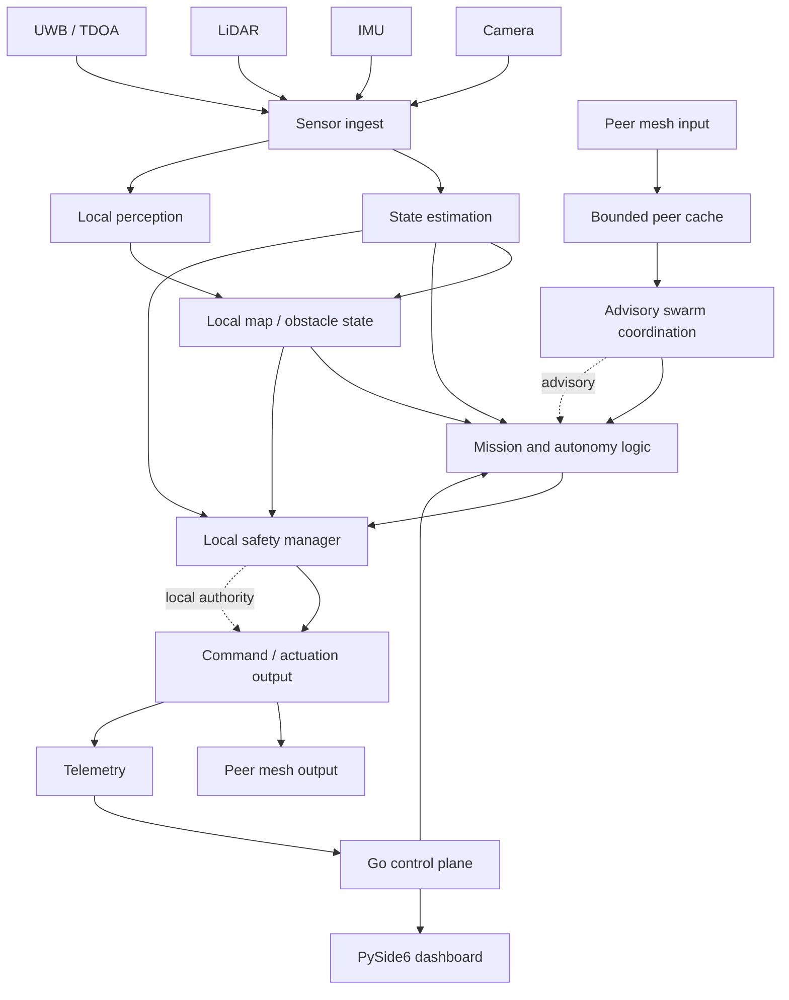
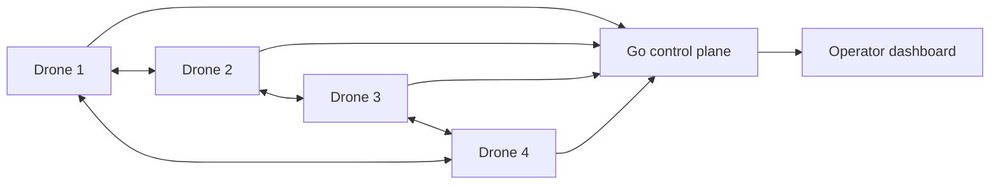

# GPS-Denied Autonomous UAV Swarm Platform

A research and engineering codebase for UAV navigation, local autonomy, and swarm coordination when GNSS is unavailable, degraded, or unreliable.

The platform combines a C++20 onboard runtime, a Go supervisory control plane, a Python/PySide6 operator dashboard, sensor-fusion and localization code, peer-to-peer swarm communication, replay and simulation tools, deployment assets, and experiment tooling in one repository.

[](https://github.com/smshagor-dev/UVA-GPS-Denied-Navigation-in-Dynamic-Environments/actions/workflows/ci.yml)
[](https://github.com/smshagor-dev/UVA-GPS-Denied-Navigation-in-Dynamic-Environments/actions/workflows/security.yml)
[](https://github.com/smshagor-dev/UVA-GPS-Denied-Navigation-in-Dynamic-Environments/actions/workflows/nightly.yml)

> **Safety note**
>
> This is research software, not a certified flight controller. The repository contains software tests, replay tooling, simulation support, bench-oriented workflows, and hardware-facing interfaces, but it does not claim completed free-flight validation, production-radio qualification, airworthiness approval, or regulatory certification. Hardware timing, sensor calibration, radio behavior, failsafe behavior, and physical flight safety must be validated independently before use on an aircraft.

## Contents

- [Why this project exists](#why-this-project-exists)
- [Architecture](#architecture)
- [Platform overview](#platform-overview)
- [Implementation details for reviewers](#implementation-details-for-reviewers)
- [Onboard autonomy](#onboard-autonomy)
- [Localization and state estimation](#localization-and-state-estimation)
- [UWB and TDOA localization](#uwb-and-tdoa-localization)
- [Perception and mapping](#perception-and-mapping)
- [Swarm networking and distributed coordination](#swarm-networking-and-distributed-coordination)
- [Safety and degraded operation](#safety-and-degraded-operation)
- [Control plane](#control-plane)
- [Operator dashboard](#operator-dashboard)
- [Runtime modes](#runtime-modes)
- [Security model](#security-model)
- [Academic mathematical formulation and implementation mapping](#academic-mathematical-formulation-and-implementation-mapping)
- [Performance model and benchmark planning](#performance-model-and-benchmark-planning)
- [Complexity notes](#complexity-notes)
- [Replay, simulation, and repeatability](#replay-simulation-and-repeatability)
- [Testing and validation](#testing-and-validation)
- [Hardware and HIL plan](#hardware-and-hil-plan)
- [Build and installation](#build-and-installation)
- [Running the backend and dashboard](#running-the-backend-and-dashboard)
- [Configuration](#configuration)
- [Repository layout](#repository-layout)
- [Research use and reproducibility](#research-use-and-reproducibility)
- [Research direction](#research-direction)
- [Current limitations](#current-limitations)
- [Roadmap](#roadmap)
- [Documentation](#documentation)
- [Citation](#citation)
- [Contributing](#contributing)
- [License](#license)

## Why this project exists

GPS-denied navigation appears in indoor environments, urban canyons, tunnels, disaster-response areas, industrial sites, and other places where GNSS is missing or unreliable. A single UAV can fall back to onboard estimation, but a swarm adds another problem: coordination should not collapse just because a backend link becomes slow or unavailable.

This project explores a local-first architecture. Each vehicle keeps state estimation, obstacle handling, mission decisions, and immediate safety onboard. Peer communication is used to exchange compact state and awareness summaries. The backend remains useful for supervision, mission management, logging, and fleet visibility, but it is deliberately kept outside the immediate safety loop.

The main engineering goals are:

- combine VIO/inertial estimation with UWB/TDOA and map-aware corrections;
- keep emergency and collision-related decisions local to the UAV;
- support peer-to-peer swarm state without streaming raw sensor data between every vehicle;
- reject stale or invalid peer state before it influences coordination;
- keep simulation, bench, and live-source behavior clearly separated;
- provide replay and fault-injection tooling for repeatable software testing;
- expose fleet, sensor, localization, safety, and security state through a supervisory backend and dashboard;
- keep the implementation testable across C++, Go, and Python components.

## Architecture

At a high level, the repository is split into seven areas:

1. **Onboard runtime** — C++20 sensing, estimation, autonomy, swarm networking, telemetry, and local safety.
2. **Localization and perception** — VIO/EKF/ESKF work, UWB/TDOA, LiDAR, camera, occupancy mapping, and feature tracking.
3. **Peer coordination** — bounded peer state, packet validation, advisory consensus, stale-peer handling, and partition recovery logic.
4. **Control plane** — Go service for telemetry, fleet state, commands, mission APIs, event handling, and operator-facing state.
5. **Operator tooling** — PySide6 dashboard for fleet, mission, sensor, localization, replay, safety, and security visibility.
6. **Experiment and simulation tooling** — replay, scenario runners, fault injection, digital-twin and multi-agent experiments, benchmark utilities, and configuration checks.
7. **Deployment and operations** — CMake presets, Docker/Compose, Kubernetes material, monitoring, packaging, release automation, security scanning, and reproducibility documentation.

### End-to-end data flow



### Swarm communication topology



The peer mesh provides shared context for formation, obstacle anticipation, health, and mission coordination while local safety retains authority.

## Platform overview

| Area | What is present in the repository | Current scope |
|---|---|---|
| Onboard UAV runtime | C++ node for sensors, localization, autonomy, swarm, telemetry, and safety | implemented software stack |
| VIO / inertial estimation | EKF path, ESKF work, replay, guarded corrections, confidence/state handling | implemented and under continued estimator development |
| UWB / TDOA | ranging input, time synchronization, localizer and fusion interfaces | implemented software support |
| LiDAR / mapping | scan handling, obstacle extraction, occupancy/map components | implemented software path |
| Camera / perception | camera path, feature tracking and detector-facing interfaces | implemented software path |
| Local autonomy | decision engine, mission behavior, degraded-localization handling | implemented software path |
| Safety | local safety manager, emergency behavior, command rejection and degraded-state handling | implemented software logic; physical validation still required |
| Peer networking | V2X-style peer packets, UDP fallback, bounded peer state and health exchange | implemented software path |
| Peer serialization | JSON debug transport and CBOR binary transport | implemented; radio characterization still required |
| Swarm coordination | peer cache, stale-peer filtering, advisory consensus and recovery concepts | implemented software logic |
| Go backend | telemetry/control plane, fleet state, command and mission APIs | implemented |
| Dashboard | PySide6 operator console and supporting dialogs/workspaces | implemented |
| Replay / simulation | replay-aware paths, scenario tools, fault injection and simulation helpers | implemented for software testing |
| Security | command policy, TLS/mTLS paths, trust state, stale/replay handling, firmware-state support | partial operational security model |
| Post-quantum work | migration design and experiment direction around ML-KEM and ML-DSA families | research direction, not operational peer transport |
| Deployment | CMake presets, containers, Kubernetes material, monitoring and release packaging | software/deployment tooling |

## Implementation details for reviewers

The values below are code defaults, not universal flight constants, and should be calibrated and validated for target sensors, radios, compute platform, and airframe.

### Estimator execution model

`EstimatorCoordinator` keeps the baseline estimator authoritative and the secondary estimator isolated behind a bounded worker queue. The secondary queue defaults to 128 measurements. A reset generation prevents pre-reset queued measurements from contaminating the next estimator generation, and active-versus-secondary comparisons expose position, velocity, orientation, bias, covariance-trace, lag, queue, and failure diagnostics.

```text
include/vio/EstimatorCoordinator.hpp
include/vio/StateEstimator.hpp
include/vio/EKFStateEstimatorAdapter.hpp
src/vio/EstimatorCoordinator.cpp
```

### Typed measurement boundary

Estimator input is represented by `MeasurementEnvelope`. Current payload families include IMU, visual pose, visual features, manual ZUPT, LiDAR depth, and disabled LiDAR observations. Source identity, timestamp, sequence, frame, payload and covariance hints travel with each measurement.

```text
include/vio/MeasurementEnvelope.hpp
src/vio/MeasurementEnvelope.cpp
```

### Peer wire contract and bounded swarm state

Every `EdgePeerPacket` carries packet type, sender ID, timestamp, sequence number, trust epoch, source, TTL, authentication hook and typed payload. Validation rejects invalid sender/TTL/type/sequence, non-finite state, malformed emergency geometry, expired state and oversized packets. The peer cache defaults to 32 entries, stale after 900 ms and removal after 2500 ms.

```text
include/swarm/EdgePeerProtocol.hpp
src/swarm/EdgePeerProtocol.cpp
include/swarm/SwarmStateCache.hpp
src/swarm/SwarmStateCache.cpp
```

### Time synchronization and TDOA solver

`TimeSyncTracker` uses separate rolling windows for IMU-camera, anchor and peer offsets. `TDOALocalizer` requires at least four anchors, uses a damped iterative least-squares update, and returns position, convergence, RMS residual and a bounded software confidence.

```text
include/localization/TimeSyncTracker.hpp
include/localization/TDOALocalizer.hpp
src/localization/TimeSyncTracker.cpp
src/localization/TDOALocalizer.cpp
```

### Safety and security as command gates

`SafetyManager::evaluate()` produces arming, autonomous-flight, mission-command, remote-command, speed and acceleration constraints. `SafetyManager::enforce()` then limits the autonomy command. Security state can independently gate remote control and updates trust epochs.

```text
include/safety/SafetyManager.hpp
src/safety/SafetyManager.cpp
include/security/DroneSecurity.hpp
src/security/
```

## Onboard autonomy

The onboard node is the latency-sensitive part of the platform. It handles local perception, state estimation, obstacle state, decision generation, peer awareness, safety checks and telemetry publication. Core modules include `DecisionEngine`, `ExperienceMemory`, `SafetyManager`, edge consensus, peer protocol/cache and control-plane telemetry.

## Localization and state estimation

The estimator stack includes a baseline EKF, a secondary ESKF path, stationary detection and ZUPT, First-Estimate Jacobian support, bounded camera-state cloning, MSCKF-style multi-view feature constraints, null-space projection, chi-square-style gating, Joseph-form covariance correction, marginalization and sustained comparison/readiness monitoring. The secondary estimator is not automatically promoted to flight authority.

## UWB and TDOA localization

GPS-denied correction support includes `TDOAIngestor`, `TDOALocalizer`, `TimeSyncTracker`, `UWBSerialDriver` and `LocalizationFusion`. Performance depends on surveyed anchor geometry, clock quality, timestamping, calibration, multipath and radio behavior.

## Perception and mapping

The runtime includes camera, LiDAR, IMU, rangefinder, barometer, optical-flow and motor-facing components, together with occupancy-grid, keyframe and mapping code. Raw camera or LiDAR streams remain local; compact summaries can be shared with peers after freshness/trust checks.

## Swarm networking and distributed coordination

Peer packets cover heartbeat, pose, health, obstacle summary, threat summary, coordination state, emergency corridors and peer shutdown. JSON and CBOR are implemented; `protobuf_placeholder` remains a reserved compatibility setting. Consensus is advisory to local safety. Partition/rejoin logic filters stale/trust-incompatible peers, requires healthy coordination state and advances epochs conservatively.

## Safety and degraded operation

```text
local immediate safety
  > degraded local autonomy
  > fresh peer coordination
  > backend mission intent
```

Emergency behavior does not wait for backend approval, stale peers are excluded from safety-sensitive coordination and backend loss does not automatically disable all local behavior.

## Control plane

The Go control plane is supervisory. It handles telemetry ingestion, fleet snapshots, mission/command endpoints, events, audit state, simulation/live-source separation, security/firmware state and operator/device authorization.

## Operator dashboard

The PySide6 dashboard exposes fleet, peer, topology, localization, camera, IMU, LiDAR, TDOA, replay, mission, backend, safety, security, serialization and runtime state. Supported roles include `operator`, `commander` and `maintenance`.

## Runtime modes

| Mode | Intended use | Data policy |
|---|---|---|
| `simulation` | UI, algorithm bring-up, synthetic or replay work | synthetic/demo data is allowed |
| `bench` | local hardware and replay-assisted testing | live sensors are preferred; replay can support testing |
| `production` | live-source runtime with stricter configuration | safety-sensitive paths expect live inputs |
| `edge_swarm` | live local autonomy with peer communication | live local sensing plus peer exchange |

The name `production` is a software configuration name, not a certification statement.

## Security model

Security work includes peer authentication hooks, stale/replay handling, trust epochs, command policy, TLS/mTLS paths, signed firmware manifests, rollback counters, firmware-trust telemetry and operator/device authorization. Post-quantum items are research/migration work, not a claim that the current peer transport is operationally post-quantum secure.

# Academic mathematical formulation and implementation mapping

This section maps the mathematical operations used by the current implementation to their source locations. Each equation is either directly implemented or explicitly marked as an analytical/design model. Numerical thresholds, confidence weights and policy gains are software choices unless independently calibrated and validated on target hardware.

## 1. Notation and coordinate conventions

Nominal state:

$$
\mathbf{x}=\left(\mathbf p,\mathbf v,\mathbf q,\mathbf b_a,\mathbf b_g\right)
$$

15-dimensional error state:

$$
\delta\mathbf{x}=\begin{bmatrix}
\delta\mathbf p^T&\delta\mathbf v^T&\delta\boldsymbol\theta^T&\delta\mathbf b_a^T&\delta\mathbf b_g^T
\end{bmatrix}^T\in\mathbb R^{15}.
$$

Primary code: `include/vio/EKFEstimator.hpp`, `src/vio/EKFEstimator.cpp`, `src/vio/Phase17ESKFEstimator.cpp`.

## 2. IMU raw-unit conversion

$$
s_a=\frac{9.81}{16384},\qquad \mathbf a_m=s_a\mathbf a_{raw}
$$

$$
s_g=\frac{250}{32768}\frac{\pi}{180},\qquad \boldsymbol\omega_m=s_g\boldsymbol\omega_{raw}
$$

$$
T[^{\circ}C]=\frac{T_{raw}}{340}+36.53
$$

Code: `src/sensors/IMUSensor.cpp`.

## 3. Static IMU calibration

$$
\hat{\mathbf b}_g=\frac1N\sum_{i=1}^{N}\boldsymbol\omega_i
$$

$$
\hat{\mathbf b}_a=\frac1N\sum_{i=1}^{N}\mathbf a_i-\begin{bmatrix}0&0&9.81\end{bmatrix}^T
$$

$$
\mathbf a_c=\mathbf S_a(\mathbf a_m-\hat{\mathbf b}_a),\qquad
\boldsymbol\omega_c=\boldsymbol\omega_m-\hat{\mathbf b}_g
$$

$$
f_s=\frac1{t_k-t_{k-1}}
$$

Code: `src/sensors/IMUSensor.cpp`.

## 4. LiDAR Cartesian point geometry

$$
r=\sqrt{x^2+y^2+z^2}
$$

$$
\psi=\mathrm{atan2}(y,x)\frac{180}{\pi}
$$

$$
\theta=\mathrm{atan2}\left(z,\sqrt{x^2+y^2}\right)\frac{180}{\pi}
$$

Code: `src/sensors/LidarSensor.cpp`.

## 5. Camera preprocessing and detector coordinate conversion

$$
I_{net}=\frac{I}{255}
$$

$$
x=\left(c_x-\frac w2\right)\frac W{640},\qquad y=\left(c_y-\frac h2\right)\frac H{640}
$$

$$
w_{img}=w\frac W{640},\qquad h_{img}=h\frac H{640}
$$

Camera intrinsics:

$$
\mathbf K=\begin{bmatrix}f_x&0&c_x\\0&f_y&c_y\\0&0&1\end{bmatrix}
$$

Code: `src/sensors/CameraSensor.cpp`.

## 6. Motor-health heuristic

$$
p_T=\mathrm{clamp}\left(\frac{T-55}{35},0,0.5\right)
$$

$$
p_V=\mathrm{clamp}(1.5(V-0.25),0,0.4)
$$

$$
p_I=\mathrm{clamp}(0.15(I-6),0,0.2)
$$

$$
h_i=\mathrm{clamp}(1-p_T-p_V-p_I,0,1)
$$

$$
\bar h=\frac1M\sum_{i=1}^{M}h_i,\qquad \bar h<0.45\Rightarrow\text{critical fault}
$$

Code: `src/sensors/MotorSensor.cpp`.

## 7. Placeholder sensor equations

Current barometer placeholder:

$$
P=101325-12h
$$

with fixed simulated altitude $h=8$ m. Optical-flow and rangefinder placeholder values are also software-generated and not calibrated hardware models.

Code: `src/sensors/BarometerSensor.cpp`, `src/sensors/OpticalFlowSensor.cpp`, `src/sensors/RangefinderSensor.cpp`.

## 8. IMU noise model

$$
\mathbf Q_{imu}=\mathrm{diag}(\sigma_{na}^2\mathbf I_3,\sigma_{ng}^2\mathbf I_3,\sigma_{nba}^2\mathbf I_3,\sigma_{nbg}^2\mathbf I_3)
$$

Current defaults: $\sigma_{na}=0.02$, $\sigma_{ng}=0.005$, $\sigma_{nba}=10^{-4}$, $\sigma_{nbg}=10^{-5}$.

## 9. Initial covariance

$$
\mathbf P_0=\mathrm{diag}(\sigma_p^2\mathbf I_3,\sigma_v^2\mathbf I_3,\sigma_\theta^2\mathbf I_3,\sigma_{ba}^2\mathbf I_3,\sigma_{bg}^2\mathbf I_3)
$$

Defaults: 0.1 m position, 0.05 m/s velocity, 0.05 rad attitude-error representation, 0.01 accelerometer bias, 0.001 gyroscope bias.

## 10. Bias-corrected inertial input

$$
\mathbf a=\mathbf a_m-\mathbf b_a,\qquad \boldsymbol\omega=\boldsymbol\omega_m-\mathbf b_g
$$

$$
\mathbf g=\begin{bmatrix}0&0&-9.81\end{bmatrix}^T
$$

## 11. Midpoint attitude and world acceleration

$$
\mathbf q_{1/2}=\mathbf q_k\otimes\mathrm{Exp}\left(\frac12\boldsymbol\omega\Delta t\right)
$$

$$
\mathbf a_w=\mathbf R(\mathbf q_{1/2})\mathbf a+\mathbf g
$$

## 12. Nominal-state propagation

$$
\mathbf p_{k+1}=\mathbf p_k+\mathbf v_k\Delta t+\frac12\mathbf a_w\Delta t^2
$$

$$
\mathbf v_{k+1}=\mathbf v_k+\mathbf a_w\Delta t
$$

$$
\mathbf q_{k+1}=\mathrm{normalize}(\mathbf q_k\otimes\mathrm{Exp}(\boldsymbol\omega\Delta t))
$$

Code for Sections 8–12: `include/vio/EKFEstimator.hpp`, `src/vio/EKFEstimator.cpp`.

## 13. Error-state transition matrix

$$
\mathbf F_{pv}=\mathbf I\Delta t
$$

$$
\mathbf F_{v\theta}=-\mathbf R[\mathbf a]_\times\Delta t
$$

$$
\mathbf F_{vb_a}=-\mathbf R\Delta t,\qquad \mathbf F_{\theta b_g}=-\mathbf I\Delta t
$$

Noise mapping:

$$
\mathbf G_{vn_a}=-\mathbf R,\quad \mathbf G_{\theta n_g}=-\mathbf I,\quad \mathbf G_{b_an_{ba}}=\mathbf I,\quad \mathbf G_{b_gn_{bg}}=\mathbf I
$$

## 14. Discrete process covariance and covariance propagation

$$
\mathbf Q_d=(\mathbf G\mathbf Q_{imu}\mathbf G^T)\Delta t
$$

$$
\mathbf P^-=\mathbf F\mathbf P\mathbf F^T+\mathbf Q_d
$$

$$
\mathbf P\leftarrow\frac12(\mathbf P+\mathbf P^T)
$$

## 15. Perspective camera projection

$$
\mathbf p_c=\mathbf R^T(\mathbf p_f-\mathbf p)=\begin{bmatrix}X&Y&Z\end{bmatrix}^T
$$

$$
\hat u=f_x\frac XZ+c_x,\qquad \hat v=f_y\frac YZ+c_y
$$

$$
\mathbf J_\pi=\begin{bmatrix}f_x/Z&0&-f_xX/Z^2\\0&f_y/Z&-f_yY/Z^2\end{bmatrix}
$$

$$
\mathbf H_p=\mathbf J_\pi(-\mathbf R^T),\qquad \mathbf H_\theta=\mathbf J_\pi\mathbf R^T[\mathbf p_f-\mathbf p]_\times
$$

$$
\mathbf r=\mathbf z-\hat{\mathbf z}
$$

## 16. Innovation covariance and Mahalanobis gate

$$
\mathbf S=\mathbf H\mathbf P\mathbf H^T+\mathbf R_m
$$

$$
d_M^2=\mathbf r^T\mathbf S^{-1}\mathbf r
$$

Current configured scalar threshold: 7.815.

## 17. Generic Kalman correction

$$
\mathbf K=\mathbf P\mathbf H^T\mathbf S^{-1}
$$

$$
\delta\mathbf x=\mathbf K\mathbf r
$$

## 18. Joseph-form covariance correction

$$
\mathbf P^+=(\mathbf I-\mathbf K\mathbf H)\mathbf P(\mathbf I-\mathbf K\mathbf H)^T+\mathbf K\mathbf R_m\mathbf K^T
$$

## 19. Visual-pose correction

$$
\mathbf r=\begin{bmatrix}\mathbf p_{obs}-\mathbf p\\\mathbf v_{obs}-\mathbf v\end{bmatrix}
$$

$$
\mathbf R_m=\mathrm{diag}(\sigma_p^2\mathbf I_3,\sigma_v^2\mathbf I_3)
$$

## 20. LiDAR depth correction

$$
r=z_{depth}-p_z,\qquad R_m=\sigma_z^2
$$

Typed wrapper: `covariance_hint = sigma_m^2`.

## 21. Zero-velocity update

$$
\mathbf r=-\mathbf v
$$

$$
\mathbf H_v=\begin{bmatrix}\mathbf0&\mathbf I_3&\mathbf0&\mathbf0&\mathbf0\end{bmatrix}
$$

$$
\mathbf R_{zupt}=\sigma_v^2\mathbf I_3
$$

## 22. Position uncertainty, drift proxy, and localization confidence

$$
\boldsymbol\sigma_p=\begin{bmatrix}\sqrt{P_{xx}}&\sqrt{P_{yy}}&\sqrt{P_{zz}}\end{bmatrix}^T
$$

$$
d_u=\|\boldsymbol\sigma_p\|_2
$$

$$
c=\mathrm{clamp}\left(1-\frac{d_u}{2.5},0,1\right)
$$

Age adjustments: visual age >0.8 s gives $c\leftarrow0.78c$; >1.6 s applies $0.62$ again; depth age <0.6 s gives $c\leftarrow\min(1,c+0.08)$.

Code for Sections 13–22: `src/vio/EKFEstimator.cpp`.

## 23. Continuous ESKF linearization

$$
\mathbf F_{pv}=\mathbf I,\qquad \mathbf F_{v\theta}=-\mathbf R[\mathbf a]_\times
$$

$$
\mathbf F_{vb_a}=-\mathbf R,\qquad \mathbf F_{\theta\theta}=-[\boldsymbol\omega]_\times,\qquad \mathbf F_{\theta b_g}=-\mathbf I
$$

## 24. ESKF transition discretization

$$
\boldsymbol\Phi\approx\mathbf I+\mathbf F_c\Delta t
$$

$$
\Phi_{p\theta}=-\frac12\mathbf R[\mathbf a]_\times\Delta t^2,\qquad \Phi_{pb_a}=-\frac12\mathbf R\Delta t^2
$$

$$
\Phi_{v\theta}=-\mathbf R[\mathbf a]_\times\Delta t,\qquad \Phi_{vb_a}=-\mathbf R\Delta t
$$

$$
\Phi_{\theta\theta}=\mathbf I-[\boldsymbol\omega]_\times\Delta t,\qquad \Phi_{\theta b_g}=-\mathbf I\Delta t
$$

## 25. ESKF process-noise discretization

$$
\mathbf Q_c=\mathbf G_c\mathbf Q_{imu}\mathbf G_c^T
$$

$$
\mathbf Q_d=\boldsymbol\Phi\mathbf Q_c\boldsymbol\Phi^T\Delta t
$$

$$
\mathbf Q_{pp}\leftarrow\mathbf Q_{pp}+\frac14\sigma_{na}^2\Delta t^4\mathbf I
$$

$$
\mathbf Q_{pv}\leftarrow\mathbf Q_{pv}+\frac12\sigma_{na}^2\Delta t^3\mathbf I,\qquad \mathbf Q_{vp}=\mathbf Q_{pv}^T
$$

$$
\mathbf P^-_{aug}=\boldsymbol\Phi_{aug}\mathbf P_{aug}\boldsymbol\Phi_{aug}^T+\mathbf Q_{aug}
$$

## 26. Quaternion error injection and reset Jacobian

$$
\mathbf q^+=\mathrm{normalize}(\mathbf q\otimes\mathrm{Exp}(\delta\boldsymbol\theta))
$$

$$
\mathbf G_{reset}=\mathbf I-\frac12[\delta\boldsymbol\theta]_\times
$$

$$
\mathbf P\leftarrow\mathbf J_{reset}\mathbf P\mathbf J_{reset}^T
$$

## 27. Innovation-conditioning check

$$
\mathbf S_s=\frac12(\mathbf S+\mathbf S^T)
$$

$$
\kappa(\mathbf S)=\frac{\lambda_{max}}{\lambda_{min}}
$$

Guard uses minimum eigenvalue around $10^{-12}$ and maximum condition number $10^{12}$.

## 28. Stationary detector

$$
e_a=\left|\|\mathbf a_m\|_2-g\right|,\qquad e_g=\|\boldsymbol\omega_m\|_2
$$

Default entry thresholds: 0.15 m/s² and 0.02 rad/s; exit thresholds: 0.25 m/s² and 0.04 rad/s.

$$
\Delta t_{zupt,min}=\frac1{f_{zupt,max}}
$$

Default $f_{zupt,max}=10$ Hz.

## 29. First-Estimate Jacobian linearization

$$
\mathbf p_c^{FEJ}=\mathbf R(\mathbf q_{first})^T(\mathbf p_f-\mathbf p_{first})
$$

Residual may use current nominal state while selected Jacobians use stored first-estimate poses.

## 30. Camera-state covariance augmentation

$$
\mathbf P_{xc}=\mathbf P\mathbf J_c^T
$$

$$
\mathbf P_{cc}=\mathbf J_c\mathbf P\mathbf J_c^T
$$

$$
\mathbf P_{aug}=\begin{bmatrix}\mathbf P&\mathbf P_{xc}\\\mathbf P_{xc}^T&\mathbf P_{cc}\end{bmatrix}
$$

## 31. Multi-view feature triangulation

$$
\mathbf d_i=\mathrm{normalize}(\mathbf R_i\mathbf b_i)
$$

$$
\mathbf M_i=\mathbf I-\mathbf d_i\mathbf d_i^T
$$

$$
\mathbf A=\sum_i\mathbf M_i,\qquad \mathbf b=\sum_i\mathbf M_i\mathbf p_i
$$

$$
\mathbf p_f=\mathbf A^{-1}\mathbf b
$$

Current geometry checks include minimum baseline 0.05 m, depth 0.1–50 m and reprojection error up to 2.5 px.

## 32. Reprojection validation

$$
\hat{\mathbf z}_i=\begin{bmatrix}f_xX/Z+c_x\\f_yY/Z+c_y\end{bmatrix}
$$

$$
e_{rep,i}=\|\mathbf z_i-\hat{\mathbf z}_i\|_2
$$

## 33. MSCKF normalized residual

$$
\mathbf z_i=\begin{bmatrix}b_x/b_z\\b_y/b_z\end{bmatrix},\qquad \hat{\mathbf z}_i=\begin{bmatrix}X/Z\\Y/Z\end{bmatrix}
$$

$$
\mathbf r_i=\mathbf z_i-\hat{\mathbf z}_i
$$

$$
\mathbf J_n=\begin{bmatrix}1/Z&0&-X/Z^2\\0&1/Z&-Y/Z^2\end{bmatrix}
$$

$$
\mathbf H_f=-\mathbf J_n\mathbf R_{cw}
$$

$$
e_{track}=\sqrt{\sum_i\|\mathbf r_i\|_2^2}
$$

## 34. Feature null-space projection

$$
\mathbf r=\mathbf H_x\delta\mathbf x+\mathbf H_f\delta\mathbf p_f+\mathbf n
$$

For left-nullspace basis $\mathbf A$:

$$
\mathbf A^T\mathbf H_f\approx\mathbf0
$$

$$
\mathbf r_o=\mathbf A^T\mathbf r,\qquad \mathbf H_o=\mathbf A^T\mathbf H_x,\qquad \mathbf R_o=\mathbf A^T\mathbf R\mathbf A
$$

Checks include $\|\mathbf A^T\mathbf H_f\|$ and $\|\mathbf A^T\mathbf A-\mathbf I\|$ around $10^{-8}$ tolerance.

## 35. MSCKF residual and chi-square gating

$$
\|\mathbf r_o\|_2\le r_{max}
$$

$$
\mathbf S=\mathbf H_o\mathbf P_{aug}\mathbf H_o^T+\mathbf R_o
$$

$$
\gamma=\mathbf r_o^T\mathbf S^{-1}\mathbf r_o
$$

$$
\tau=F_{\chi^2_\nu}^{-1}(p),\qquad \gamma\le\tau
$$

Current default $p=0.95$.

## 36. Augmented-state Kalman correction

$$
\mathbf K=\mathbf P_{aug}\mathbf H_{aug}^T(\mathbf H_{aug}\mathbf P_{aug}\mathbf H_{aug}^T+\mathbf R)^{-1}
$$

$$
\delta\mathbf x_{aug}=\mathbf K\mathbf r
$$

## 37. Clone marginalization

$$
\mathbf P_{ret}=\mathbf P_{aug}[\mathcal I,\mathcal I]
$$

$$
\mathbf P_{ret}\leftarrow\frac12(\mathbf P_{ret}+\mathbf P_{ret}^T)
$$

$$
e_{sym}=\max_{ij}|P_{ij}-P_{ji}|,\qquad \lambda_{min}=\min\mathrm{eig}(\mathbf P_{ret})
$$

Code for Sections 23–37: `src/vio/Phase17ESKFEstimator.cpp`, `include/vio/MsckfMarginalization.hpp`, `include/vio/MsckfRetirementTransaction.hpp`.

## 38. Optical-flow quality aggregation

$$
\bar e=\frac1{N_v}\sum_{i\in\mathcal V}e_i
$$

$$
r_{inlier}=\frac{N_{inlier}}{N_{tracked}}
$$

## 39. Visual update confidence

$$
s_f=\mathrm{clamp}\left(\frac{N_{tracked}}{140},0,1\right)
$$

$$
s_i=\mathrm{clamp}(r_{inlier},0,1)
$$

$$
s_r=\mathrm{clamp}\left(1-\frac{e_{reproj}}8,0,1\right)
$$

$$
c_v=0.35s_f+0.45s_i+0.20s_r
$$

Rejected frontend update multiplies confidence by 0.45. Placeholder confidence is capped at 0.42; zero-feature failure uses 0.18.

## 40. Essential-matrix motion direction and metric scale

$$
\Delta\mathbf p_{pred}=\mathbf p_{pred,k}-\mathbf p_{k-1}
$$

$$
s=\max(\|\Delta\mathbf p_{pred}\|,\|\mathbf v_{pred}\|\Delta t)
$$

$$
\Delta\mathbf p_w=\mathbf R_{prev}\hat{\mathbf t}s
$$

$$
\mathbf p_{obs}=\mathbf p_{prev}+\Delta\mathbf p_w,\qquad \mathbf v_{obs}=\frac{\Delta\mathbf p_w}{\Delta t}
$$

Acceptance defaults: at least 24 tracked features, inlier ratio at least 0.55, error metric at most 3.5 px.

Code: `src/vio/VIOPipeline.cpp`, `include/vio/VIOPipeline.hpp`.

## 41. Persistent track association

$$
d_i^2=\|\mathbf u_i-\mathbf u_{track}\|_2^2
$$

Default radius 3 px implies $d_i^2<9$.

## 42. Two-view triangulation used by the track manager

$$
\mathbf b=\mathbf p_2-\mathbf p_1,\qquad \|\mathbf b\|\ge0.05\text{ m}
$$

$$
\mathbf r_1=\mathrm{normalize}(\mathbf R_1\mathbf K^{-1}[u_1,v_1,1]^T)
$$

$$
\mathbf r_2=\mathrm{normalize}(\mathbf R_2\mathbf K^{-1}[u_2,v_2,1]^T)
$$

$$
\theta=\cos^{-1}(\mathrm{clamp}(\mathbf r_1^T\mathbf r_2,-1,1))\frac{180}{\pi}
$$

Minimum parallax default: 1°.

$$
\begin{bmatrix}\mathbf r_1&-\mathbf r_2\end{bmatrix}\begin{bmatrix}\lambda_1\\\lambda_2\end{bmatrix}=\mathbf p_2-\mathbf p_1
$$

$$
\mathbf x_1=\mathbf p_1+\lambda_1\mathbf r_1,\qquad \mathbf x_2=\mathbf p_2+\lambda_2\mathbf r_2
$$

$$
\|\mathbf x_1-\mathbf x_2\|\le0.25\text{ m}
$$

$$
\mathbf p_f=\frac12(\mathbf x_1+\mathbf x_2)
$$

Code: `include/vio/VisualFeatureTrackManager.hpp`.

## 43. Clock-offset observations

$$
\Delta t_{ic}=1000(t_{cam}-t_{imu})\text{ ms}
$$

$$
\Delta t_a=1000(t_{arrival}-t_{reference})\text{ ms}
$$

$$
\Delta t_p=1000(t_{local\_receive}-t_{remote})\text{ ms}
$$

## 44. Mean offset and jitter

$$
\mu=\frac1N\sum_i x_i
$$

$$
MAD=\frac1N\sum_i|x_i-\mu|
$$

Jitter is the maximum MAD across IMU-camera, anchor and peer windows. Default history is 128 samples.

## 45. Synchronization confidence

$$
o_{worst}=\max(|\mu_{ic}|,|\mu_a|,|\mu_p|)
$$

$$
c_{sync}=\mathrm{clamp}\left(1-\frac{o_{worst}}{\max(T_{degraded},1)},0,1\right)
$$

Current $T_{degraded}=20$ ms; synchronized threshold is 8 ms.

Code: `include/localization/TimeSyncTracker.hpp`, `src/localization/TimeSyncTracker.cpp`.

## 46. TDOA range-difference observation

$$
\rho_i=\|\mathbf x-\mathbf a_i\|,\qquad \rho_0=\|\mathbf x-\mathbf a_0\|
$$

$$
h_i(\mathbf x)=\rho_i-\rho_0
$$

$$
y_i=c(t_i-t_0),\qquad c=299702547.0\text{ m/s}
$$

$$
r_i=y_i-h_i(\mathbf x)
$$

## 47. TDOA Jacobian

$$
\mathbf J_i=\frac{\mathbf x-\mathbf a_i}{\rho_i}-\frac{\mathbf x-\mathbf a_0}{\rho_0}
$$

Distances are lower-bounded by $10^{-3}$ m.

## 48. Damped TDOA least-squares solve

$$
(\mathbf J^T\mathbf J+\lambda\mathbf I)\Delta\mathbf x=\mathbf J^T\mathbf r
$$

$$
\mathbf x\leftarrow\mathbf x+\Delta\mathbf x
$$

Default damping $10^{-3}$, convergence $\|\Delta\mathbf x\|\le10^{-4}$ m, maximum 10 iterations.

$$
\mathbf x_0=\frac1M\sum_{j=1}^{M}\mathbf a_j
$$

## 49. TDOA residual and confidence

$$
e_{rms}=\sqrt{\frac{\mathbf r^T\mathbf r}{\max(n,1)}}
$$

$$
c_t=\mathrm{clamp}\left(1-\frac{e_{rms}}6,0,1\right)
$$

Code: `include/localization/TDOALocalizer.hpp`, `src/localization/TDOALocalizer.cpp`.

## 50. Anchor visibility ratio

$$
r_a=\frac{N_{visible}}{N_{configured}}
$$

TDOA batch emission requires at least four valid measurements.

Code: `src/localization/TDOAIngestor.cpp`.

## 51. VIO/TDOA fusion weight

$$
b_d=\mathrm{clamp}\left(\frac{d_{vio}}2,0,1\right)
$$

$$
w_t=\mathrm{clamp}(0.55c_t+0.45b_d,0,0.85)
$$

$$
\mathbf p_f=(1-w_t)\mathbf p_{vio}+w_t\mathbf p_{tdoa}
$$

## 52. Localization fusion confidence

$$
c\leftarrow\max(c,(1-w_t)c_{vio}+w_tc_t)
$$

Availability/timing factors:

$$
\text{no camera}:\;c\leftarrow0.72c
$$

$$
\text{no LiDAR/rangefinder}:\;c\leftarrow0.92c
$$

$$
\text{unsynchronized}:\;c\leftarrow c\mathrm{clamp}(c_{sync},0.35,1)
$$

$$
\text{anchor visibility}:\;c\leftarrow c\mathrm{clamp}(0.65+0.35r_a,0.65,1)
$$

TDOA-supported floor when timing/visibility are strong:

$$
c_{floor}=0.55c_t+0.25\mathrm{clamp}(r_a,0,1)+0.20\mathrm{clamp}(c_{sync},0,1)
$$

$$
c\leftarrow\max(c,c_{floor}),\qquad \Delta c_k=c_k-c_{k-1}
$$

Code: `src/localization/LocalizationFusion.cpp`.

## 53. Occupancy-grid coordinate conversion

$$
g_x=\left\lfloor\frac{x_w}{r}\right\rfloor+\frac W2,\qquad g_y=\left\lfloor\frac{y_w}{r}\right\rfloor+\frac H2
$$

$$
i=g_yW+g_x
$$

## 54. Occupancy ratio

$$
r_{occ}=\frac{N_{nonzero}}{N_{cells}}
$$

Code: `src/slam/OccupancyGridMap.cpp`.

## 55. Map-planner segmentation

$$
d=\|(\mathbf p_g-\mathbf p_s)_{xy}\|_2
$$

$$
N=\max\left(2,\left\lceil\frac d{\max(1,4r)}\right\rceil\right)
$$

$$
t_i=\frac iN,\qquad \mathbf p_i=\mathbf p_s+t_i(\mathbf p_g-\mathbf p_s)
$$

## 56. Occupancy-aware altitude and path cost

$$
p_{occ}=\mathrm{clamp}(r_{occ},0,1)
$$

$$
z_i=\max(z_s,z_g)+2p_{occ}+0.5\,\mathbf{1}_{N_{visible}>0}
$$

$$
c_i=\frac dN(1+p_{occ}),\qquad C=\sum_{i=1}^{N}c_i
$$

Code: `src/slam/MapPlanner.cpp`.

## 57. Keyframe orientation difference

$$
q_\Delta=q_a^{-1}\otimes q_b
$$

$$
\Delta\theta=2\cos^{-1}(|q_{\Delta,w}|)\frac{180}{\pi}
$$

Default keyframe gates include 0.4 m translation, 10° rotation, 0.5 s minimum time and at least 20 tracked features.

## 58. Keyframe overlap heuristic

$$
o=\frac{\min(N_p,N_t)}{\max(N_p,N_t)}
$$

Default maximum overlap: 0.9.

## 59. ORB descriptor matching

$$
d_1<0.75d_2,\qquad d_1\le50
$$

Single-neighbor acceptance uses distance ≤40; loop candidate requires at least 15 accepted matches.

## 60. Approximate map-point projection and fusion

$$
\mathbf p_{proj}=\mathbf p_{kf}+5\hat{\mathbf b}_w
$$

Local match:

$$
\mathbf p_{mp}\leftarrow0.7\mathbf p_{mp}+0.3\mathbf p_{proj}
$$

Remote match:

$$
\mathbf p_{mp}\leftarrow0.5\mathbf p_{mp}+0.5\mathbf p_{proj}
$$

## 61. Relocalization confidence and pose blending

$$
c_{reloc}=\mathrm{clamp}\left(\frac s{80},0,1\right)
$$

$$
\mathbf p_c=0.7\mathbf p_{matched}+0.3\mathbf p_{guess}
$$

$$
\mathbf q_c=\mathrm{slerp}(\mathbf q_{matched},\mathbf q_{guess},0.3)
$$

Code for Sections 57–61: `include/slam/KeyframeManager.hpp`, `src/slam/KeyframeManager.cpp`.

## 62. Perception focus geometry

$$
c_x=x+\frac w2,\qquad c_y=y+\frac h2
$$

$$
\mathbf o=\begin{bmatrix}c_x-0.5\\c_y-0.5\end{bmatrix}
$$

$$
A=\mathrm{clamp}(wh,0,1)
$$

$$
s_c=\mathrm{clamp}(1-1.4\|\mathbf o\|,0,1)
$$

$$
d_{proxy}=\frac1{\sqrt{\max(A,10^{-3})}}
$$

## 63. Detection priority score

$$
s_{det}=c_d(0.45+0.35s_c+0.20A)b_c
$$

Current class multipliers: 1.25 hazard, 1.15 unknown, 1.0 target, 0.65 other.

## 64. Caution and localization speed scales

$$
s_{caution}=\mathrm{clamp}(1-0.18r_{risk},0.55,0.90)
$$

$$
s_{loc}=\mathrm{clamp}(c_{loc},0.35,1)
$$

$$
s_v=s_{caution}s_{loc}
$$

## 65. Speed-vector saturation

$$
\mathbf v_{cmd}=\begin{cases}\mathbf v\frac{v_{max}}{\|\mathbf v\|},&\|\mathbf v\|>v_{max}\\\mathbf v,&\text{otherwise}\end{cases}
$$

## 66. Return-home position blending

$$
\mathbf p_{rh}=0.45\mathbf p_{vio}+0.55\mathbf p_{tdoa}
$$

$$
\mathbf e_h=\mathbf p_{home}-\mathbf p_{rh}
$$

Used when TDOA confidence is at least 0.45.

## 67. Search command

$$
\mathbf v_{search}=\hat{\mathbf f}(v_{search,max}s_v)+\hat{\mathbf u}\mathrm{clamp}(0.18e_z,-0.5,0.5)
$$

Yaw alternates between ±0.18 rad/s.

## 68. Target-tracking command

$$
e_A=0.12-A
$$

$$
\mathbf v=\hat{\mathbf f}\mathrm{clamp}(8e_A,-0.3,v_{track,max}s_v)+\hat{\mathbf r}\mathrm{clamp}(2.2o_x,-1,1)+\hat{\mathbf u}\mathrm{clamp}(-1.6o_y,-0.8,0.8)
$$

$$
\dot\psi=\mathrm{clamp}(1.8o_x,-0.9,0.9)
$$

## 69. Camera-obstacle avoidance command

$$
\mathbf v=-\hat{\mathbf f}(0.9+2A)-\hat{\mathbf r}\mathrm{clamp}(3o_x,-1.2,1.2)+\hat{\mathbf u}\mathrm{clamp}(0.15e_z,0,0.9)
$$

## 70. LiDAR-obstacle escape gain

$$
d_s=\max(0.1,d)
$$

$$
k_{escape}=\mathrm{clamp}\left(\frac{2.5}{d_s},0.8,2.4\right)
$$

## 71. Hold and localization-recovery damping

$$
\mathbf v_{hold}=-0.35\mathbf v
$$

$$
\mathbf v_{hover}\supset-0.55\mathbf v,\qquad \mathbf v_{degraded}\supset-0.45\mathbf v,\qquad \mathbf v_{lost}\supset-0.60\mathbf v
$$

Code for Sections 62–71: `src/autonomy/DecisionEngine.cpp`.

## 72. Experience-memory trend estimation

$$
s_y=\frac{y_1-y_0}{\max(t_1-t_0,10^{-6})}\times60
$$

## 73. Experience frequencies and means

$$
f_{hazard}=\frac{N_{hazards}}N,\qquad f_{target}=\frac{N_{targets}}N
$$

$$
\bar c_{loc}=\frac1N\sum_i c_{loc,i}
$$

$$
f_{dropout}=\frac{N_{lost\ or\ }c<0.35}{N},\qquad f_{lowfeature}=\frac{N_{zero\ detection\ observations}}N
$$

## 74. Experience-memory risk score

$$
r=\mathrm{clamp}\Big(0.32f_{hazard}+0.85\max(0,s_{drift})+0.06\max(0,s_{battery})+0.70f_{dropout}+0.22f_{lowfeature}+0.55\max(0,0.70-\bar c_{loc}),0,1.5\Big)
$$

Code: `src/autonomy/ExperienceMemory.cpp`.

## 75. Safety speed saturation

$$
\mathbf v_s=\mathbf v\min\left(1,\frac{v_{max}}{\max(\|\mathbf v\|,\epsilon)}\right)
$$

$$
a_{cmd,max}\leftarrow\min(a_{cmd,max},a_{safety,max})
$$

## 76. Emergency descent direction

$$
\hat{\mathbf u}=\mathbf R_{wb}\begin{bmatrix}0&1&0\end{bmatrix}^T
$$

$$
\mathbf v_{emergency}=-\hat{\mathbf u}v_{emergency}
$$

Current default $v_{emergency}=0.85$ m/s.

## 77. Link/sensor fault hold

$$
\mathbf v_{hold}=\mathrm{sat}(-0.55\mathbf v,v_{max})
$$

## 78. Localization-lost safety command

$$
\mathbf v_{lost}=\mathrm{sat}(-0.60\mathbf v-\hat{\mathbf u}v_{lost\_descent},v_{max})
$$

Current default $v_{lost\_descent}=0.18$ m/s.

Code for Sections 75–78: `include/safety/SafetyManager.hpp`, `src/safety/SafetyManager.cpp`.

## 79. Leadership score

$$
b=\mathrm{clamp}\left(\frac{B_{\mathrm{battery}}}{100},0,1\right)
$$

where $B_{\mathrm{battery}}$ is the battery percentage on a 0–100 scale.

$$
L=\mathrm{clamp}(0.32b+0.28h_m+0.18q_l+0.12h_{cpu}+0.10h_{thermal},0,1)
$$

Emergency-fault nodes receive zero score. Re-election policy also checks motor health <0.35, link quality <0.25, battery <18% or leadership score <0.40.

Code: `src/swarm/V2XMeshNetwork.cpp`.

## 80. Formation geometry

LINE:

$$
\mathbf o_i=\begin{bmatrix}0&-(i+1)s&0\end{bmatrix}^T
$$

VEE, with $r=\lfloor i/2\rfloor+1$ and side $\eta\in\{-1,+1\}$:

$$
\mathbf o_i=\begin{bmatrix}\eta rs\sin30^\circ\\-rs\cos30^\circ\\0\end{bmatrix}
$$

Diamond offsets are $(s,0)$, $(-s,0)$, $(0.7s,-s)$ and $(-0.7s,-s)$.

$$
\mathbf p_i^*=\mathbf p_L+\mathbf o_i
$$

## 81. Formation P-controller

$$
\mathbf e=\mathbf p^*-\mathbf p
$$

$$
\mathbf v_p=k_p\mathbf e
$$

Default public $k_p=1.5$.

$$
\mathbf v=\mathbf v_p+\mathbf v_{avoid}
$$

A deterministic 0.8 m/s lateral escape is injected when preferred motion is substantial but the combined vector nearly cancels.

## 82. Relative closing speed

$$
\mathbf r=\mathbf p_{self}-\mathbf p_{obj},\qquad \mathbf v_r=\mathbf v_{obj}-\mathbf v_{self}
$$

$$
v_c=-\mathbf v_r^T\frac{\mathbf r}{\max(\|\mathbf r\|,\epsilon)}
$$

## 83. Separation-field weight

$$
g=\mathrm{clamp}\left(\frac{R-d}{\max(R-d_{min},\epsilon)},0,1\right)
$$

Peer base weight:

$$
w=g^2
$$

Inside minimum separation:

$$
w\leftarrow w+1+\frac{d_{min}-d}{\max(d_{min},\epsilon)}
$$

Obstacle base weight:

$$
w=0.8g^2
$$

Obstacle inside minimum separation adds

$$
1.1+\frac{d_{min}-d}{\max(d_{min},\epsilon)}
$$

## 84. Time-to-collision augmentation

$$
t_{tc}=\frac d{\max(v_c,\epsilon)}
$$

If $t_{tc}<T_p$:

$$
\Delta w=\frac{T_p-t_{tc}}{\max(T_p,0.1)}
$$

Dynamic external obstacles multiply this term by 0.75. Defaults: 2 m minimum separation, 6 m influence radius, 3 m/s avoidance speed, 2 s horizon.

## 85. Final avoidance vector

$$
\mathbf r_{sum}=\sum_jw_j\hat{\mathbf d}_j
$$

$$
\mathbf v_{avoid}=\frac{\mathbf r_{sum}}{\|\mathbf r_{sum}\|}\min(v_{avoid,max},v_{avoid,max}w_{max})
$$

Code for Sections 80–85: `include/swarm/V2XMeshNetwork.hpp`, `src/swarm/V2XMeshNetwork.cpp`.

## 86. Consensus quorum

$$
Q_{eff}=\max(Q_{proposal},Q_{default})
$$

$$
|\mathcal S|\ge Q_{eff}
$$

Collective action requires non-empty proposal, quorum and no local safety override.

Code: `src/swarm/EdgeConsensusManager.cpp`.

## 87. Peer age, stale state, and expiry

$$
a_{peer}=t_{now}-t_{last}
$$

Current cache defaults: stale >900 ms; remove >2500 ms. Safety eligibility additionally requires no disconnected operation, no fault edge-health state and positive trust epoch.

Code: `include/swarm/SwarmStateCache.hpp`, `src/swarm/SwarmStateCache.cpp`.

## 88. Swarm-message fixed-point timestamp

$$
t_{ns}=\lfloor t_s\times10^9\rfloor
$$

$$
t_s=t_{ns}\times10^{-9}
$$

Code: `src/swarm/V2XMeshNetwork.cpp`.

## 89. Edge packet lifetime

$$
a_t=|t_{now}-t_{packet}|
$$

Authentication clock-skew rejection:

$$
a_t>T_{skew}+TTL
$$

Zero TTL and non-monotonic sequence numbers are also rejected.

## 90. Serialization compression ratio

$$
r_c=\frac{B_e}{B_j}
$$

Encode/decode latency is measured around serializer/parser calls. Default application packet limit: 1400 bytes; CBOR strings: 512 bytes; CBOR arrays: 64 elements.

## 91. Current mesh-bandwidth indicator

$$
B_{indicator}=B_{local}+\frac{B_{tx,total}+B_{rx,total}}{128}
$$

The cumulative-byte term is not time-normalized. A physically meaningful windowed kbps rate would be

$$
B_{rate}=\frac{8\Delta B}{1000\Delta t}
$$

Code: `src/swarm/EdgePeerProtocol.cpp`, `src/swarm/V2XMeshNetwork.cpp`, `src/security/PeerPacketAuth.cpp`.

## 92. Canonical peer-packet hash

$$
h=SHA256(CBOR(P_{canonical}))
$$

HMAC mode:

$$
MAC=HMAC\text{-}SHA256(K,C(P))
$$

Code: `src/security/PeerPacketAuth.cpp`.

## 93. Replay and trust-epoch gates

$$
E_{packet}=E_{configured}
$$

$$
s_k>s_{last}
$$

## 94. Per-node key derivation for the secured swarm envelope

Salt is `swarm-node-<i>`.

$$
D=PBKDF2\text{-}HMAC\text{-}SHA256(secret,salt,iterations,128)
$$

Default iterations: 120000.

$$
D=K_{enc}\|K_{mac}\|K_{eddsa-seed}\|K_{future}
$$

## 95. Encrypted swarm frame

$$
C=AES\text{-}256\text{-}CBC_{K_{enc},IV}(M)
$$

A fresh 16-byte IV is generated for each frame.

## 96. Present, past, and future digests

$$
h_{present}=SHA256(M)
$$

$$
h_{past}=SHA1(h_{frame,k-1})
$$

$$
h_{future}=SHA3\text{-}256(M\|K_{future}\|t_{issued})
$$

## 97. Frame MAC and signature

$$
MAC=HMAC\text{-}SHA256(K_{mac},H\|C)
$$

$$
S=EdDSA_{sk}(H\|MAC\|C)
$$

## 98. Ledger-style previous-frame linkage

$$
h_{prev}=SHA256(F_{ledger,k-1})
$$

Code for Sections 94–98: `include/swarm/SwarmSecurity.hpp`, `src/swarm/SwarmSecurity.cpp`.

## 99. Onboard security health score

$$
t=\mathrm{clamp}\Big(t_{input}+0.20\mathbf{1}_{N_{replay}>0}+0.25\mathbf{1}_{N_{spoof}>0}+0.12\mathbf{1}_{N_{control}>0}+0.10\mathbf{1}_{N_{auth}>0},0,1\Big)
$$

$$
L=\mathrm{clamp}(0.35q_{link}+0.25c_{sync}+0.15c_{loc}+0.15t_{issuer}+0.10p,0,1)
$$

$$
p=\begin{cases}1,&N_{peer}>0\\0.65,&N_{peer}=0\end{cases}
$$

Code: `include/security/DroneSecurity.hpp`.

## 100. Security-event decay windows

Authorization-failure counters are cleared after 90 s; replay, spoof and control-plane failure counters after 120 s.

## 101. Signed command canonical string

Canonical fields are action, payload JSON, operator ID, normalized role, issued time, expiry and nonce.

$$
S_{cmd}=HMAC\text{-}SHA256(K_{operator},canonical\_command)
$$

Code: `internal/controlplane/security.go`.

## 102. Command validity interval

$$
t_{expire}>t_{issue}
$$

$$
t_{expire}-t_{issue}\le TTL_{max}
$$

Default $TTL_{max}=90$ s.

$$
t_{issue}\le t_{now}+T_{skew}
$$

$$
t_{expire}\ge t_{now}-T_{skew}
$$

Default $T_{skew}=30$ s. Nonce retention adds a default 5-minute interval after the later of expiry/current time.

## 103. Audit hash chain

$$
h_k=SHA256(kind\|subject\|message\|actor\|payload\|h_{k-1}\|timestamp)
$$

Code: `internal/controlplane/state.go`.

## 104. Fleet aggregation

$$
\bar x=\frac1N\sum_{i=1}^{N}x_i
$$

Used for fleet/cluster arithmetic means. Critical predicates include battery <15%, CPU temperature >82°C, unreachable/stale state, lost localization, sync confidence <0.35 and selected non-nominal security states. The current snapshot `PacketLossPct` value is a placeholder, not measured packet loss.

Code: `internal/controlplane/state.go`.

## 105. Active-versus-secondary timing difference

$$
\Delta t_{ms}=1000|t_a-t_s|
$$

## 106. State-difference norms

$$
d_p=\|\mathbf p_a-\mathbf p_s\|_2
$$

$$
d_v=\|\mathbf v_a-\mathbf v_s\|_2
$$

$$
d_{ba}=\|\mathbf b_{a,a}-\mathbf b_{a,s}\|_2
$$

$$
d_{bg}=\|\mathbf b_{g,a}-\mathbf b_{g,s}\|_2
$$

$$
d_P=|\mathrm{tr}(P_a)-\mathrm{tr}(P_s)|
$$

## 107. Quaternion angular difference

$$
d_q=\mathrm{clamp}(|q_a^Tq_s|,0,1)
$$

$$
\Delta\theta=2\cos^{-1}(d_q)\frac{180}{\pi}
$$

Code: `src/vio/EstimatorCoordinator.cpp`.

## 108. Readiness gate for estimator comparison

Current strict defaults require at least 100 valid comparisons,

$$
d_p\le0.25\text{ m},\qquad d_v\le0.35\text{ m/s},\qquad \Delta\theta\le5^\circ,\qquad d_P\le1.0
$$

plus zero queue drops, stale queued measurements and secondary-processing failures, with both estimators healthy and the worker running. This does not automatically promote the secondary estimator.

Code: `include/vio/EstimatorPromotionReadiness.hpp`.

## 109. Sustained-readiness monitor

Let $R_k\in\{0,1\}$ represent the readiness result. With current defaults:

$$
ready_{sustained}=(N_{blocked,consecutive}\le0)\land(N_{ready,consecutive}\ge500)
$$

A blocked sample resets consecutive-ready progress under the default policy.

Code: `include/vio/EstimatorPromotionSoakMonitor.hpp`.

## 110. Peer-information confidence decay model — analytical/design model

$$
C_{final}=C_{initial}\exp(-\lambda_t\Delta t)\exp(-\lambda_hh)T(E)D(local\ consistency)
$$

The current runtime primarily implements TTL, stale-state, trust-epoch and safety-eligibility gates rather than this exact continuous decay function.

## 111. Swarm-bandwidth planning model — analytical/design model

$$
B_{total}\approx NBf
$$

$$
B_{mesh}\approx N(N-1)Bf
$$

Actual radio throughput must be measured on target hardware over a defined time window.

## 112. Latency decomposition — analytical/design model

$$
T_{total}=T_{sensor}+T_{fusion}+T_{coordination}+T_{network}+T_{actuation}
$$

$$
T_{local\ safety}=T_{sensor}+T_{fusion}+T_{safety}+T_{actuation}
$$

## 113. Independent-reference drift measurement — experimental reference model

$$
drift(t)=\|\mathbf p_{estimated}(t)-\mathbf p_{reference}(t)\|_2
$$

$$
\dot d\approx\frac{drift(t_2)-drift(t_1)}{t_2-t_1}
$$

Covariance-derived uncertainty is not a substitute for independently measured ground-truth position error.

### Source-to-equation index

| Subsystem | Main calculations | Source |
|---|---|---|
| IMU acquisition | raw scaling, temperature, static bias mean, sample-rate estimate | `src/sensors/IMUSensor.cpp` |
| Camera | normalization, detector box scaling, confidence/NMS gate, intrinsics/undistortion | `src/sensors/CameraSensor.cpp` |
| LiDAR | Cartesian range, azimuth, elevation, range filtering | `src/sensors/LidarSensor.cpp` |
| Motor health | temperature/vibration/current penalties, average health | `src/sensors/MotorSensor.cpp` |
| Baseline EKF | inertial propagation, covariance, projection, Mahalanobis, Kalman/Joseph, confidence | `src/vio/EKFEstimator.cpp` |
| Secondary ESKF | error-state dynamics, second-order discretization, reset, FEJ, ZUPT | `src/vio/Phase17ESKFEstimator.cpp` |
| MSCKF | clone augmentation, triangulation, nullspace, chi-square gate, marginalization | `src/vio/Phase17ESKFEstimator.cpp`, `include/vio/MsckfMarginalization.hpp` |
| Visual frontend | flow/inlier metrics, confidence, essential-matrix direction, predicted metric scale | `src/vio/VIOPipeline.cpp` |
| Track manager | pixel association, parallax, two-ray QR triangulation, midpoint | `include/vio/VisualFeatureTrackManager.hpp` |
| Estimator comparison | time, state/bias norms, quaternion angle, covariance trace | `src/vio/EstimatorCoordinator.cpp` |
| Estimator readiness | strict delta/health gates and sustained-ready counters | `include/vio/EstimatorPromotionReadiness.hpp`, `include/vio/EstimatorPromotionSoakMonitor.hpp` |
| Time synchronization | mean offsets, MAD jitter, confidence | `src/localization/TimeSyncTracker.cpp` |
| TDOA | range differences, Jacobian, damped least squares, RMS/confidence | `src/localization/TDOALocalizer.cpp` |
| Localization fusion | adaptive TDOA weight, confidence factors/trend | `src/localization/LocalizationFusion.cpp` |
| Occupancy map | grid projection and occupancy ratio | `src/slam/OccupancyGridMap.cpp` |
| Map planner | interpolation segments, altitude heuristic, cost | `src/slam/MapPlanner.cpp` |
| Keyframe SLAM | quaternion delta, overlap, descriptor ratio, map blending, relocalization | `src/slam/KeyframeManager.cpp` |
| Autonomy | detection score, motion scales, search/track/avoid vectors | `src/autonomy/DecisionEngine.cpp` |
| Experience memory | slopes, frequencies, mean confidence, risk score | `src/autonomy/ExperienceMemory.cpp` |
| Safety | velocity/acceleration limiting, damping, descent commands | `src/safety/SafetyManager.cpp` |
| Leader election | weighted health score and deterministic tie break | `src/swarm/V2XMeshNetwork.cpp` |
| Formation | geometric offsets, P control, speed saturation | `src/swarm/V2XMeshNetwork.cpp` |
| Collision avoidance | inverse separation field, closing speed, TTC term | `src/swarm/V2XMeshNetwork.cpp` |
| Consensus/cache | quorum, age/staleness, safety-eligible count | `src/swarm/EdgeConsensusManager.cpp`, `src/swarm/SwarmStateCache.cpp` |
| Edge protocol | packet age, size guard, CBOR/JSON size and latency ratio | `src/swarm/EdgePeerProtocol.cpp` |
| Peer auth | canonical SHA-256, HMAC-SHA256, epoch/sequence/clock gates | `src/security/PeerPacketAuth.cpp` |
| Secure swarm envelope | PBKDF2, AES-256-CBC, HMAC, EdDSA, digest/history linkage | `src/swarm/SwarmSecurity.cpp` |
| Onboard security policy | link-integrity and tamper heuristics, time-decayed fault counters | `include/security/DroneSecurity.hpp` |
| Go command security | HMAC command signature, TTL/skew, nonce retention | `internal/controlplane/security.go` |
| Control-plane audit | SHA-256 hash chain and fleet arithmetic means | `internal/controlplane/state.go` |

### Reproducibility rules for mathematical claims

When publishing or benchmarking this repository, classify each result as one of:

1. analytical/design model;
2. runtime-derived software metric;
3. simulation/replay result;
4. bench/HIL measurement;
5. physical flight measurement.

Do not merge these categories without labeling them. In particular, covariance uncertainty is not independent ground-truth error; TDOA/visual confidence and experience/security/leadership scores are software mappings or policy functions; simulated sensor constants are not hardware measurements; and repeatable replay demonstrates software repeatability under replay conditions, not deterministic physical behavior.

For an academic experiment, record the repository commit SHA, compiler/dependency versions, configuration files, sensor calibration, anchor coordinates, clock source, input log/dataset identifier, runtime mode, radio/hardware setup and independent reference used for error calculation.

## Performance model and benchmark planning

Model/mock benchmark material under `docs/benchmarks/` is for experiment planning, not validated multi-UAV flight or production RF performance.

| Scenario | Backend-heavy planning range | Peer/local planning range |
|---|---:|---:|
| Obstacle reaction latency | 120–220 ms | 30–70 ms |
| Peer synchronization latency | 80–160 ms | 25–70 ms |
| Coordination propagation | 120–240 ms | 45–110 ms |
| Obstacle-awareness propagation | 100–210 ms | 35–85 ms |
| Telemetry per peer | 64–160 kbps | 24–64 kbps |

Planning dataset: `docs/benchmarks/edge_swarm_benchmark_mock_data.json`.

Future hardware experiments should measure packet latency/loss, JSON-vs-CBOR encode/decode time, CPU/GPU/thermal saturation, clock skew, sensor-to-decision latency and emergency propagation with the backend disconnected.

## Complexity notes

Let `p` be local points/features, `g` occupancy-grid cells, `n` cached peers, `m` peer summaries and `e` bounded coordination records.

| Operation | Approximate complexity |
|---|---:|
| Front-end perception | `O(p)` plus detector/inference cost |
| Obstacle/grid fusion | `O(g)` or sparse `O(p)` |
| Peer-cache merge | `O(n * m)` |
| Coordination merge | `O(e)` or `O(n)` |
| Stale-peer filtering | `O(n)` |
| One-hop synchronization | `O(n)` |
| Packet verification | approximately `O(1)` per packet plus cryptographic cost |
| Partition merge | `O(n)` to `O(n log n)` |

## Replay, simulation, and repeatability

Deterministic replay has a narrow software meaning: the same ordered recorded input, configuration and compatible runtime should produce repeatable state transitions and outputs within the expectations of the test. It does not mean physical motion, RF behavior or sensor noise is deterministic, and it is not a substitute for independent physical validation.

## Testing and validation

### Native C++

The project uses CTest/GoogleTest-based targets for estimator, localization, peer protocol, safety, replay, configuration and regression work. CMake presets cover GCC, Clang, MSVC, warnings-as-errors, sanitizers, coverage and packaging checks.

### Go

```bash
go test ./...
```

### Python

```powershell
$env:VCPKG_ROOT="$env:USERPROFILE\vcpkg"
python scripts/local_validate.py
```

Telemetry smoke tests:

```text
scripts/telemetry_smoke_test.py
scripts/production_telemetry_smoke_test.py
```

CI success validates the checked software configuration; it is not a hardware certification signal.

## Hardware and HIL plan

A realistic validation setup should include calibrated IMU/camera/LiDAR/UWB, synchronized logging, controllable radio loss/congestion, current-limited bench power, propeller-off HIL and tethered testing only after repeatable bench criteria exist.

Useful measured quantities include:

$$
L_{packet}=t_{receive}-t_{send}
$$

$$
L_{pipeline}=t_{decision}-t_{sensor\_capture}
$$

$$
skew_{peer}=t_{peer\_clock}-t_{local\_clock}
$$

$$
loss_{rate}=\frac{dropped\ packets}{expected\ packets}
$$

$$
B_{observed}\approx\frac{\sum_i packet\_size_i}{measurement\ window}
$$

## Build and installation

Native requirements include CMake 3.24+, C++20, Eigen3, OpenCV, PCL, spdlog and Threads. Optional integrations include pybind11, Fast-DDS and TensorRT. Python dependencies are listed in `requirements.txt`.

### Windows

```powershell
git clone https://github.com/microsoft/vcpkg $env:USERPROFILE\vcpkg
$env:VCPKG_ROOT="$env:USERPROFILE\vcpkg"
& "$env:VCPKG_ROOT\bootstrap-vcpkg.bat"

cmake --preset windows-msvc-release
cmake --build --preset windows-msvc-release
ctest --preset windows-msvc-release --output-on-failure
```

### Linux

```bash
cmake --preset linux-gcc-release
cmake --build --preset linux-gcc-release
ctest --preset linux-gcc-release --output-on-failure
```

## Running the backend and dashboard

### Go control plane

```powershell
$env:DRONE_BACKEND_MODE="production"
$env:DRONE_BACKEND_SIMULATION_ENABLED="false"
go run ./cmd/control-plane
```

### Dashboard

```powershell
python gui/dashboard.py --backend-url http://127.0.0.1:8080
```

### CBOR peer mode

```powershell
$env:DRONE_EDGE_SERIALIZATION_MODE="cbor"
build-local-validate\Release\drone_node.exe --id=1 --edge-serialization=cbor
```

## Configuration

Main configuration files:

- `config/runtime.json`
- `config/anchors.json`
- `config/lidar.json`
- `config/detector_labels.json`
- `config/swarm_edge_protocol.json`

Example values are templates only. Hardware addresses, anchor coordinates, calibration values, timing thresholds, trust settings and safety parameters must be reviewed for the actual environment.

## Repository layout

```text
.
├── cmd/control-plane/              Go backend entry point
├── config/                         Runtime, sensor and peer configuration
├── datasets/                       Research/benchmark dataset structure
├── docs/                           Architecture, safety, HIL and research notes
├── gui/                            PySide6 dashboard and operator console
├── include/                        Public C++ headers
├── internal/controlplane/          Go control-plane implementation
├── research/                       Research-oriented experiments/scaffolding
├── scripts/                        Validation, replay, scenario and utility scripts
├── src/                            C++ implementation
├── tests/                          Native and Python tests; Go tests live with Go packages
├── third_party/                    Vendored support/crypto code
├── CMakeLists.txt
├── CMakePresets.json
└── requirements.txt
```

## Research use and reproducibility

For any result, record compiler and dependency versions, configuration, dataset/input source and commit SHA. Simulation, replay, model-generated benchmark data, bench/HIL measurements and physical flight measurements must remain separate result categories.

## Research direction

The project integrates GPS-denied estimation, UWB/TDOA correction, local safety authority, peer freshness/bounded state, confidence-aware context sharing, distributed coordination, partition/rejoin handling, backend supervision, explicit runtime-mode separation and replay/fault-injection support. Multi-agent, RL, digital-twin, explainability and model/inference experiments are evaluated separately around the core platform.

## Current limitations

- no completed free-flight validation is claimed;
- no production-radio qualification is claimed;
- no complete multi-UAV hardware validation is claimed;
- physical HIL work remains incomplete;
- CBOR transport still needs target-radio characterization;
- Protobuf transport is not implemented beyond the reserved compatibility setting;
- peer authentication/security work still requires operational threat-model validation;
- post-quantum peer authentication remains research work;
- distributed recovery is not a formally verified BFT protocol;
- model/mock benchmark values are not real RF or flight measurements;
- simulation and replay do not establish real-world autonomy performance;
- optional GPU inference depends on target hardware/runtime support;
- UWB/TDOA depends on geometry, synchronization, calibration, multipath and radio conditions;
- estimator development features need physical ground-truth characterization;
- MAVLink/PX4/ArduPilot transport is not currently implemented.

## Roadmap

Planned work includes physical HIL, target-radio latency/loss characterization, schema-driven transport, adaptive serialization benchmarks, complete peer signing/replay protection, trust rotation/revocation tests, hybrid/post-quantum experiments, multi-UAV bench testing, tethered testing after defined HIL criteria, degraded-link formation control, adaptive distributed mapping, UWB/TDOA calibration, formal safety invariants, independent estimator ground truth and a future flight-controller bridge.

## Documentation

Useful entry points:

- [Mathematical Formulation](docs/MATHEMATICAL_FORMULATION.md)
- [Edge Swarm Architecture](docs/EDGE_SWARM_ARCHITECTURE.md)
- [Edge Node Pipeline](docs/EDGE_NODE_PIPELINE.md)
- [Edge AI Workflow](docs/EDGE_AI_WORKFLOW.md)
- [Edge Failsafe Strategy](docs/EDGE_FAILSAFE_STRATEGY.md)
- [Edge Peer Packet Protocol](docs/EDGE_PEER_PACKET_PROTOCOL.md)
- [Edge Swarm HIL Test Plan](docs/EDGE_SWARM_HIL_TEST_PLAN.md)
- [Swarm Latency Optimization](docs/SWARM_LATENCY_OPTIMIZATION.md)
- [Edge Swarm Performance Estimate](docs/EDGE_SWARM_PERFORMANCE_ESTIMATE.md)
- [Dashboard Sensor Telemetry Schema](docs/DASHBOARD_SENSOR_TELEMETRY_SCHEMA.md)
- [Security Implementation](SECURITY_IMPLEMENTATION.md)
- [Edge Swarm Research Notes](docs/EDGE_SWARM_RESEARCH_NOTES.md)
- [Research Release](RESEARCH_RELEASE.md)

Historical development reports remain supporting engineering notes, not independent certification or third-party validation.

## Citation

Archived software record:

**https://doi.org/10.5281/zenodo.20195953**

Citation metadata is available in `CITATION.cff`. When reporting results, include the repository commit SHA and identify whether the result came from simulation, replay, bench hardware, HIL or physical flight data.

## Contributing

See [CONTRIBUTING.md](CONTRIBUTING.md). Keep local safety separate from supervisory behavior, keep peer/cache structures bounded, update tests with technical changes, document benchmark data sources and do not present model/replay output as physical measurement.

## License

Licensed under the [GNU General Public License v3.0](LICENSE).

Copyright (c) 2026 Md Shahanur Islam Shagor.

Third-party dependencies and vendored components remain under their respective licenses.