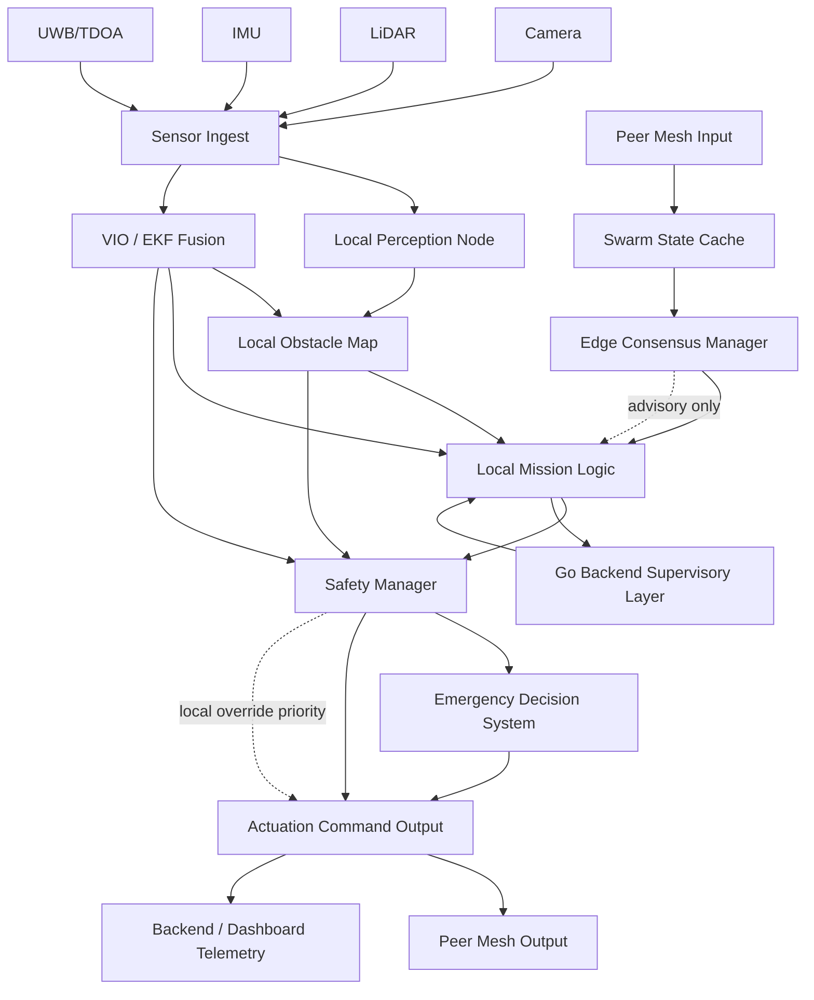
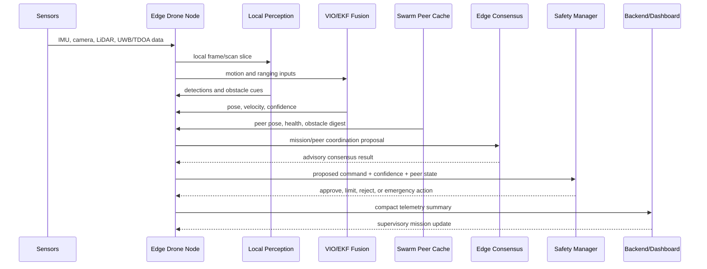

# Edge Node Pipeline

## Abstract

This document defines the onboard computational pipeline for one `edge_swarm` UAV node. It describes an architecture for edge-supervised autonomy in which perception, fusion, peer communication, and failsafe decisions are handled locally with bounded-latency coordination. It is not flight-validation evidence.

## Purpose

This document defines the onboard edge-processing pipeline for each UAV node in `edge_swarm` runtime mode. It is design intent, not validated flight behavior.

## Motivation

A GPS-denied swarm node must remain useful when backend connectivity is degraded and peer visibility is partial. The pipeline therefore prioritizes local safety, confidence-aware fusion, and bounded peer-state exchange over raw data streaming or backend-dependent arbitration.

## Proposed Method

Each node follows a local-first processing order:

```text
sensor ingest
  -> local perception
  -> VIO/EKF/localization fusion
  -> local obstacle map
  -> safety and mission logic
  -> peer digest publish/receive
  -> consensus hints
  -> local actuation decision
```

The peer path is advisory. It may influence shared awareness, leader continuity, and mission coordination, but local collision avoidance and emergency descent remain authoritative.

## Visual Architecture

The following Mermaid flowchart is an architecture/design visualization. It is intended to improve reviewer readability and is not flight validation evidence.



This diagram shows the complete edge node data path from sensor ingest to actuation. Peer mesh data and backend input are integrated as advisory context, while the local safety override path can bypass consensus when immediate collision avoidance or emergency descent is required. The backend remains supervisory: it receives summaries and may provide mission intent, but it is not on the real-time critical path for local safety.

## Edge Decision Cycle



This sequence diagram shows one edge decision cycle. Sensors drive local perception and fusion first; peer cache and consensus are consulted only after local state is available. The safety manager has final authority over the candidate command, which is why consensus cannot force unsafe action. Backend/dashboard communication is deliberately outside the real-time safety loop: it supports operator visibility, audit, and supervisory input.

Mermaid diagrams can be exported to SVG for papers or portfolio material with:

```powershell
npx @mermaid-js/mermaid-cli -i docs/EDGE_NODE_PIPELINE.md -o docs/edge_node_pipeline.svg
```

## Pipeline Overview

1. Sensor ingest
2. Local perception
3. Local fusion and state estimation
4. Local obstacle-map update
5. Local mission logic
6. Peer telemetry exchange
7. Distributed consensus assist
8. Local safety override and emergency decision

## Mathematical Timing Model

For one local control update:

```text
T_node = T_ingest + T_perception + T_fusion + T_map + T_policy + T_safety
```

For peer-assisted awareness:

```text
T_peer = T_serialize + T_mesh + T_verify + T_cache_merge
```

The design goal is:

```text
T_safety_loop < T_peer_assist < T_backend_supervision
```

This model is proposed for HIL measurement and is not yet flight-validated.

## Local Perception Node

Inputs:

- camera
- LiDAR
- IMU
- optical flow
- rangefinder

Outputs:

- local detections
- local obstacle cells
- target tracks
- inference confidence

## Local Obstacle Map

Recommended behavior:

- maintain short-horizon occupancy grid onboard
- timestamp every cell update
- merge peer obstacle digests with confidence decay
- reject peer cells older than stale-peer timeout

## Local Mission Logic

Responsibilities:

- execute mission state machine without backend round-trip
- consume local safety constraints first
- consume peer awareness second
- consume backend mission updates as supervisory overrides

## Local Swarm State Cache

Store bounded per-peer entries:

- last pose
- last health
- last consensus state
- last obstacle digest
- last trust epoch

Cache must be size-limited and age-limited.

## Peer-to-Peer Telemetry Exchange

Exchange only compact state:

- heartbeat
- pose/velocity/confidence
- edge-health summary
- consensus state
- obstacle digest
- threat digest

## Edge Collision Avoidance

Priority order:

1. local immediate obstacle avoidance
2. local peer separation enforcement
3. mission objective preservation
4. backend intent adherence

## Distributed Consensus

Use consensus for:

- leader continuity hints
- sector ownership
- collective halt or reroute requests
- emergency coordination intents

Do not require consensus for immediate collision avoidance or emergency descent.

## Local Emergency Decision System

Triggers:

- localization confidence collapse
- collision imminent
- propulsion fault
- lost peer quorum during tightly coupled formation
- backend unavailable plus local safety margin violation

Outputs:

- hold
- local reroute
- safe return by anchor reference
- emergency land

## Recommended Module Breakdown

- `EdgePerceptionNode`
- `EdgeObstacleMap`
- `LocalMissionLogic`
- `SwarmStateCache`
- `PeerTelemetryExchange`
- `EdgeConsensusManager`
- `EmergencyDecisionSystem`

## Runtime Separation

- `simulation`: synthetic/demo allowed
- `bench`: live-sensor oriented, replay may still support validation workflows
- `production`: live-sensor only
- `edge_swarm`: live-sensor plus local distributed autonomy; no playback-only positioning path

## Complexity Analysis

Let `p` be sensor points or features, `g` be local occupancy cells, `n` be cached peers, and `m` be peer digests per node.

- local inference/front-end perception: `O(p)` plus model inference cost
- local occupancy update: `O(g)` for full update or `O(p)` for sparse scan insertion
- peer cache merge: `O(n * m)`
- obstacle digest reconciliation: `O(n * m)` before local consistency checks
- consensus hint update: `O(n)` for current peer votes
- mesh synchronization: `O(n)` one-hop, increasing with relay policy under multi-hop mesh

## Limitations

- pipeline timing is architecture-level until measured under HIL load
- no full hardware swarm validation is claimed
- thermal throttling, camera frame drops, LiDAR delay, and WiFi congestion can shift the timing budget

## Future Work

- measure `T_node` and `T_peer` on Jetson Nano and Raspberry Pi class hardware
- add binary serialization timing benchmarks
- evaluate bounded cache behavior under partition and rejoin events
