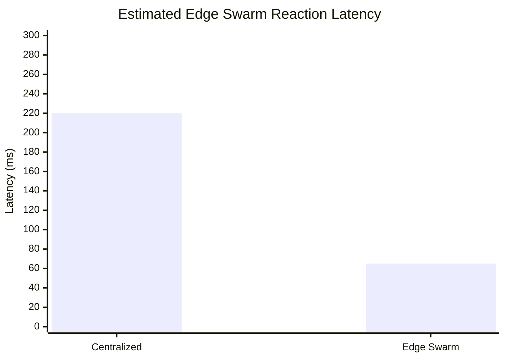

# Edge Swarm HIL Test Plan

## Abstract

This plan defines hardware-in-the-loop validation steps for `edge_swarm` peer communication, degraded-link continuity, and local safety authority. It is a pre-flight validation plan, not evidence of flight readiness.

This plan validates `edge_swarm` peer packet exchange before real multi-drone flight. Run with bench props removed, current-limited power, synchronized logs, and unique `DRONE_ID` values.

## Motivation

The architecture must be tested against realistic compute, sensor, and radio constraints before any real multi-drone validation. HIL testing should expose thermal throttling, CPU saturation, LiDAR delay, camera frame drops, synchronization drift, clock skew, and packet loss under WiFi congestion.

## Proposed Method

Use staged HIL tests:

```text
single-node timing -> two-node packet exchange -> three-node stale peer -> degraded mesh -> partition recovery
```

Each test should record monotonic timestamps, wall-clock synchronization status, packet sequence numbers, peer cache state, CPU/GPU load, device temperature, sensor frame age, and mesh bandwidth.

## 1. Two-Node Bench Packet Exchange

Start two nodes on the same V2X multicast group. Confirm both publish and receive `heartbeat`, `pose_state`, `edge_health`, `obstacle_digest`, and `consensus_state` packets. Expected result: each node reports `peer_count >= 1`, `stale_peer_count == 0`, normalized `source`, increasing sequence numbers, and non-zero mesh bandwidth.

## 2. Three-Node Stale-Peer Test

Run three nodes, then stop one node without shutting down the others. Expected result: remaining nodes mark that peer stale after the configured timeout, exclude it from `safety_eligible_peer_count`, expose split/isolation state if all known peers are stale, and remove the entry after expiry.

## 3. Backend Disconnected Test

Run nodes in `edge_swarm` with the control-plane backend unavailable. Expected result: telemetry shows `disconnected_operation=true`, autonomy remains local/distributed, and peer packet exchange continues without backend dependency.

## 4. Emergency Corridor Reservation Test

Inject or trigger a local emergency fault on one node. Expected result: the node broadcasts `emergency_corridor`; peers accept it even during degraded/disconnected state; local collision avoidance and emergency landing remain active without waiting for consensus.

## 5. Degraded Mesh Bandwidth Test

Throttle or impair the mesh link while keeping at least two nodes alive. Expected result: `mesh_bandwidth_kbps` drops, edge health moves toward degraded where appropriate, packets over the size limit are rejected, and stale peers are not used for safety-critical decisions.

## 6. Consensus Recovery Test

Create a quorum proposal such as `collective_halt` or `emergency_reroute`, then isolate and restore one peer. Expected result: quorum is lost when the peer is stale, collective action is not applied under local safety override, and consensus state recovers after fresh packets arrive in a newer epoch.

## HIL Platform Constraints

- Jetson Nano thermal throttling: record CPU/GPU temperature, clocks, and inference latency; repeat tests after thermal soak.
- Raspberry Pi CPU saturation: record CPU load, scheduler latency, packet processing delay, and dropped telemetry frames.
- WiFi congestion: inject packet loss and bandwidth contention; measure heartbeat gaps, stale-peer transitions, and recovery time.
- LiDAR scan delay: record scan age and obstacle-map update latency; verify stale scans cannot drive safety-critical peer decisions.
- Camera frame-drop behavior: record frame age, dropped frames, detector FPS, and edge inference confidence.
- synchronization drift: compare peer clock offset trends and reject measurements outside the configured skew budget.
- clock skew: test bounded skew cases and abrupt skew jumps; verify trust/TTL logic rejects stale packets.
- thermal stability: run long-duration bench loops to detect frequency throttling, memory pressure, and timing drift.

## Mathematical Measurement Model

For each test run, log:

```text
L_packet = t_receive - t_send
L_pipeline = t_decision - t_sensor_capture
skew_peer = t_peer_clock - t_local_clock
loss_rate = dropped_packets / expected_packets
```

For swarm communication load:

```text
B_observed ~= sum(packet_size_i) / measurement_window
```

Compare observed values against configured packet TTL, stale-peer timeout, and mesh bandwidth budgets.

## Benchmark Data Products

The current benchmark graphs in the README and performance estimate documents use mock/model data for research planning. They are not flight-validated and are not real RF/HIL measurements. During HIL execution, each run should export visualization-ready data with the same schema shape as `docs/benchmarks/edge_swarm_benchmark_mock_data.json`, but with `evidence_type` changed to the actual evidence level, for example `hil_measured_propeller_off`.

Required exported fields:

- run id, date, runtime mode, node count, and hardware profile
- packet type, serialization mode, encoded packet size, send timestamp, receive timestamp
- observed packet latency, dropped packet count, and stale-peer transition time
- CPU/GPU load, temperature, camera frame age, LiDAR scan age, and clock offset
- explicit validation label: `not_flight_validated`, `propeller_off_hil`, `tethered`, or `flight_adjacent`

The first replacement target is the estimated reaction latency graph:



This graph must remain labeled as estimated until synchronized HIL traces populate both bars.

## Complexity Analysis

Let `n` be active HIL nodes and `m` be digests per node.

- stale-peer filtering: `O(n)`
- peer cache validation: `O(n)`
- digest reconciliation: `O(n * m)`
- consensus recovery check: `O(n)` for current-epoch votes
- log correlation: `O(E log E)` if `E` events are sorted across nodes

## Pass Criteria

All packet validation failures must be logged with reasons, dashboard/backend fields must reflect real peer state, and no safety action may depend on consensus when immediate collision avoidance or emergency landing is required.

## Limitations

- HIL does not replace real flight validation
- bench radios may not match production radio behavior
- propeller-off tests do not validate aerodynamic or vibration effects
- no full hardware swarm validation is claimed until multi-node HIL and tethered testing are complete

## Future Work

- add automated packet-loss profiles for WiFi congestion
- add thermal soak scripts for Jetson Nano and Raspberry Pi platforms
- add clock-skew injection tests
- add tethered validation after HIL pass criteria are consistently met
