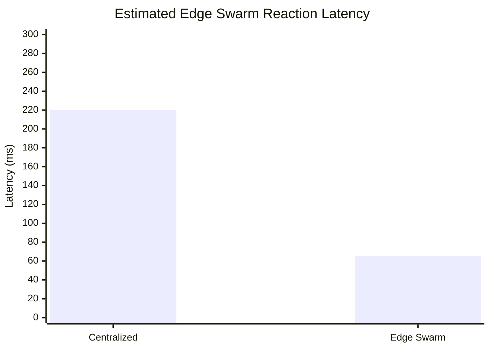
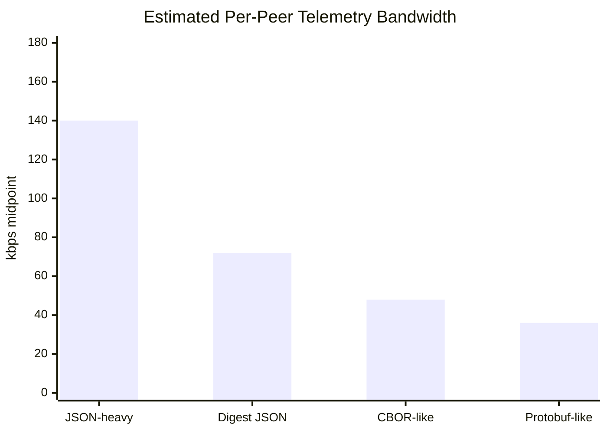
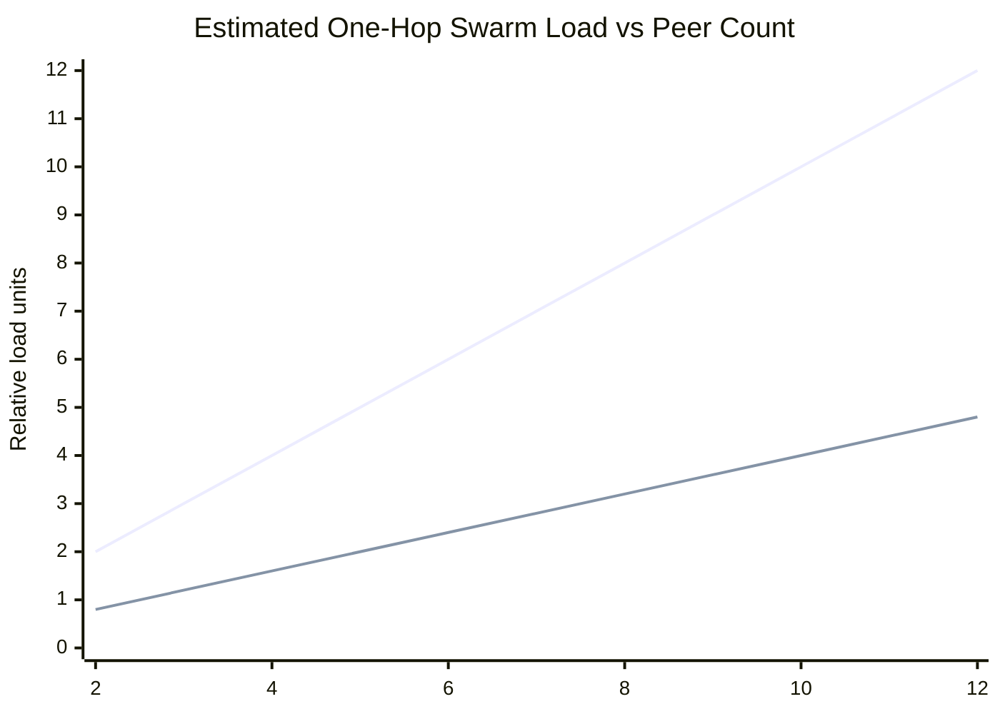
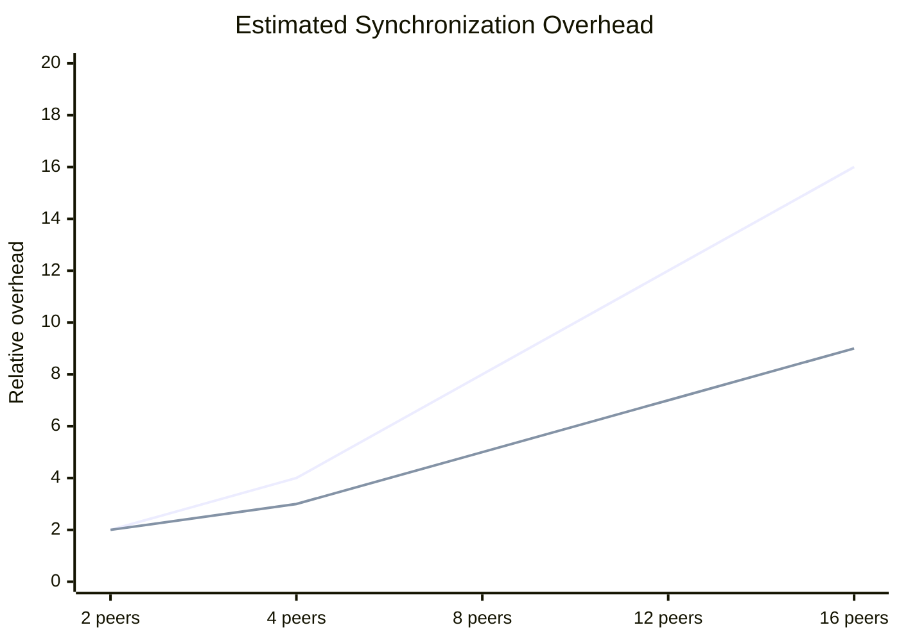

# Edge Swarm Performance Estimate

## Abstract

This document summarizes architecture-level performance estimates for `edge_swarm`, including latency, bandwidth, scalability, and resilience. The estimates are intended for research planning and HIL test design, not as validated flight metrics.

## Statement

These are architecture-based estimates only. They are not flight-validated metrics.

## Motivation

Performance modeling helps identify whether distributed autonomy, compact peer digests, and edge-supervised autonomy are plausible under small-UAV compute and radio constraints before committing to hardware swarm trials.

## Proposed Method

The estimate compares a backend-heavy coordination path against an edge-oriented path:

```text
centralized path: sensor -> backend -> command -> drone
edge path: sensor -> local inference/fusion -> peer digest -> local policy
```

The analysis emphasizes scaling trends rather than validated absolute values.

## Benchmark Methodology

The benchmark methodology is currently a mixed planning framework, not a completed flight-test campaign. It combines:

- simulation-based estimates for centralized versus edge decision paths
- local bench telemetry observations from the software validation stack
- architecture-level estimation for bandwidth, synchronization, and consensus behavior
- unit and integration tests for peer packet validation and stale-peer rejection

No real multi-drone flight benchmark has been completed. All numeric ranges below are estimated under controlled bench assumptions and are not hardware-flight validated.

Visualization-ready mock/model data for the charts is stored in `docs/benchmarks/edge_swarm_benchmark_mock_data.json`. It is suitable for documentation and research planning only, not empirical claims.

Benchmark categories:

- edge reaction latency
- centralized versus edge response delay
- peer synchronization latency
- telemetry bandwidth usage
- consensus propagation delay
- obstacle awareness propagation time
- backend dependency reduction

## Estimated Benchmark Table

Estimated under controlled bench assumptions; not hardware-flight validated.

| Scenario | Centralized / backend-heavy path | Edge swarm path | Evidence type |
|---|---:|---:|---|
| Obstacle reaction latency | 120 to 220 ms | 30 to 70 ms | architecture-level estimate |
| Peer deconfliction latency | 90 to 180 ms | 25 to 60 ms | architecture-level estimate |
| Emergency halt propagation | 140 to 260 ms | 40 to 90 ms | architecture-level estimate |
| Obstacle awareness propagation | 100 to 210 ms | 35 to 85 ms | architecture-level estimate |
| Consensus propagation delay | 120 to 240 ms | 45 to 110 ms | architecture-level estimate |
| Telemetry bandwidth per peer | 64 to 160 kbps | 24 to 64 kbps | digest-based estimate |
| Backend dependency for safety loop | high | low | architecture property |

## Observed Bench Validation Signals

The following are software/bench validation signals already represented in the repository validation workflow. They are not flight results.

| Signal | Status | Interpretation |
|---|---|---|
| C++ validation | passing in local validation | onboard components compile and tests execute |
| Go validation | passing in local validation | backend/control-plane tests execute |
| Python validation | passing in local validation | dashboard/backend-status tests execute |
| Telemetry smoke tests | available and used for schema validation | backend telemetry path can be exercised locally |
| Edge peer packet tests | passing in CTest | packet parse, expiry, stale sequence, cache, and consensus behavior covered |
| Stale-peer rejection behavior | unit-tested | stale peers are excluded from safety-critical consensus support |

## Benchmark Visualizations

All charts in this section visualize estimates or software-bench validation categories. They are not flight-measured results.

**Benchmark status warning:** These benchmark graphs are estimated/model-based visualizations for research planning. They are not real flight or RF mesh measurements.

### Estimated Edge Swarm Reaction Latency



### Latency Comparison Graph

```mermaid
xychart-beta
    title "Estimated Latency Ranges, Centralized vs Edge"
    x-axis ["Obstacle Reaction", "Peer Deconfliction", "Emergency Halt", "Obstacle Awareness", "Consensus"]
    y-axis "Latency midpoint (ms)" 0 --> 220
    bar "Centralized midpoint" [170, 135, 200, 155, 180]
    bar "Edge midpoint" [50, 42, 65, 60, 78]
```



### Bandwidth Comparison Graph



### Scalability Estimate Graph



### Peer Count vs Synchronization Overhead



## Research-Style Evaluation Metrics

Future HIL and hardware trials should record:

| Metric | Definition | Intended use |
|---|---|---|
| Localization confidence stability | variance and dropout rate of `C_loc` over time | evaluate VIO/TDOA robustness |
| Swarm continuity score | fraction of mission time with valid local autonomy and peer awareness | quantify degraded-link continuity |
| Peer freshness ratio | fresh peer entries divided by visible peer entries | detect stale mesh state |
| Edge autonomy continuity | duration of autonomous operation during backend loss | measure backend dependency reduction |
| Degraded-link survivability | mission-safe time under packet loss or bandwidth throttling | characterize mesh resilience |
| Consensus recovery time | time from partition heal to stable consensus state | evaluate split-swarm recovery |
| Obstacle awareness propagation | time from local obstacle observation to fresh peer digest acceptance | measure shared-awareness latency |

## Estimated Improvements

- latency reduction: 2x to 4x on critical local reaction loops
- bandwidth savings: 35% to 65% by sharing digests instead of raw streams
- swarm reaction improvement: materially faster obstacle and peer-separation response
- backend load reduction: fewer high-rate dependencies on centralized processing
- scalability improvement: better small-cluster autonomy with less control-plane fan-out pressure
- resilience improvement: continued operation during uplink degradation
- GPS-denied benefit: stronger continuity when external positioning and uplink are both constrained

## Adaptive Edge Serialization Strategy

Current JSON peer packets are suitable for architecture bring-up, bench debugging, and readable packet captures. A CBOR serialization path is now implemented as the first binary prototype for time-sensitive `edge_swarm` peer communication.

Serialization roadmap:

1. CBOR as the current binary runtime prototype.
2. Protocol Buffers as a future production binary schema after schema compatibility is frozen.
3. FlatBuffers as a possible later option if zero-copy reads become important.

Estimated serialization tradeoff:

| Format | Relative packet size | Relative CPU overhead | Relative parse latency | Production edge fit |
|---|---:|---:|---:|---|
| JSON | 1.0x baseline, largest | highest | highest | low, except debug |
| CBOR | observed 0.18x to 0.26x JSON in local unit samples | medium-low | low | implemented prototype |
| protobuf | about 0.30x to 0.60x JSON planning range | low | low | future roadmap |

Current local unit-test serialization samples:

| Packet | JSON bytes | CBOR bytes | Encode-size reduction |
|---|---:|---:|---:|
| `heartbeat` | 370 | 97 | 74% |
| `obstacle_digest` | 278 | 58 | 79% |
| `consensus_state` | 315 | 57 | 82% |

These values are controlled software observations from the benchmark test, not production RF throughput measurements. Actual bandwidth and latency values still require HIL packet traces on the target radio and onboard CPU.

Bandwidth estimate:

```text
Bandwidth_total ~= N * packet_size * update_rate
```

Example implication: for `N = 10` peers at `10 Hz`, reducing a digest from `900 bytes` JSON to `350 bytes` protobuf-like binary lowers one-hop offered load from roughly `720 kbps` to `280 kbps` before MAC, security, and relay overheads. That headroom matters for emergency corridor packets, consensus transitions, and degraded-link retries.

Production-grade edge communication should combine compact binary digests with adaptive rates:

- emergency and threat packets retain highest priority and burst allowance
- heartbeat, pose, and health packets are periodic but rate-capped
- background AI and backend summary telemetry are reduced under congestion
- degraded mesh mode lowers noncritical update rates before safety-adjacent packets are affected
- hazard bursts are followed by cooldown to avoid saturating the peer mesh

## Estimated Limits

- benefit depends on onboard compute headroom
- larger swarms still need cluster partitioning
- consensus overhead grows if every node talks to every node
- JSON-heavy packets will limit scale before binary peer transport is adopted

## Swarm Scaling Model

For `N` drones, packet size `S`, and update rate `R`:

```text
B_one_hop ~= N * S * R
B_full_mesh ~= N * (N - 1) * S * R
```

Clustered operation reduces the full-mesh term by limiting consensus groups and sharing inter-cluster summaries only.

## Complexity Analysis

Let `n` be peers per cluster and `m` be digests per peer.

- local inference: `O(p)` over local features/points plus neural model cost
- peer cache merge: `O(n * m)`
- obstacle digest reconciliation: `O(n * m)`
- consensus update: `O(n)` for current epoch votes
- mesh synchronization: `O(n)` one-hop, with relay overhead under multi-hop mesh

## Readiness View

Software architecture readiness for edge phase: moderate to good.

Remaining blocker for true performance claims: hardware validation with representative radios, compute, and sensing loads.

## Limitations

- no real flight validation is claimed
- no full hardware swarm validation is claimed
- no production radio validation is claimed
- thermal throttling and sensor delays are not represented in the estimates
- no RF mesh measurements have been collected yet
- no real radio congestion characterization is complete
- no synchronized hardware swarm timing proof exists
- no real packet-loss study has been completed

## Future Work

- collect HIL packet traces and timing histograms
- benchmark Jetson Nano and Raspberry Pi CPU/GPU saturation
- validate bandwidth under congested WiFi and representative mesh radios
- measure multi-node RF latency and jitter
- benchmark Jetson Nano edge inference timing under thermal load
- compare protobuf, CBOR, and JSON throughput on the target onboard CPU
- build packet-loss profiles for degraded mesh operation
