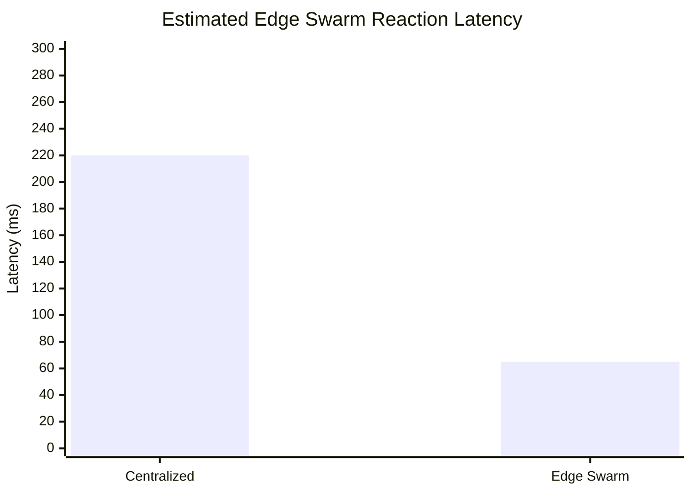
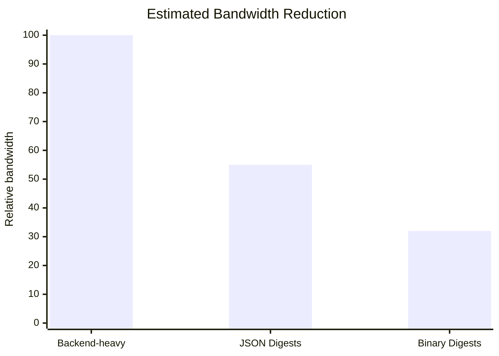
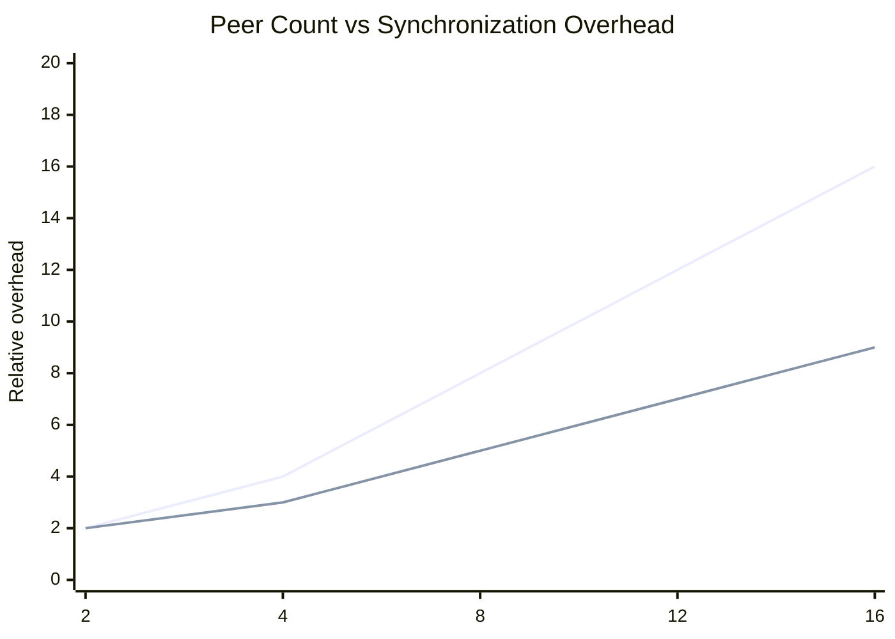

# Edge Swarm Research Notes

## Abstract

These notes position `edge_swarm` as an architecture-level research contribution for GPS-denied distributed autonomy, confidence-aware fusion, resilient mesh topology, degraded-link continuity, and edge-supervised autonomy. The repository provides software and documentation artifacts, not real-flight validation evidence.

## Research Novelty

- GPS-denied swarm autonomy with explicit edge runtime separation
- peer-shared obstacle and confidence digests instead of backend-heavy coordination
- safety-first split between local fast loops and backend supervisory loops

## Motivation

European robotics and autonomy research increasingly emphasizes trustworthy, energy-aware, and resilient systems that can operate under degraded communication and uncertain localization. `edge_swarm` is framed as a small-UAV architecture for studying bounded-latency coordination, confidence-aware peer perception, and partition-tolerant mission continuity.

## Proposed Method

The method combines:

- local perception and safety authority
- compact peer telemetry and obstacle digests
- confidence decay under age, hop count, trust mismatch, and disagreement
- bounded peer caches with stale-peer exclusion
- BFT-inspired partition rejoin and deterministic leader conflict resolution
- backend supervision for audit rather than hard real-time control

## Academic Contribution

- practical architecture for edge swarm autonomy in GPS-denied settings
- telemetry schema for confidence-aware peer coordination
- operator-facing truthfulness between simulation, playback, bench, and edge states

## Mathematical Confidence Propagation Model

This is a proposed model and intended `edge_swarm` design formulation. It is not presented as flight-validated evidence.

For a peer-shared AI observation `o_i`, the receiver computes a bounded propagated confidence:

```text
C_final =
    C_initial
    * exp(-lambda_t * Delta t)
    * exp(-lambda_h * hop_count)
    * T(epoch)
    * D(local_consistency)
    * S(stale_peer)
```

Definitions:

```text
Delta t = message age at receiver
hop_count = peer relay count
lambda_t = time decay constant
lambda_h = hop-count decay constant
T(epoch) = trust epoch compatibility factor
D(local_consistency) = local-sensor agreement factor
S(stale_peer) = stale-peer eligibility factor
```

The trust epoch term is:

```text
T(epoch) =
    1.0,                         if trust_epoch_i == trust_epoch_local
    exp(-lambda_e * |Delta e|),  if 0 < |Delta e| <= e_max
    0.0,                         otherwise
```

The local consistency term may be modeled as:

```text
D(local_consistency) = exp(-lambda_d * d_i)
```

where:

```text
d_i = w_p * ||p_peer - p_local||_2
    + w_v * ||v_peer - v_local||_2
    + w_c * I[class_peer != class_local]
    + w_m * map_residual
```

For safety-critical logic:

```text
S(stale_peer) =
    1.0, if peer is fresh and safety-eligible
    0.0, otherwise
```

The key research claim is architectural rather than empirical: confidence propagation makes peer awareness degrade under age, relay depth, trust mismatch, and sensor disagreement. This is safer than naive shared awareness because a remote inference is not treated as a binary fact merely because it arrived on the mesh.

## Confidence Fusion Procedure

```text
procedure ConfidenceFusion(local_state, peer_cache, local_observations):
    output = empty set

    for peer in peer_cache:
        if peer.stale or not peer.safety_eligible:
            continue

        for observation in peer.observations:
            if IsExpired(observation):
                continue

            T = TrustEpochFactor(observation.trust_epoch, local_state.trust_epoch)
            if T == 0:
                continue

            D = LocalConsistencyFactor(observation, local_observations)
            C = observation.C_initial
                * exp(-lambda_t * MessageAge(observation))
                * exp(-lambda_h * observation.hop_count)
                * T
                * D

            if C >= C_min:
                output.add((observation, C))

    return output
```

## Complexity Notes

Let `n` be cached peers, `m` be per-peer observations, and `k` be local observations or map cells considered during consistency checking.

- local confidence update: `O(k)` for direct local scans
- peer confidence merge: `O(n * m * k)` without indexing
- indexed peer merge: `O(n * m * log k)` with a spatial or grid index
- bounded cache memory: `O(N_max * m)` where `N_max` is the configured peer-cache limit

Because `edge_swarm` uses bounded peer state, the proposed model is intended to remain HIL-measurable under fixed swarm-size assumptions.

## Partition Rejoin and Conflict Resolution

This is proposed resilience architecture for academic modeling of split-swarm recovery. It is not a claim that a validated Byzantine fault-tolerant consensus implementation exists in the repository.

Problem statement: if a mesh disconnects, partitions `P_a` and `P_b` may independently elect leaders `L_a` and `L_b`. They may also advance different consensus epochs, observe different obstacle digests, and diverge in mission continuity state. When the mesh heals, the system needs deterministic leader conflict resolution and stale or malicious peer isolation.

Partition comparison variables:

```text
E_c = consensus epoch
E_t = trust epoch
Q_h = quorum health
M_s = mission continuity state
U_s = stable uptime
F_s = fault score
ID = deterministic node identifier
```

Leader preference is proposed as lexicographic ordering:

```text
LeaderScore(L_i) =
    lexicographic(
        E_t,
        Q_h,
        U_s,
        -F_s,
        -ID_tiebreak
    )
```

The preferred leader is:

```text
L* = argmax_i LeaderScore(L_i)
```

where `ID_tiebreak` is defined so every node computes the same final fallback order.

Byzantine fault-tolerant concepts applied at the architecture level:

- malicious or stale peers are excluded before quorum evaluation
- quorum validation requires fresh, trust-compatible, safety-eligible peers
- epoch mismatch causes temporary isolation or trust-reconciliation mode
- consensus timeouts return the node to local-only degraded operation
- conflicting leader claims require deterministic tie-breaking and operator-visible status

### Partition Merge Procedure

```text
procedure PartitionMerge(P_local, P_remote):
    A = FilterFreshTrustCompatible(P_local.peers)
    B = FilterFreshTrustCompatible(P_remote.peers)

    if Size(B) == 0:
        return LocalOnlyDegraded

    if TrustEpochMismatch(P_local.E_t, P_remote.E_t):
        return EpochIsolation

    if not QuorumValid(B):
        return RejectRemoteLeader

    candidates = {P_local.leader, P_remote.leader}
    L_star = ArgMax(candidates, LeaderScore)

    E_c_star = max(P_local.E_c, P_remote.E_c) + 1
    M_s_star = ReconcileMissionState(P_local.M_s, P_remote.M_s)
    O_star = MergeFreshObstacleDigests(P_local.obstacles, P_remote.obstacles)

    return MergedPartition(L_star, E_c_star, M_s_star, O_star)
```

Safety invariant:

```text
Local collision avoidance and emergency descent bypass consensus.
```

Partition merge can influence formation, leader continuity, shared obstacle reconciliation, and mission resumption. It must not delay emergency landing, emergency corridor reservation, propulsion failsafe, or immediate collision avoidance.

### Complexity Analysis

Let `n` be visible peers after reconnect, `q` be candidate quorum records, and `m` be bounded obstacle or mission records per peer.

- stale-peer filtering: `O(n)`
- trust-epoch compatibility scan: `O(n)`
- leader conflict resolution: `O(n)` with single-pass lexicographic comparison
- quorum validation: `O(q)`
- bounded obstacle digest merge: `O(n * m)`
- consensus history comparison: `O(q)` when epoch history is bounded

The bounded-cache assumption is central: without cache limits, partition healing can create unbounded reconciliation work during exactly the period when mesh bandwidth and CPU should remain available for safety loops.

Research contribution: this model frames split-swarm recovery as lightweight BFT-inspired reconciliation for small UAV swarms. It combines deterministic leader selection, trust epoch isolation, stale-peer quarantine, and consensus timeout handling while preserving local safety independence.

## Post-Quantum Peer Authentication

This is a future research and architecture roadmap. The current repository does not implement operational post-quantum peer signatures. Current `edge_swarm` authentication is represented by an `auth_hook` placeholder, while implemented validation focuses on packet syntax, expiry, sequence freshness, stale-peer rejection, and safety gating.

The proposed research direction is a crypto-agile, hybrid classical plus post-quantum swarm authentication layer:

- ML-KEM, standardized from CRYSTALS-Kyber, for post-quantum key establishment
- ML-DSA, standardized from CRYSTALS-Dilithium, for post-quantum digital signatures
- classical signatures or mTLS retained during migration for interoperability and fallback
- trust epochs and replay nonces bound into the signed packet transcript

Proposed signed transcript:

```text
signed_bytes =
    H(canonical_packet)
    || sender_id
    || sequence_number
    || nonce
    || trust_epoch
    || packet_type
```

Peer verification:

```text
procedure PeerPacketVerification(packet, keyring, replay_cache, local_epoch):
    if not PacketShapeValid(packet):
        return reject("shape")
    if PacketExpired(packet) or SequenceStale(packet):
        return reject("freshness")
    if NonceSeen(replay_cache, packet.sender_id, packet.trust_epoch, packet.nonce):
        return reject("replay")

    key = LookupPeerKey(keyring, packet.sender_id, packet.key_id)
    if key is revoked:
        return quarantine("revoked")

    digest = H(CanonicalizeWithoutSignature(packet))
    if not VerifyHybridOrPQCSignature(key, packet.signature, digest):
        return quarantine("auth")
    if not TrustEpochCompatible(packet.trust_epoch, local_epoch):
        return quarantine("epoch")

    MarkNonceSeen(replay_cache, packet.sender_id, packet.trust_epoch, packet.nonce)
    return accept
```

Security model notes:

- node compromise isolation: a suspected node can be quarantined by key id and excluded from safety-critical consensus
- stale peer quarantine: stale packets and stale trust epochs remain observable but do not influence local safety loops
- trust revocation: revoked key material should force epoch rotation and invalidate old signed packets
- epoch rotation: rotations should occur after replay suspicion, command-auth failures, maintenance transitions, or backend trust changes

Performance notes:

- PQC signatures add bandwidth and CPU verification overhead, which matters for small UAV mesh radios
- hybrid signing may initially be preferred because it preserves classical compatibility while collecting PQC timing data
- full-signature verification can be prioritized for emergency corridor, consensus, threat digest, and trust-transition packets
- heartbeat and pose streams may use session-level authentication after ML-KEM establishment if HIL tests show per-packet signatures exceed timing budgets

Research positioning:

PQC-enabled edge swarm coordination is relevant for autonomous defense systems, future aerospace systems, and long-lifecycle robotics infrastructure because these systems may remain deployed beyond classical public-key cryptography migration timelines. A swarm that can rotate trust epochs, quarantine compromised peers, and verify peer packets under post-quantum assumptions is a stronger architecture for GPS-denied and disconnected operation. This remains a research objective until implemented and validated.

## Experimental Design

Study modes separately:

1. simulation
2. playback-assisted bench
3. live bench edge-swarm
4. hardware-in-the-loop mesh degradation

## Benchmark Methodology

The current benchmark methodology is intended to make future evaluation reproducible while keeping present claims honest. It combines simulation-based estimates, local bench telemetry observations, and architecture-level modeling. It does not include real multi-drone flight benchmarks.

Estimated benchmark categories:

- edge reaction latency
- centralized versus edge response delay
- peer synchronization latency
- telemetry bandwidth usage
- consensus propagation delay
- obstacle awareness propagation time
- backend dependency reduction

Estimated under controlled bench assumptions:

| Scenario | Centralized / backend-heavy | Edge swarm | Status |
|---|---:|---:|---|
| Obstacle reaction latency | 120 to 220 ms | 30 to 70 ms | estimated, not flight-measured |
| Peer synchronization latency | 80 to 160 ms | 25 to 70 ms | estimated, not RF-measured |
| Consensus propagation delay | 120 to 240 ms | 45 to 110 ms | estimated, not flight-measured |
| Telemetry bandwidth per peer | 64 to 160 kbps | 24 to 64 kbps | estimated, not radio-measured |
| Backend dependency for safety loop | high | low | architecture property |

Observed bench validation signals:

- local telemetry smoke tests exercise backend telemetry schema
- edge_swarm packet tests validate parse, expiry, stale sequence, cache, and consensus behavior
- C++/Go/Python validation verifies the software stack builds and unit tests execute
- stale-peer rejection behavior is covered by edge consensus/cache tests

### Estimated Benchmark Visuals

These charts are planning visualizations, not measured flight data. They are architecture-level estimates and mock visualization data for research planning only.

```mermaid
xychart-beta
    title "Estimated Edge vs Centralized Latency"
    x-axis ["Obstacle", "Peer Sync", "Consensus", "Awareness"]
    y-axis "Latency midpoint (ms)" 0 --> 220
    bar "Centralized" [170, 120, 180, 155]
    bar "Edge Swarm" [50, 48, 78, 60]
```









Research-style evaluation metrics:

- localization confidence stability
- swarm continuity score
- peer freshness ratio
- edge autonomy continuity
- degraded-link survivability
- consensus recovery time
- obstacle awareness propagation time

Visualization-ready benchmark data is stored in `docs/benchmarks/edge_swarm_benchmark_mock_data.json`. The file is intentionally labeled as mock/model data and should be replaced by HIL traces before making empirical claims.

## Proposed Evaluation Metrics

- obstacle reaction latency
- peer deconfliction latency
- shared-awareness freshness
- stale-peer rejection accuracy
- backend load per drone
- bandwidth per peer
- mission continuity under uplink loss
- localization confidence stability
- swarm continuity score
- peer freshness ratio
- edge autonomy continuity
- degraded-link survivability

## Benchmark Ideas

- centralized-only control path
- edge_swarm path with healthy mesh
- edge_swarm path with partial peer loss
- backend-disconnected edge_swarm path

## Comparison with Centralized UAV Systems

Centralized systems may simplify orchestration but are weaker under uplink degradation. Edge-swarm systems trade implementation complexity for lower latency and higher resilience.

## Future Work

- real UWB/TDOA edge synchronization tuning
- learned shared-obstacle compression
- cluster-level consensus optimization
- BFT optimization for small UAV swarms
- lightweight edge consensus under mesh partitions
- partition recovery timing under degraded radios
- HIL timing measurements with synchronized logs
- multi-node RF latency and jitter measurement
- Jetson Nano inference benchmarking under thermal load
- protobuf versus JSON throughput benchmarking
- HIL and tethered validation

## Limitations

- no real flight validation is claimed
- no full hardware swarm validation is claimed
- no production radio validation is claimed
- confidence propagation, PQC authentication, and BFT recovery are proposed architecture models unless separately implemented and tested
- current performance values are planning estimates rather than validated metrics
- no RF mesh measurements or radio congestion characterization are complete
- no synchronized hardware swarm timing proof exists
- no real packet-loss study has been completed
