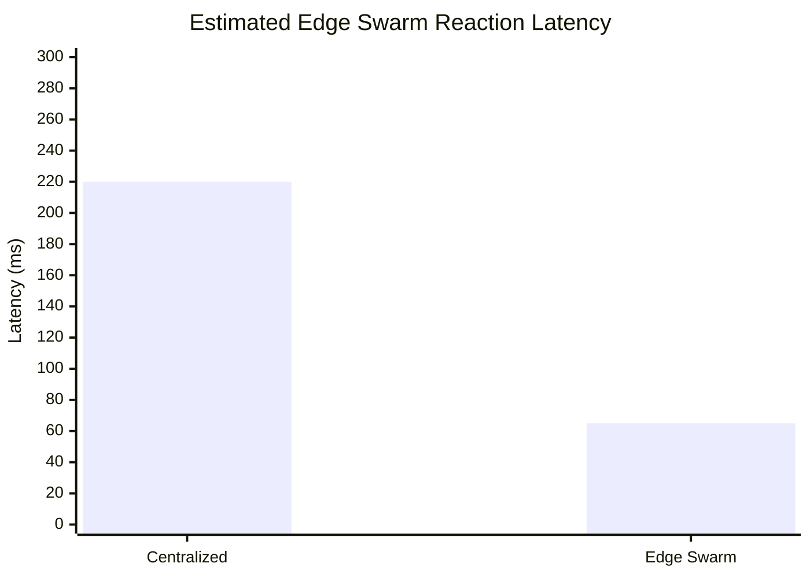

# Swarm Latency Optimization

## Abstract

This document models latency-reduction strategies for `edge_swarm` by moving safety-adjacent loops from backend-dependent control paths to local edge and peer-mesh coordination. Values are estimates unless marked as measured.

## Objective

Reduce swarm reaction latency by removing backend dependence from time-critical loops while preserving supervisory backend visibility.

## Motivation

Bounded-latency coordination is central to GPS-denied distributed autonomy. Backend round trips, JSON-heavy payloads, mesh congestion, and degraded-link jitter can all delay peer awareness. The optimization strategy therefore combines local-first control, compact binary digests, and adaptive packet rates.

## Strategy

- keep obstacle detection and avoidance onboard
- keep local mission arbitration onboard
- share only compressed peer state
- use backend for audit, mission injection, and coarse coordination

## Proposed Method

Latency is reduced by assigning each path to the slowest acceptable control tier:

```text
emergency safety       -> local edge loop
peer deconfliction     -> mesh digest loop
mission supervision    -> backend loop
post-mission analysis  -> backend/archive loop
```

## Adaptive Edge Serialization Strategy

Current peer packet serialization keeps JSON for development readability and bench debugging, while adding a CBOR binary prototype for low-latency edge runtime packets. JSON is intentionally inspectable, but it is not the long-term preferred runtime transport for production `edge_swarm` communication.

Preferred migration order:

1. CBOR for the first production-oriented binary runtime path.
2. Protocol Buffers for future production schemas after compatibility rules are frozen.
3. FlatBuffers as optional future exploration for zero-copy or low-copy readers.

JSON adds latency through repeated field names, text-to-number parsing, dynamic allocation, and larger UDP payloads. Larger payloads increase airtime on the mesh, which raises collision probability, queueing delay, and retransmission pressure. Binary serialization reduces packet size and parsing work, which helps preserve predictable peer update timing.

Estimated serialization comparison:

| Format | Packet size | CPU overhead | Parsing latency | Edge suitability |
|---|---:|---:|---:|---|
| JSON | high | high | high | debug and bench visibility |
| CBOR | low to medium | low to medium | low | implemented binary prototype for constrained peer digests |
| protobuf | low | low | low | reserved future schema-driven transport |

Current local software benchmark samples from unit tests are:

| Packet | JSON bytes | CBOR bytes | Estimated savings |
|---|---:|---:|---:|
| `heartbeat` | 370 | 97 | 74% |
| `obstacle_digest` | 278 | 58 | 79% |
| `consensus_state` | 315 | 57 | 82% |

These are local encode-size observations from controlled unit tests. They are not production RF throughput measurements and do not characterize real radio congestion.

For a first-order estimate:

```text
Bandwidth_total ~= N * packet_size * update_rate
```

Reducing `packet_size` has immediate value because each peer transmits repeatedly, and multi-hop relays may forward selected high-priority packets. Compact binary digests therefore improve both bandwidth use and latency stability.

Adaptive-rate logic:

- high-priority emergency packets bypass normal background rate limits
- background health and autonomy telemetry reduce first under congestion
- pose and heartbeat rates degrade gradually when link quality drops
- threat and obstacle updates can burst during hazard windows
- after a burst, cooldown restores bounded mesh occupancy

## Degraded Network Behavior

When backend latency rises or backend is lost:

- continue local autonomy
- continue peer-awareness exchange
- reduce packet budgets to critical summaries
- mark disconnected operation explicitly in telemetry and dashboard

## Disconnected Swarm Operation

Allowed in `edge_swarm` mode when:

- local sensing remains healthy
- peer trust remains above threshold
- mission logic supports partition-safe behavior

## Local Fallback Decisions

- hold formation loosely instead of tightly
- widen separation margins
- prefer safe corridor over mission optimality
- land locally if confidence or propulsion health collapses

## Expected Timing Comparison

These are engineering estimates, not validated measurements.

| Path | Centralized estimate | Edge estimate |
|---|---:|---:|
| obstacle reaction | 120 to 220 ms | 30 to 70 ms |
| peer deconfliction | 90 to 180 ms | 25 to 60 ms |
| emergency collective halt propagation | 140 to 260 ms | 40 to 90 ms |



Latency can be modeled as:

```text
L_local = L_sensor + L_compute + L_policy
L_peer = L_local + L_serialize + L_mesh + L_parse
L_backend = L_peer + L_uplink + L_backend_compute + L_downlink
```

The intended optimization is to keep emergency and collision loops in `L_local`, and only use `L_peer` or `L_backend` for advisory coordination.

## Expected Swarm Reaction Improvement

- roughly 2x to 4x faster local reaction in backend-degraded conditions
- stronger continuity under intermittent uplink loss
- reduced coordination jitter for small tactical swarms

## Constraint

Real latency values still require hardware-in-the-loop and flight-adjacent validation.

## Complexity Analysis

Let `n` be peers, `r` be update rate, and `s` be packet size.

- local safety update: `O(1)` with respect to swarm size after local perception is complete
- peer synchronization: `O(n)` for one-hop state exchange
- bandwidth load: `O(n * s * r)` for one-hop broadcast approximation
- consensus update: `O(n)` for bounded current-epoch votes
- obstacle digest merge: `O(n * m)` for `m` digests per peer

## Limitations

- timing values are estimates, not flight-validated measurements
- production radio behavior under interference is not validated
- binary serialization benefits are projected until implemented and benchmarked

## Future Work

- measure latency on WiFi-congested and degraded-link benches
- compare JSON, CBOR, and future protobuf parse timing
- quantify clock skew and synchronization drift effects
